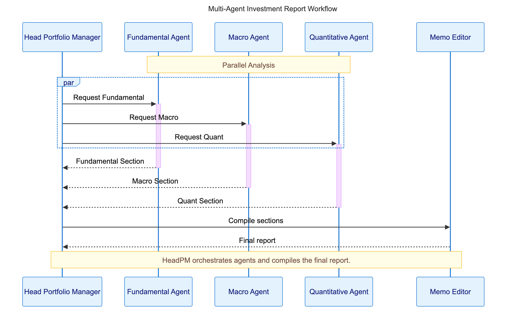

---
tags:
  - multi-agent
  - OpenAI
  - Agents-SDK
  - agent-as-tool
  - portfolio-management
  - observability
  - tracing
  - MCP
  - parallel-execution
  - orchestration
aliases:
  - OpenAI多智能体投资组合协作
date: 2025-05-28
url: https://cookbook.openai.com/examples/multi_agent/multi_agent_portfolio_collaboration
---

# Multi-Agent Portfolio Collaboration with OpenAI Agents SDK

## 核心信息

- **标题**: Multi-Agent Portfolio Collaboration with OpenAI Agents SDK
- **作者**: OpenAI Developers / OpenAI Cookbook Team
- **来源**: OpenAI Cookbook 官方示例教程
- **URL**: https://cookbook.openai.com/examples/multi_agent/multi_agent_portfolio_collaboration
- **日期**: 2025-05-28
- **PDF**: `[a-020]-multi-agent-portfolio-collaboration-with-openai-agents-sdk.pdf`
- **证据质量**: high

## 内容摘要

本文是 OpenAI Cookbook 中一个高级多智能体协作教程，以投资组合研究为真实业务场景，完整演示了如何使用 OpenAI Agents SDK 构建一个由中央协调智能体和多个领域专家智能体组成的多智能体协作系统。该示例不仅提供了可直接运行的代码实现，更深入阐述了"agents as a tool"（智能体即工具）这一设计哲学的工程实践方法和最佳实践原则。

### 教程定位与学习目标

教程面向已熟悉 OpenAI 模型和 LLM 智能体的读者，核心目标是解决一个真实的复杂投资研究问题：评估美联储计划中的降息对 Alphabet（GOOGL）持仓的影响，并给出年末合理的目标价区间。为此，系统构建了一个 hub-and-spoke（轮辐式）架构：Head Portfolio Manager（PM，投资组合经理）智能体作为中央枢纽，协调四位专家智能体——Macro Agent（宏观分析）、Fundamental Agent（基本面分析）、Quantitative Agent（量化分析）以及 Memo Editor（备忘录编辑工具）。

读者将学会：构建一个多专家智能体（宏观、基本面、量化）在 PM 智能体领导下协作解决挑战性投资研究问题的工作流；使用"agents as a tool"方法，由中央智能体 orchestrate 并将其他智能体作为特定子任务的工具来调用；在单一集成工作流中充分利用 SDK 支持的所有主要工具类型（自定义 Python 函数、Code Interpreter 和 WebSearch 等托管工具、以及外部 MCP 服务器）；在智能体模式中应用模块化、并行性和可观测性的最佳实践。

### 两种协作模式的清晰区分

文章首先对多智能体协作中两种核心模式进行了清晰的对比和界定：

**Handoff（交接）模式**：一个智能体可以在问题解决过程中将控制权移交给另一个智能体。在交接架构中，每个智能体了解其他智能体的存在，并能够在适当时机将任务委托给更合适的智能体。这种模式对开放式或对话式工作流非常灵活，但难以维持对任务的全局视图，追踪和调试也相对复杂。

**Agent-as-Tool（智能体即工具）模式**：在这种方法中，一个智能体（通常是中央规划者或管理者）将其他智能体当作工具来调用。子智能体不接管对话的控制权；相反，主智能体为特定子任务调用它们，并将它们的结果纳入自己的推理过程。这种模式保持单一控制线程（主智能体 orchestrate 一切），通常简化了协调工作。本示例明确选择了 Agent-as-Tool 模式，因为投资组合分析需要透明的推理过程、可审计的决策路径和并行执行能力。

### Hub-and-Spoke 架构详解

系统采用 hub-and-spoke 设计。用户的查询（例如"计划中的降息会如何影响我的 GOOGL 持仓？"）首先进入 Portfolio Manager 智能体。PM 智能体被提示分解问题并将其委托给适当的专家智能体。它将每个专家视为一个可调用工具，在需要其专业知识时调用它们。三位专家的分析结果全部返回给 PM，由其综合为最终答案返回给用户。



选择这种设计的根本原因在于：让单个智能体承担所有可能的责任会导致输出浅薄、泛化，并且使系统难以长期维护。通过将问题分解为具有明确角色的专业智能体，系统获得了四大核心收益：

- **更深入、更高质量的研究**：每个智能体可以专注于自己的领域，使用适合该工作的正确工具和提示词。PM 智能体将这些视角整合为更加细致和稳健的答案。
- **模块化和清晰性**：可以更新、测试或改进一个智能体而不影响其他智能体，使系统更易于维护和扩展。
- **通过并行化获得更快的结果**：独立的智能体可以同时工作，显著降低完成复杂多部分分析所需的时间。
- **一致性和可审计性**：结构化、由提示词驱动的工作流确保每次运行都遵循最佳实践，易于调试，产生的输出可以被信任和审查。

### 三层工具策略

工具类型的多样性是本示例的一大亮点。系统同时整合了 SDK 支持的三种主要工具类型，展示了在真实业务场景中的灵活性和扩展性：

**MCP（Model Context Protocol）服务器**：用于以标准化方式将智能体连接到外部工具和数据源。本项目使用了一个本地 MCP 服务器来获取 Yahoo Finance 数据（参见 `mcp/yahoo_finance_server.py`）。MCP 作为 Anthropic 提出并推动标准化的协议，正在成为智能体与外部世界交互的重要基础设施。

**OpenAI Managed Tools（托管工具）**：由 OpenAI 提供的内置托管工具，无需自定义实现即可使用。它们提供开箱即用的强大能力，例如 Code Interpreter（用于量化/统计分析）和 WebSearch（用于获取最新新闻和数据）。这些工具易于集成、由 OpenAI 维护，允许智能体执行代码和实时信息检索等高级操作，无需额外设置。

**Custom Tools（自定义工具）**：任何开发者定义的 Python 函数都可以注册为智能体的工具。Agents SDK 使这一过程非常简单：只需装饰函数，SDK 就会自动提取其名称、文档字符串和输入模式。这非常适合领域特定逻辑、数据访问或工作流扩展。在本项目中，自定义工具用于访问 FRED 经济数据（联邦储备经济数据）和执行文件系统操作。

### 代码实现的关键细节

教程详细展示了 PM 智能体的构建过程。每个专家智能体（Fundamental、Macro、Quantitative）通过 `function_tool` 装饰器封装为 PM 的可调用工具，使用自定义名称和描述使 PM 的工具集对 LLM 更加友好和明确。

PM 智能体使用 `run_all_specialists_parallel` 工具并发调用所有三位专家，通过设置 `parallel_tool_calls=True` 实现最大速度和效率。在模型配置层面，示例采用 GPT-4.1 系列模型，温度设为 0 以保证投资分析的可重复性和一致性，工具选择设为 auto 以允许模型自主决策。

PM 智能体的系统提示从外部 Markdown 文件（`prompts/pm_base.md`）加载，这不仅编码了投资哲学（原创性、风险意识、挑战共识），还包含详细的工具使用规则和分步骤工作流程。这种"提示即代码"（prompt-as-code）的做法确保了每次运行的一致性、可审计性和高质量输出。在收集和审查专家输出后，PM 使用专门的备忘录编辑工具来组装、格式化和定稿投资报告。

系统被设计为可扩展的：可以添加新的专家智能体、更换工具或更新提示词，而不会破坏整体编排逻辑。所有工具调用、智能体决策和输出都被捕获到 OpenAI Traces 中，实现完全的透明度和调试能力。

### Tracing 与可观测性集成

教程在代码层面展示了完整的 Tracing 集成。首先通过 `add_trace_processor(BatchTraceProcessor(FileSpanExporter()))` 配置追踪处理器，然后在 `run_workflow()` 函数中使用 `trace()` 上下文管理器包裹整个投资研究工作流：

```python
with trace("Investment Research Workflow", metadata={"question": question[:512]}) as workflow_trace:
    print(f"\n🔗 View the trace in the OpenAI console: "
          f"https://platform.openai.com/traces/trace?trace_id={workflow_trace.trace_id}\n")
    response = await Runner.run(bundle.head_pm, question, max_turns=40)
```

通过这种方式，整个工作流的每一步——包括智能体决策、工具调用、参数传递和输出结果——都被完整记录。开发者可以获得直接的 trace URL，在 OpenAI Platform 上实时查看和分析执行轨迹。这对于调试复杂多智能体工作流、定位性能瓶颈和审计决策路径至关重要。

运行工作流需要两个环境变量：`OPENAI_API_KEY`（用于 OpenAI 访问）和 `FRED_API_KEY`（用于 FRED 经济数据）。根据任务复杂度，完整请求可能需要长达 10 分钟，示例中设置了 20 分钟的超时和最多 40 轮交互的限制。

### 示例输出：专业级投资备忘录

示例输出是一份结构完整、分析深入的专业投资备忘录，以 2025 年 5 月的 GOOGL 分析为例：

**Executive Summary（执行摘要）**：GOOGL 当前股价 171.42 美元，市值 1.88 万亿美元，市盈率 16.91。投资论点为温和看多——虽然美联储计划中的降息是轻微顺风，但并非 GOOGL 股价走势的主要驱动力。最具原创性的差异化洞见是：GOOGL 对利率的直接敏感度较低（与 10 年期国债收益率的最大周相关性约为 0.29），真正的风险/收益取决于 AI 驱动增长的可持续性、板块轮动和监管压力。

**Fundamentals Perspective（基本面视角）**：Alphabet 核心业务由数字广告（Google Search、YouTube）主导，云和 AI 板块增长迅速。2025 年第一季度营收 902 亿美元，净利润 345 亿美元，每股收益 2.81 美元，净利润率 38.3%。分析师情绪极为正面，当前有 56 个买入、12 个持有、0 个卖出评级。

**Macro Perspective（宏观视角）**：美国实际 GDP 扩张（23.5 万亿美元，2025 年第一季度），失业率 4.2%，通胀仍然偏高（CPI: 320.3）。美联储维持利率在 4.25–4.50%，采取耐心立场。投资者正从美国科技板块向亚洲股市轮动，反映出对高估值的担忧和对海外更好增长前景的期待。

**Quantitative Perspective（量化视角）**：量化分析确认 GOOGL 对利率的直接敏感度较低。与 10 年期国债收益率的日均相关性为 0.13，周均相关性为 0.29；与联邦基金利率的日均相关性仅 0.05，周均相关性仅 0.05。技术形态稳健：GOOGL 位于关键移动均线上方，动能正面，波动率适中。

**Portfolio Manager Perspective & Recommendation（PM 综合视角与建议）**：三位专家的分析汇合于温和看多的前景，年末 2025 年现实目标价为 190–210 美元。最佳情景下可能达到 200–210 美元；最差情景下可能回测 160–170 美元。建议维持或适度增加对 GOOGL 的配置，尤其是如果当前低配大盘科技股的话，但仓位规模应反映板块轮动或宏观失望的风险。

示例生成了大量专业图表支持分析结论，包括日收益率图、移动平均线图、RSI 指标、滚动波动率、累计收益对比、滚动相关性回归图、季度趋势图、季度利润率图和分析师推荐趋势图等。

### SDK 最佳实践总结

文章最后总结了 OpenAI Agents SDK 支持多智能体最佳实践的关键特性：

- **Agent Loop**：自动处理工具调用、LLM 推理和工作流控制
- **Python-first orchestration**：使用熟悉的 Python 模式来链式组合、编排智能体
- **Handoffs**：在智能体之间委派任务以实现专业化和模块化
- **Guardrails**：验证输入/输出并在错误时提前终止，提升可靠性
- **Function Tools**：将任何 Python 函数注册为工具，自动提取模式和验证
- **Tracing**：可视化、调试和监控工作流的每一步，实现完全透明

## 关键要点

- **Agent-as-Tool 模式的核心优势**：保持单一控制线程，主智能体 orchestration 全局可见，子智能体作为专用工具被调用，天然支持并行执行和结果审计，调试时的因果关系更清晰
- **Hub-and-Spoke 架构的工业验证**：Head PM 智能体作为中央协调器，专家智能体作为轮辐各司其职，通过并行工具调用同时展开多维度分析，避免单一智能体过载导致的浅薄输出
- **三层工具策略覆盖全场景**：MCP 服务器连接外部标准化数据源、Managed Tools（Code Interpreter / WebSearch）提供开箱即用的高级能力、Custom Tools 实现领域专属业务逻辑
- **Prompt 工程化确保可复现性**：将系统提示外置为 Markdown 文件（`pm_base.md`），编码投资哲学、工具规则和工作流程，实现"提示即代码"，确保一致性、可审计性和可维护性
- **并行执行大幅提速复杂分析**：通过 `parallel_tool_calls=True` 同时调用 Fundamental、Macro、Quant 三大专家，显著降低复杂多部分分析的总耗时，提升用户体验
- **全链路 Tracing 是多智能体调试的基础设施**：使用 `trace()` 上下文和 `BatchTraceProcessor` 记录完整执行轨迹，生成可直接访问的 trace URL，支持在 OpenAI Platform 上可视化调试每个智能体决策和工具调用
- **模型配置需匹配任务特性**：示例采用 GPT-4.1 系列模型平衡分析深度与工具调用能力，温度设为 0 保证投资分析的可重复性，`max_turns=40` 和 20 分钟超时反映了对复杂任务耗时的现实预期
- **输出结构化便于下游消费与审计**：投资备忘录以结构化格式输出（包含文件路径的 JSON），既便于程序化处理，也形成了清晰的决策审计记录
- **真实场景的工程约束不可忽视**：完整工作流可能耗时长达 10 分钟，需要合理的超时设置、错误处理和用户预期管理

## 与综述的关联

本文与 AI 智能体可观测性、追踪与调试综述的关联体现在多个核心维度：

1. **Tracing 作为多智能体调试的基础设施**：教程明确集成 OpenAI Traces，通过 `trace()` 上下文管理器和 `BatchTraceProcessor` 实现全链路记录，并生成可直接在 Platform 查看的 trace URL（`https://platform.openai.com/traces/trace?trace_id={trace_id}`）。这与综述中关于 distributed tracing for agentic workflows、trace visualization、execution trajectory logging 和 span-based instrumentation 的研究直接对应。教程的代码实现本身就可以被视为一个 tracing 集成的参考范例。

2. **Agent-as-Tool 模式的可观测性架构优势**：相比 Handoff 模式下控制权在智能体间动态转移可能造成的追踪断点和因果模糊，Agent-as-Tool 的单一 orchestration 线程使调用栈更完整、因果关系更清晰。这为综述中讨论的 multi-agent failure attribution 和 root cause analysis 提供了一个重要的架构性解决方案——当任务失败时，可以明确追踪到是哪个"工具智能体"的调用出现了问题，而无需在复杂的交接链中追溯控制权的转移路径。

3. **工具调用层级的可观测性需求**：系统同时使用了 MCP 服务器、Managed Tools 和 Custom Tools 三类异构工具，每类工具的调用延迟、成功率、返回数据质量和错误模式都需要独立监控和分析。这与综述中关于 tool-use observability、MCP instrumentation、heterogeneous tool monitoring 和 tool failure detection 的研究方向高度一致。特别是 MCP 作为新兴标准协议，其可观测性工具链的完善程度直接影响多智能体系统的可靠性。

4. **结构化输出与审计追踪**：投资备忘录的结构化输出（JSON 格式包含文件路径）不仅便于下游消费，也形成了清晰的审计记录，记录了 PM 智能体如何综合各专家意见形成最终投资建议。这与综述中讨论的 audit trail、structured logging、agent decision record 和 compliance-ready observability 等主题紧密相连。

5. **并行执行下的状态一致性挑战**：虽然教程主要展示同步并行（`parallel_tool_calls`），但三个专家智能体可能同时访问外部数据源（Yahoo Finance、FRED、WebSearch）并产生时间敏感的结果，如何协调这些并发调用的时序和一致性，如何处理部分专家失败而其他人成功的情况，正是综述中关于 multi-agent state management、concurrency control、partial failure handling 和 distributed consistency 所关注的核心问题。

6. **长时运行工作流的监控需求**：投资研究任务可能持续 10 分钟甚至更久，期间涉及数十轮模型调用和工具执行。这种长时运行特性对 progress tracking、heartbeat monitoring、timeout handling 和 intermediate state inspection 提出了明确的可观测性需求，与综述中关于 long-horizon agent monitoring 的研究方向直接相关。

7. **温度为零与可重复性工程**：示例将模型温度设为 0，将提示词外置为 Markdown 文件，精确化工具描述，这些工程选择本质上是在用确定性工程手段约束非确定性模型行为。这与综述中关于 reliability engineering for agents、deterministic safeguards、guardrails 和 reproducible agent behavior 的研究形成了重要的实践呼应。

## 我的笔记

这是目前最为完整、可直接复现的工业级多智能体协作示例之一。其最大价值在于展示了"agents as a tool"不仅是一种设计模式，更是一种可观测性和可调试性的架构选择——当每个专家智能体都被封装为显式工具时，失败定位、性能归因和结果审计都变得更加直接和系统化。从可观测性研究的角度看，这是一个重要的架构级发现：observability 不应只是事后附加的监控层，而应该在架构设计阶段就被纳入考量。

从可观测性技术角度看，本示例对综述的一个重要启示是：tracing 必须覆盖三个层级——orchestration 层（PM 的决策过程、任务分解逻辑）、tool 层（每次工具调用的输入输出、延迟和错误）和 model 层（每次 LLM 调用的推理轨迹、token 消耗和输出质量）。OpenAI Agents SDK 的 `trace()` 机制恰好提供了这种分层能力，但如何将其与外部可观测性平台（如基于 OpenTelemetry 的生态系统、Langfuse、Phoenix 等）进行标准化对接，仍是一个亟待解决的开放工程问题。

另一个值得深入思考的问题是投资场景对"可重复性"的苛刻要求。温度设为 0、提示外置为 Markdown、工具描述精确化、使用 `pm_base.md` 编码投资哲学——这些工程选择的本质是用确定性手段约束非确定性。这与综述中关于 agent reliability、guardrails 和 deterministic safeguards 的研究形成了呼应，也提示我们：在高风险应用场景中，可观测性不仅是"看见"系统在做什么，更是"确保"系统按照预期做。

最后，MCP 在本示例中的使用展示了协议标准化对工具生态的重要性。当 Yahoo Finance、FRED 等外部数据源通过统一协议接入时，工具的可替换性、可测试性和可监控性都大幅提升。可以预期，随着 MCP 生态的扩展，围绕 MCP 的专用可观测性工具（如 MCP server health monitoring、tool schema validation、MCP call tracing）将成为一个重要的研究和工程方向。

---

> 原文链接：https://cookbook.openai.com/examples/multi_agent/multi_agent_portfolio_collaboration
