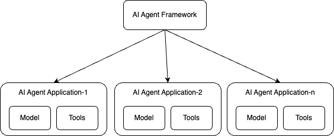

# AI Agent Observability - Evolving Standards and Best Practices | OpenTelemetry

## 核心信息

- **标题**: AI Agent Observability - Evolving Standards and Best Practices | OpenTelemetry
- **作者**: Guangya Liu (IBM), Sujay Solomon (Google)
- **日期**: 2025-03-06
- **来源类型**: 技术博客（OpenTelemetry 官方博客）
- **URL**: https://opentelemetry.io/blog/2025/ai-agent-observability/
- **PDF**: `[c-003]-opentelemetry-ai-agent-observability-standards.pdf`
- **证据质量**: low
- **关联概念**: Agent 可观测性、语义约定、遥测标准化、仪器化策略、GenAI SIG、供应商锁定

## 内容摘要

这篇博客由 IBM 的 Guangya Liu 与 Google 的 Sujay Solomon 联合撰写，发表于 OpenTelemetry 官方博客，系统性地阐述了 AI Agent 可观测性（observability）的标准化需求、当前进展与未来方向。

文章指出，2025 年被称为 "AI Agent 之年"，随着自主工作流和智能决策系统的快速普及，Agent 正在驱动跨行业的众多应用。

然而，Agent 的非确定性（non-deterministic）本质使得传统的监控、追踪和日志机制显得尤为关键——没有完善的可观测体系，企业级部署中的故障诊断、效率提升和可靠性保障将举步维艰。

文章首先界定了 AI Agent 的概念：Agent 是一种结合大语言模型（LLM）能力、外部工具连接和高层推理的应用程序，其目标是自主达成预设的最终状态；也可以将 Agent 视为由 LLM 动态指挥自身流程和工具使用的系统。

Google 的 AI Agent 白皮书为这一概念提供了理论基础，而 IBM、Microsoft、AWS 和 Anthropic 等厂商也从各自角度对 Agent 进行了定义和阐述。

这些定义虽然侧重点不同，但共同强调了 Agent 的自主性、工具使用能力和目标导向性。

在此基础上，作者强调 Agent 的可观测性不仅是监控与排障手段，更是持续学习和质量改进的反馈回路——遥测数据（telemetry）可以作为评估工具的输入，从而闭环优化 Agent 表现。

面对当前碎片化的可观测性格局，OpenTelemetry 的 GenAI 可观测性项目正在积极定义语义约定（semantic conventions），以统一遥测数据的采集和报告格式。

文章区分了 "AI Agent 应用" 与 "AI Agent 框架" 两个层次：前者指执行特定任务的自主实体，后者指开发、管理和部署 Agent 的基础设施（如 CrewAI、AutoGen、LangGraph、Semantic Kernel、PydanticAI、IBM Bee AI、IBM wxFlow 等）。

针对这两个层次，OpenTelemetry 分别推进 Agent 应用语义约定（已初步定稿，基于 Google AI Agent 白皮书）和 Agent 框架语义约定（正在社区讨论中），并允许各框架在遵循通用标准的前提下定义厂商特定的扩展约定。

在实现路径上，文章详细对比了两种主要的仪器化（instrumentation）策略：内建仪器化（baked-in instrumentation）和通过 OpenTelemetry 外部库进行仪器化。

前者将可观测性作为框架原生能力，降低用户上手门槛，但可能带来依赖膨胀和版本锁定风险；后者将可观测性与核心框架解耦，借助社区维护保持标准更新，却可能面临生态碎片化的问题。

文章还给出了针对不同角色的选型建议，并展望了未来更完善的语义约定、更紧密的 AI 模型可观测性集成，以及 OpenTelemetry GenAI SIG 在推动标准化方面的核心作用。

博客最后呼吁更广泛的社区参与，通过 CNCF Slack 和 GenAI SIG 例会共同塑造 AI 可观测性的未来标准。

从背景上看，这篇博客发表于 2025 年 3 月，正值各大云厂商和 AI 框架密集发布 Agent 相关产品的窗口期。

OpenTelemetry 此时推动 Agent 可观测性标准，具有明显的抢占生态话语权的战略意图。

作者来自 IBM 和 Google，这两家公司分别维护着 Bee Stack、wxFlow 等 Agent 框架，同时又是 OpenTelemetry 的核心贡献者，这种双重身份使得本文既具有技术标准的前瞻性，又不可避免地带有厂商生态布局的色彩。

阅读本文时需要意识到，文中对某些框架的提及可能反映了作者所在公司的利益关联。

## 关键要点

1. **Agent 可观测性的双重价值**

   对于传统应用，遥测数据用于监控和排障；对于 AI Agent，由于其非确定性行为，遥测数据还承担评估反馈和持续改进的关键角色，是连接运行时监控与离线评估的桥梁。

   这种双重定位意味着 Agent 的可观测性设计不能简单照搬微服务时代的模式，而需要同时满足运维人员、评估人员和 Agent 开发者三类角色的信息需求。

   运维人员关注系统健康度和异常告警，评估人员关注 Agent 决策质量和任务完成度，开发者则关注性能瓶颈和错误根因。

   这三类需求的信息粒度、更新频率和消费方式各不相同，对遥测系统的设计提出了分层服务的要求。

2. **标准化语义约定的紧迫性**

   当前各厂商和框架的遥测格式互不兼容，导致供应商锁定（vendor lock-in）。

   OpenTelemetry 通过 GenAI 可观测性项目推动统一标准，使不同框架的指标（metrics）、追踪（traces）和日志（logs）能够互操作和横向比较。

   标准化不仅降低迁移成本，也为第三方监控工具的蓬勃发展创造条件，避免因格式碎片化而重复造轮子。

   对于企业用户而言，统一标准意味着可以在不改动应用代码的情况下切换监控后端（backend），从而获得真正的可移植性。

   此外，标准化还有助于建立跨框架的基准测试（benchmarking）体系，使得不同 Agent 框架的性能对比具有可比性。

3. **两层语义约定架构**

   - **Agent 应用语义约定**：已基于 Google AI Agent 白皮书初步定稿，定义单个 Agent 实体的可观测性标准，包括 Agent 身份标识、工具调用语义、推理步骤标记等核心维度。该约定已在 OpenTelemetry 语义约定仓库中完成讨论和定稿，为框架层约定提供了概念基础。
   - **Agent 框架语义约定**：正在 OpenTelemetry 社区讨论中，目标是为 CrewAI、AutoGen、LangGraph、IBM Bee Stack、IBM wxFlow 等框架建立通用报告规范，同时保留厂商特定扩展（Vendor Specific Semantic Convention）的空间，兼顾统一性与灵活性。框架层约定是当前的工作重点，其难度也远高于应用层约定，因为不同框架的架构抽象差异较大。

4. **两种仪器化路径的详细权衡**

   - **内建仪器化（Baked-in）**：优势是开箱即用、简化配置、新功能发布即带遥测支持、保密性好（可在发布日即提供仪器化而无需提前暴露新功能）；劣势是增加框架体积、版本更新滞后、灵活性不足、高级用户难以自定义、可能无法获得 OTel 社区对语义约定的直接反馈。CrewAI 是采取此路径的代表性框架。
   - **外部 OpenTelemetry 库**：优势是解耦、社区维护、可混搭 contrib 库、更容易遵循最新语义约定、减轻框架核心维护负担；劣势是存在生态碎片化风险、contrib 包可能互不兼容、评审队列可能拖慢开发节奏、用户需要自行配置和集成。Traceloop 和 Langtrace 是此路径的代表，且 Traceloop 正尝试将其仪器化代码捐赠给 OpenTelemetry。

5. **框架开发者的最佳实践清单**

   无论选择哪种仪器化策略，都应提供易于启停遥测的配置开关，避免与外部仪器包冲突，并在文档中明确推荐配置。

   若选择内建方案，建议将框架列入 OpenTelemetry Registry 以提升可发现性。

   同时应预先规划与其他外部仪器包的共存策略，防止运行时冲突。

   还需确保仪器化代码遵循当前最佳实践，避免因闭门造车而导致与上游标准脱节。

   文章特别提到，框架开发者如果选择外部库路径，应确保与流行的 contrib 库兼容，并提供清晰的配置示例。

6. **应用开发者的选型考量**

   如果追求最小外部依赖和开箱即用的可观测性，应优先选择具备内建仪器化的框架。

   如果需要对遥测源和目的地进行细粒度控制，或者需要与利基工具或自定义监控方案集成，则外部库方案更为合适。

   无论哪种选择，都必须确保框架遵循 AI Agent 框架语义约定，以保障互操作性和数据一致性。

   文章还提醒应用开发者注意配置隔离，确保不同环境的遥测数据不会相互干扰。

7. **GenAI SIG 的角色与社区协作**

   OpenTelemetry 的 GenAI 特别兴趣组（SIG）正在主导 LLM、向量数据库（VectorDB）和 AI Agent 的语义约定制定，并扩展 Python 等语言的仪器化覆盖。

   文章明确呼吁更广泛的社区贡献，邀请开发者在 CNCF Slack 的 #otel-genai-instrumentation 频道参与讨论，或在 GenAI SIG 例会上直接贡献标准草案。

   SIG 的工作不仅限于约定制定，还包括为 Agent 和模型提供多语言的仪器化实现。

8. **未来演进方向**

   文章展望了 Agent 可观测性的四个演进维度：更鲁棒的语义约定以覆盖边界场景和新兴框架；统一的 AI Agent 框架语义约定确保跨框架互操作；AI Agent 语义约定的持续迭代以应对 Agent 形态的快速演化；改进的监控、调试和优化工具链；以及与 AI 模型可观测性的端到端集成，提供从模型层到 Agent 层的全链路可见性。

   这些方向共同构成了一个从标准到工具再到生态的完整发展蓝图。

9. **与传统可观测性的本质差异**

   传统应用的可观测性主要回答 "系统是否正常运行"，而 Agent 的可观测性还需要回答 "Agent 的决策是否合理"。

   后者涉及对 LLM 推理过程、工具调用序列和状态转换逻辑的深度理解，这要求遥测数据不仅包含时序指标，还要包含语义层面的结构化信息。

   语义约定的核心价值就在于为这些语义信息提供统一的表现形式。

10. **语义约定的具体覆盖范围**

    根据 OpenTelemetry 已有的实验性约定，GenAI 语义约定目前覆盖了模型推理（LLM spans）、向量数据库操作（VectorDB spans）等关键领域。

    Agent 应用语义约定在此基础上扩展了 Agent 身份（agent.id、agent.name）、工具调用（tool.name、tool.input、tool.output）、以及 Agent 间通信（agent-to-agent message attributes）等属性维度。

    这些属性定义了 Agent 遥测数据的最小必需集合，确保不同实现之间至少在这些核心维度上可互操作。

## 与综述的关联

这篇博客为综述中 "Agent 可观测性与追踪" 相关章节提供了来自工业界标准组织的一手视角。

OpenTelemetry 作为云原生计算基金会（CNCF）旗下的关键项目，其语义约定一旦成熟，将直接影响 Agent 框架的遥测数据格式、追踪链路结构以及跨框架性能对比的基准方法。

综述在讨论 Agent 系统架构时，可引用本文对 "Agent 应用" 与 "Agent 框架" 的层次划分，以及语义约定如何成为连接框架层与监控层的契约接口。

在 Agent 评估维度上，本文提出的 "遥测数据作为评估输入" 观点，与综述中 Agent 评测、错误诊断和持续优化等主题形成呼应——可观测性不仅是运维问题，更是 Agent 智能水平迭代的数据基础。

综述若涉及 Agent 部署的企业级实践，本文对标准化避免供应商锁定的论述可作为重要论据，说明为何在技术选型阶段就应关注框架的 OpenTelemetry 兼容性。

特别是当企业需要在多个框架之间进行横向对比或渐进式迁移时，统一的遥测格式将大幅降低评估成本。

从更宏观的视角看，本文揭示了一个正在形成中的行业标准博弈场：Google、IBM、Microsoft 等巨头通过 OpenTelemetry 这一中立平台协调各自的 Agent 框架利益，试图在标准制定阶段就确立有利于自身生态的约定形态。

综述在梳理 Agent 生态格局时，可将 OpenTelemetry 的语义约定进程作为观察工业界标准竞争的关键窗口。

特别是 IBM 和 Google 作为本文作者所在公司，同时又是 Bee Stack、wxFlow 等框架的维护方，其推动标准制定的动机和策略值得在综述中作为案例分析。

这种 "标准即权力" 的动态在云计算历史上反复出现，Agent 领域很可能正在重演类似剧本。

此外，本文对向量数据库语义约定的提及，为综述讨论 Agent 记忆与检索机制的可观测性提供了线索。

RAG（Retrieval-Augmented Generation）架构已成为现代 Agent 的核心组件之一，向量检索的延迟、命中率和召回率等指标的语义标准化，对于构建端到端的 Agent 可观测性同样至关重要。

如果综述涉及 Agent 的长期记忆和知识更新机制，可以补充讨论 VectorDB 语义约定与 Agent 语义约定之间的衔接问题。

从实践层面看，综述在讨论 Agent 系统的可观测性设计时，可以借鉴本文提出的两层架构思想：应用层关注单个 Agent 实体的行为和状态，框架层关注开发部署基础设施的遥测报告。

这种分层设计不仅适用于 OpenTelemetry，也可以作为其他可观测性方案（如 Prometheus + Grafana、Jaeger 等）的参考架构。

综述若对不同监控后端进行对比，可以引用本文的语义约定作为评估各后端 Agent 支持能力的基准。

在 Agent 安全与合规维度，标准化的遥测格式也为审计和监管提供了技术基础。

如果综述涉及 Agent 系统的可解释性和可审计性要求，OpenTelemetry 的语义约定可以被视为实现这些要求的基础设施层。

统一的追踪链路使得 Agent 的每一次工具调用、每一次 LLM 推理都可以被记录、查询和回放，这对于金融、医疗等高合规场景的 Agent 部署至关重要。

## 我的笔记

OpenTelemetry 这篇博客的价值在于它从标准制定者的视角，将 Agent 可观测性从单纯的技术工具提升到了生态基础设施的高度。

当前 Agent 框架百花齐放，但可观测性层面的各自为政已经成为规模化部署的隐性成本。

作者提出的两层语义约定（应用层 + 框架层）是一个务实的架构设计：应用层约定锚定 Agent 实体的基本语义，框架层约定则提供通用报告规范，同时通过 "Vendor Specific Semantic Convention" 保留创新空间。

这种 "通用基线 + 扩展面" 的模式在标准制定中较为常见，但执行难度不低，需要社区有足够强的协调机制来防止扩展面退化为新的碎片化源头。

两种仪器化路径的对比值得深入思考。

内建仪器化看似对终端用户最友好，但维护负担和版本锁定风险往往被低估——Agent 框架迭代速度极快，如果仪器化代码与框架核心强耦合，一旦 OpenTelemetry 语义约定演进，框架升级将被迫滞后。

相反，外部库方案虽然增加了用户的初始配置成本，却更符合云原生生态的解耦哲学。

一个可能的折中思路是：框架提供官方的 OpenTelemetry 集成插件（plugin），既保持核心轻量，又通过官方背书降低用户的配置门槛。

CrewAI 选择内建路径，而 Traceloop、Langtrace 等选择外部库路径，这两种模式的长期竞争将为社区提供宝贵的实证经验。

文中提到的遥测数据作为评估反馈回路，是笔者认为最具前瞻性的观点。

现有的 Agent 评估往往是一次性的离线评测（如基准测试得分），而运行时遥测数据包含大量在线行为信息（工具调用序列、LLM 推理延迟、错误恢复路径等），这些数据若经过结构化处理，完全可以成为在线评估和自动调优的信号源。

将可观测性与评估体系打通，可能是下一代 Agent 开发平台的关键差异化能力。

例如，追踪数据中的 span 可以天然对应 Agent 的推理步骤和工具调用，将这些 span 的时延分布和错误率作为评估指标，就能实现对 Agent 在线表现的持续监控。

此外，文章虽然提到向量数据库（VectorDB）的语义约定也在 GenAI SIG 的范畴内，但未展开论述。

考虑到 Retrieval-Augmented Generation（RAG）是当代 Agent 架构的核心组件之一，向量检索的延迟、命中率和召回率等指标的语义标准化，对于构建端到端的 Agent 可观测性同样至关重要。

综述若涉及 Agent 的记忆与检索机制，可补充讨论 VectorDB 语义约定与 Agent 语义约定之间的衔接问题。

在实际落地层面，本文的一个隐含挑战是如何说服已有大量用户的框架（如 LangChain、AutoGen）进行向后兼容的仪器化改造。

这些框架的早期版本并未考虑 OpenTelemetry 兼容性，如果标准约定要求侵入式的代码修改，框架维护者可能面临巨大的迁移成本。

因此，语义约定的设计应尽可能采用非侵入式的约定方式（如基于日志格式和 HTTP Header 的约定），降低存量框架的采纳门槛。

另一个值得关注的点是，本文虽然强调了标准化的重要性，但对 "如何平衡标准化与创新速度" 这一张力着墨不多。

Agent 领域的技术迭代极快，今天定义的语义约定可能在半年后就不再适用。

OpenTelemetry 需要建立一种敏捷的标准迭代机制，允许实验性约定快速进入、验证和演化，而不必等待漫长的社区共识形成过程。

GenAI SIG 的活跃程度将是决定这种敏捷性能否实现的关键变量。

*图注：Google AI Agent 白皮书中的 Agent 概念示意图，展示了 LLM、工具连接与高层推理的组合结构。该图帮助理解 Agent 应用语义约定所针对的核心实体边界。*

*图注：Agent 应用与 Agent 框架的层次关系示意。前者是自主执行任务的实体，后者是支撑开发部署的基础设施。图中列出的 CrewAI、AutoGen、LangGraph 等框架正是当前 OpenTelemetry 框架语义约定所瞄准的标准化对象。*
