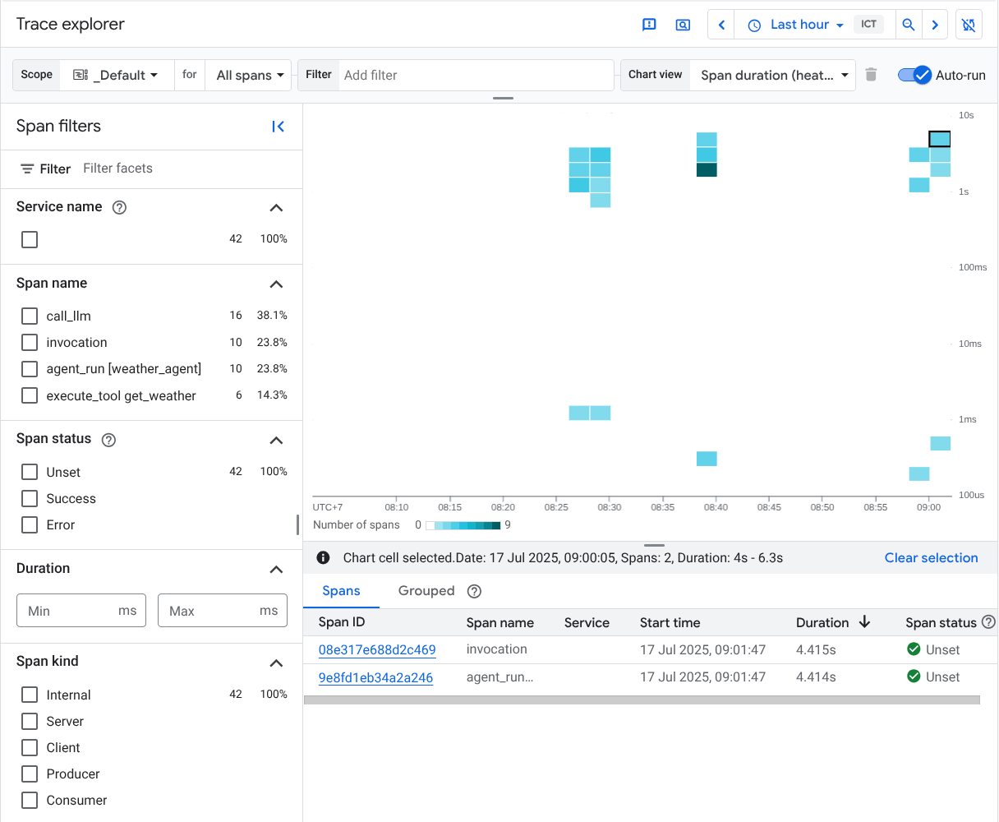

---
tags:
  - Google-Cloud
  - ADK
  - OpenTelemetry
  - Cloud-Trace
  - 可观测性
  - 分布式追踪
  - AI-Agent
  - 生产部署
  - 云原生
  - 追踪可视化
aliases:
  - Google Cloud Trace 与 ADK 集成观测指南
date: 2025-05-24
url: /home/hugulas/agent_trace_analysis/agentic_trace_insight/cited-materials/[s1-001]-google-cloud-trace-observability-for-adk.pdf
---

# Google Cloud Trace observability for ADK

## 核心信息

- **标题**: Google Cloud Trace observability for ADK - Agent Development Kit (ADK)
- **来源类型**: 官方技术文档
- **发布平台**: Google Cloud 官方文档（Agent Development Kit 文档站点）
- **核心主题**: 如何在基于 ADK 构建的 AI Agent 应用中集成 Google Cloud Trace，
  实现生产环境下的分布式追踪与可观测性
- **PDF 归档**: `[s1-001]-google-cloud-trace-observability-for-adk.pdf`
- **相关图片**:
  - `[s1-001]-cloud-trace1.png`
  - `[s1-001]-cloud-trace2.png`
  - `[s1-001]-cloud-trace3.png`
  - `[s1-001]-agent-development-kit.png`

## 内容摘要

本文档是 Google Cloud 官方为 Agent Development Kit（ADK）提供的可观测性集成指南，
核心目标是帮助开发者将本地开发阶段已经熟悉的 Agent 交互调试能力，
平滑延伸到云端生产环境。

ADK 在本地开发时已经内置了功能强大的 Web 开发 UI，
开发者可以通过该界面实时查看 Agent 的调用链、工具执行结果与中间状态。
然而，当 Agent 应用部署到云端后，面对真实流量与多实例并发场景，
开发者需要一个集中化的可观测性仪表盘来持续追踪请求链路、
定位性能瓶颈并快速排错。
Google Cloud Trace 正是为此而设计的关键组件，
它为 ADK 应用提供了从开发到生产全生命周期的追踪能力。

Cloud Trace 隶属于 Google Cloud Observability 产品家族，
专注于分布式追踪能力的提供。
对于 ADK 应用而言，Cloud Trace 能够实现对 Agent 交互过程的全面追踪，
帮助开发者理解请求如何在 Agent 的各个组件之间流转，
并识别出性能瓶颈或错误根因。
值得强调的是，Cloud Trace 的底层建立在 OpenTelemetry 这一开源标准之上，
支持多语言接入与多种数据摄入方式。
这与 ADK 自身的可观测性实践高度一致，
因为 ADK 同样采用了 OpenTelemetry 兼容的埋点机制，
使得两者之间的集成非常自然，
开发者无需担心数据格式转换或协议适配问题。
这种基于开源标准的架构选择，
在当前云厂商纷纷构建各自封闭生态的大背景下显得尤为珍贵，
因为它为企业在未来进行多云迁移或混合部署时保留了数据可移植性。

文档中详细介绍了三种启用 Cloud Trace 的方式，
体现了 Google 在不同使用场景下的分层设计思路。

第一种是通过 ADK CLI 在部署或运行 Agent 时直接添加 `--trace_to_cloud` 标志，
适用于使用 `agent_engine` 部署或 ADK Go launcher 运行 Agent 的场景。
这种方式最为简单直接，
适合希望快速验证追踪功能或进行标准部署的开发者，
几乎不需要修改任何代码即可获得完整的追踪数据上报能力。

第二种是利用 ADK App 抽象层，
在创建应用实例时设置 `enable_tracing=True` 参数即可自动开启云端追踪。
这种方式适合已经使用 ADK App 封装模式构建应用的场景，
开发者无需修改底层代码即可获得追踪能力，
体现了声明式配置的设计理念。

第三种则是面向需要完全自定义运行时的开发者，
通过直接调用 `google.adk.telemetry` 模块中的 `get_gcp_exporters()` 和
`maybe_set_otel_providers()` 等函数，
手动初始化并配置 OpenTelemetry 的全局 Provider。
这种分层设计兼顾了开箱即用的便捷性与底层定制的灵活性，
使得不同经验水平的开发者都能找到适合自己的接入方式，
同时也为高级用户预留了深度定制的空间。

在追踪数据被成功上报后，
开发者可以通过 Google Cloud Console 中的 Trace Explorer 查看所有由 ADK Agent 产生的追踪记录。
Trace Explorer 提供了热力图展示 Span 持续时间分布，
以及瀑布流视图直观呈现 Agent 执行路径中的各个阶段。
文档中的示例以一个天气查询 Agent 为示范，
展示了从 Agent 调用、内容生成到工具执行的完整追踪链路，
对应的 Span 名称包括 `invoke_agent`、`generate_content` 和 `execute_tool` 等。
这种细粒度的可视化能力，
对于诊断跨服务通信延迟、工具调用超时以及非确定性 Agent 行为尤为关键。
当 Agent 在执行过程中出现延迟异常时，
开发者可以通过瀑布流视图迅速定位是哪个工具调用或 LLM 推理步骤成为了瓶颈，
从而大幅缩短故障排查时间。

更进一步，文档还涉及了不同编程语言的实现差异，
体现了 ADK 跨语言一致性的设计追求。
Python 开发者可以通过 `google.adk.telemetry.google_cloud` 子模块获取 GCP exporter 配置，
TypeScript 开发者则使用 `@google/adk` 包中的 `getGcpExporters` 与 `maybeSetOtelProviders` 函数，
而 Go 开发者则通过 `google.golang.org/adk/telemetry` 包完成初始化。
这种跨语言的一致性体验，
体现了 Google 在 ADK 可观测性设计上追求"一套理念、多种实现"的工程哲学。
无论团队使用何种语言栈，都能获得一致的追踪语义与配置范式，
这对于多语言技术栈的企业团队尤为重要。
值得注意的是，所有语言的初始化流程都遵循相似的模式：
获取 exporter 配置、启用追踪、设置全局 Provider，
这种设计大大降低了开发者在不同语言之间切换时的认知成本，
也使得团队协作中的知识传递更加顺畅。

## 关键要点

1. **OpenTelemetry 标准化集成**
   Cloud Trace 与 ADK 均基于 OpenTelemetry 构建，避免了厂商锁定，
   追踪数据格式符合行业通用标准，便于与其他可观测性平台对接。
   开发者可以使用熟悉的 OTLP 协议与语义约定，降低学习成本，
   同时也为未来的多平台迁移保留了数据可移植性。
   这种标准化选择在当前云厂商竞相构建封闭生态的环境中显得尤为难得，
   是企业进行长期技术投资时的重要考量因素。

2. **三层启用机制**
   - CLI 层：通过 `--trace_to_cloud` 或 `-otel_to_cloud` 标志一键开启，
     适合快速验证与标准部署场景；
   - App 抽象层：通过 `enable_tracing=True` 参数自动配置，
     适合使用 ADK App 封装的应用；
   - 底层模块层：通过 `google.adk.telemetry` 手动初始化 exporter 与 provider，
     适合需要自定义采样策略、标签注入或私有运行时的高级场景。

3. **细粒度追踪覆盖**
   ADK 自动为 Agent 调用、LLM 内容生成、工具执行等关键操作生成 Span，
   覆盖了 Agent 执行路径的核心节点。
   开发者无需手动埋点即可获得开箱即用的追踪数据，
   大大降低了可观测性接入的门槛。
   这种自动埋点机制对于快速迭代阶段的团队尤为宝贵，
   因为它允许团队在不影响开发速度的前提下获得生产级的可观测性能力。

4. **可视化排错工具**
   Trace Explorer 提供热力图与瀑布流视图，
   支持快速定位延迟热点与错误来源，
   显著提升复杂 Agent 工作流的调试效率。
   瀑布流视图尤其适合分析工具调用之间的串行依赖关系，
   帮助开发者理解 Agent 决策过程中的时间分布特征。
   热力图则能帮助开发者发现系统中存在的系统性延迟模式，
   例如特定时间段内的性能退化趋势。

5. **多语言统一体验**
   文档示例涵盖 Python、TypeScript 与 Go，
   体现了 ADK 跨语言统一可观测性体验的设计思路。
   无论团队使用何种语言栈，都能获得一致的追踪语义与配置范式，
   确保多语言项目中的可观测性标准统一。
   这种一致性对于大型企业中的异构技术栈尤为重要，
   可以有效避免因语言差异导致的可观测性碎片化问题。

6. **生产环境就绪**
   从本地 Web UI 调试到云端 Cloud Trace 观测，
   ADK 提供了贯穿开发与生产全生命周期的可观测性支持，
   帮助企业实现从原型到规模的平稳过渡，
   减少环境切换带来的认知摩擦。
   开发者可以在本地已经熟悉追踪数据的结构，
   到生产环境后无需重新学习，
   这种一致性体验对于提升团队整体效率具有显著价值。

7. **与 Google Cloud 生态深度整合**
   追踪数据的认证、路由与存储均由 Google Cloud 基础设施托管，
   开发者无需自行维护 OpenTelemetry Collector 集群，
   降低了运维复杂度，
   但同时也意味着对 Google Cloud 平台的依赖性增加。
   企业在享受便捷的同时需要评估长期的数据主权风险，
   特别是在涉及敏感数据的场景中，
   需要仔细审查数据留存策略与访问控制机制。

8. **Span 语义规范**
   ADK 遵循一致的 Span 命名规范，
   如 `invoke_agent`、`generate_content`、`execute_tool` 等，
   使得不同 Agent 应用的追踪数据具有可比性。
   这种语义标准化是后续进行跨 Agent 性能分析与基准对比的基础，
   也是构建统一可观测性平台的前提条件。

9. **环境变量驱动的配置**
   Cloud Trace 的集成大量依赖环境变量
   （如 `GOOGLE_CLOUD_PROJECT`、`GOOGLE_CLOUD_LOCATION`、`GOOGLE_GENAI_USE_VERTEXAI`）
   进行项目配置，
   这种设计使得配置管理可以与容器编排平台
   （如 Kubernetes ConfigMap 或 Cloud Run 环境变量）无缝集成，
   便于在 CI/CD 流水线中进行环境隔离与配置注入。

10. **自动上下文传播**
    基于 OpenTelemetry 的上下文传播机制，
    Cloud Trace 能够自动追踪跨服务边界的请求链路。
    当 Agent 调用外部工具或与其他微服务交互时，
    追踪上下文会自动传递，确保端到端的请求路径完整可见。
    这种能力对于理解现代分布式 Agent 架构中的请求流向至关重要。

## 与综述的关联

本材料为综述中"云厂商原生 Agent 可观测性方案"章节提供了 Google Cloud 侧的第一手技术实现细节。
与 Amazon Bedrock AgentCore 的 CloudWatch 集成（s1-007）、
Amazon CloudWatch 生成式 AI 可观测性（s1-006）相比，
Google Cloud 的方案更强调 OpenTelemetry 标准兼容性，
这为综述中"标准化 vs 厂商专属方案"的对比分析提供了重要论据。
Google 选择以开源标准作为可观测性底座，
而 AWS 更倾向于围绕自有 CloudWatch 生态构建垂直整合，
这两种路线代表了当前云厂商在 Agent 基础设施领域的两种典型哲学。
前者更注重生态开放性与未来可扩展性，
后者则更强调与现有云服务的深度整合和自动化联动，
企业在做技术选型时需要根据自身的多云策略和工具链现状做出权衡。

此外，文档中关于跨服务延迟诊断、工具调用追踪的实践经验，
可直接支撑综述中"Agent 执行轨迹追踪"与"性能瓶颈定位"两个技术主题的论述。
在多 Agent 协作场景中，
一次用户请求可能触发跨多个 Agent 实例、工具服务与外部 API 的复杂调用链，
Cloud Trace 所展示的瀑布流视图正是理解这种分布式执行路径的关键工具。
对于长程任务而言，
追踪数据还能帮助开发者分析 Agent 在不同阶段的决策质量与效率，
为后续优化提供数据支撑。
这些实践经验对于综述中"如何设计可观测的 Agent 架构"的建议具有直接的参考价值，
特别是在涉及递归调用、循环执行和条件分支等复杂控制流时，
追踪数据的可读性与完整性成为关键设计考量。

文档所展示的三层启用机制（CLI、App 抽象、底层模块），
也为综述讨论"可观测性接入的易用性与灵活性权衡"提供了具体案例。
在实际工程中，过于简单的接入方式可能无法满足高级定制需求，
而过于复杂的配置又会吓退普通开发者。
ADK 的分层设计试图在两者之间取得平衡，
这一思路对于综述中关于"Agent 可观测性最佳实践"的建议具有参考价值。
这种分层模式也可以为其他 Agent 框架的可观测性设计提供借鉴，
例如 LangChain 的回调系统或 LlamaIndex 的事件处理器，
都可以参考这种渐进式复杂度设计来提升开发者体验。

从更宏观的视角看，
Google 将 Cloud Trace 与 ADK 深度绑定的策略，
也反映了云厂商试图通过可观测性能力锁定开发者生态的竞争逻辑。
当企业的 Agent 追踪数据全部沉淀在 Cloud Trace 中时，
迁移至其他云平台的成本将显著增加，
因为历史追踪数据的可移植性往往被忽视。
综述在讨论"可观测性数据的可移植性"与"避免厂商锁定"时，
可引用此案例作为警示，
提醒企业在享受便捷的同时关注长期的数据主权问题。
这一论点与综述中关于"Agent 平台锁定风险"的讨论
（s1-002、Vertex AI 竞争分析）形成了呼应，
共同构成了企业级 Agent 技术选型中需要审慎评估的维度。

## 我的笔记

Google 将 Cloud Trace 与 ADK 深度集成的策略非常清晰：
本地用 Web UI 做开发调试，云端用 Cloud Trace 做生产观测，
两者形成完整的开发生命周期闭环。
这种分层可观测性设计避免了开发者在不同阶段切换工具链的认知负担，
从工程体验角度来说是极为出色的设计。
开发者在本地已经通过 Web UI 熟悉了追踪数据的结构与语义，
切换到生产环境后看到 Cloud Trace 中的数据会感到高度一致，
这种连贯性对于降低学习曲线非常关键。
对于已经习惯使用 OpenTelemetry 的开发者来说，
这种一致性体验更加突出，
因为他们可以将已有的可观测性知识和工具链直接应用到 ADK 项目中。

从实现角度看，
ADK 在 telemetry 模块中封装了 GCP exporter 的初始化逻辑，
开发者无需手动配置 OTLP endpoint 或认证信息，
降低了 OpenTelemetry 的上手门槛。
这对于不熟悉可观测性技术栈的 AI 开发者尤其友好，
因为他们可以将更多精力集中在 Agent 逻辑本身，而非基础设施配置。
但这也意味着如果开发者希望将追踪数据同时发送到第三方平台
（如 Datadog 或 Jaeger），
需要额外配置多路导出（multi-export），
文档对此并未展开说明，
这在生产环境中是一个常见的需求场景，值得后续补充调研。
实际生产中，企业通常需要将追踪数据同时发送至内部监控平台和外部 SaaS 服务，
以实现多层次的可观测性覆盖。

文档中的天气 Agent 示例虽然简单，
但很好地展示了追踪数据的结构层次：
Agent 入口 Span 作为根节点，
LLM 生成内容作为子 Span，
工具调用再作为下一层子 Span。
在实际生产场景中，
多 Agent 协作、长程任务链、递归工具调用等复杂模式会显著增加追踪树的深度与分支数量，
此时 Trace Explorer 的瀑布流视图是否仍然保持足够的可读性，
值得在实际部署中验证。
当追踪树深度超过数十层时，
可视化工具的交互设计将成为影响排错效率的关键因素，
可能需要借助自定义过滤与折叠功能来提升可用性。
对于特别复杂的 Agent 系统，
甚至需要考虑自定义可视化工具来替代通用的 Trace Explorer，
或者将追踪数据导出到专门的 APM 平台进行分析。

另一个值得关注的点是，
Cloud Trace 的计费模型基于 Span 数量上报。
对于高频调用的 Agent 应用，全量开启追踪可能带来显著的成本开销。
文档未提及采样策略（sampling）的配置方法，
这是生产部署前需要补充调研的方向。
tail-based sampling 或概率采样对于高流量 Agent 场景至关重要，
前者可以保留异常追踪而丢弃正常追踪，
后者则以固定概率减少总体数据量。
结合综述中关于"成本可观测性"的讨论（s3-014、s3-015），
Span 级别的成本归因也是未来可以深挖的课题。
当 Agent 应用的日调用量达到百万级别时，
Span 成本甚至可能超过计算成本本身，
因此合理的采样策略不仅是技术问题，也是经济问题。

从与其他厂商方案的对比来看，
Google 基于 OpenTelemetry 的路线在标准兼容性上具有天然优势，
但 AWS 的 CloudWatch 垂直整合在告警自动化、与 IAM 和自动扩缩容联动方面可能更为成熟。
综述在比较不同厂商方案时，
应当避免简单的"谁更好"判断，
而是根据企业的技术栈现状、多云策略与合规要求给出差异化的选型建议。
对于已经深度使用 Google Cloud 的企业，
ADK 与 Cloud Trace 的组合无疑是最自然的选择；
而对于多云架构或已有成熟可观测性体系的企业，
则需要更仔细地评估数据导出与集成的可行性。
混合云场景下的可观测性架构设计，
可能是综述中可以进一步展开的方向，
特别是关于跨云追踪数据关联与统一分析的技术挑战。

最后，文档中提及的 Go 语言支持值得注意。
ADK 最初以 Python 为主力语言，后续扩展到 TypeScript 和 Java，现在又加入了 Go。
这种多语言支持的演进，反映了 Google 试图覆盖更广泛开发者群体的野心。
对于可观测性而言，跨语言一致的追踪语义至关重要，
OpenTelemetry 正好为此提供了统一的基础。
未来如果 ADK 继续扩展至 Rust 或 C# 等语言，
其可观测性体系的可扩展性将面临新的考验。
在综述中关于"Agent 框架多语言支持趋势"的讨论中，
ADK 的案例可以作为重要的参照点。
同时，多语言支持也对测试和文档提出了更高要求，
因为每种语言的 SDK 都需要保持一致的追踪行为与配置接口，
这对工程团队的维护能力是一个不小的挑战。

