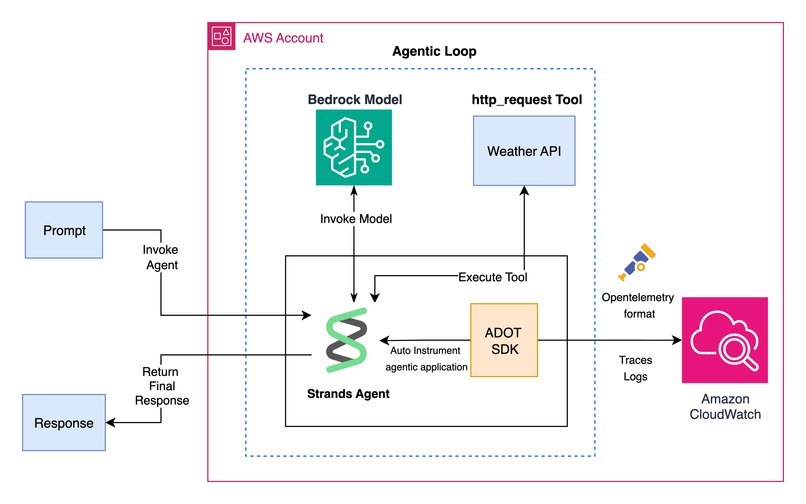

---
tags:
  - aws
  - cloudwatch
  - generative-ai
  - observability
  - opentelemetry
  - bedrock
  - agentcore
  - github-repo
aliases:
  - "Amazon CloudWatch generative AI observability samples"
  - "AWS CloudWatch GenAI Observability"
date: 2025-09-16
url: https://github.com/aws-samples/sample-amazon-cloudwatch-generative-ai-observability
---

# Amazon CloudWatch Generative AI Observability Samples

## 核心信息

- **标题**: Amazon CloudWatch generative AI observability samples
- **来源**: AWS 官方示例仓库（aws-samples）
- **类型**: GitHub 仓库与部署示例文档
- **日期**: 2025-09-16
- **URL**: https://github.com/aws-samples/sample-amazon-cloudwatch-generative-ai-observability
- **本地文件**: `[s1-006]-amazon-cloudwatch-generative-ai-observability-samples.pdf`
- **证据质量**: high（官方发布，覆盖多种部署场景）

## 内容摘要

本仓库是 AWS 官方提供的生成式 AI 可观测性示例集合，核心目标是演示如何在多种主流 AWS 计算平台上，为基于大语言模型的智能应用构建端到端的可观测性体系。该体系以 Amazon CloudWatch Generative AI Observability（预览版）为核心监控平台，通过 OpenTelemetry 实现分布式追踪与指标采集，覆盖从模型推理调用、Agent 执行轨迹到基础设施运行状态的全链路监控。

仓库以一个天气查询 Agent 作为贯穿所有场景的示例应用。该应用采用 Python 开发，技术栈包含 Strands Agent Framework（用于构建 AI 驱动的天气助手）、National Weather Service API（气象数据源）、Amazon Bedrock（提供 Claude Sonnet 4 等大模型的推理能力）、OpenTelemetry（分布式追踪与可观测性数据采集）以及 Amazon CloudWatch（日志、追踪与指标的统一存储与可视化）。这种设计使得开发者可以将同一个应用部署到四种不同的 AWS 计算环境中，直观对比各环境下可观测性方案的差异与共性。

在架构层面，示例展示了如何通过 AWS Distro for OpenTelemetry（ADOT）Python 自动埋点 SDK，将天气 Agent 的运行时遥测数据发送至 Amazon CloudWatch。ADOT 的自动埋点机制显著降低了接入门槛——开发者无需手动修改大量业务代码，仅需在应用启动时配置 OpenTelemetry 探针，即可自动捕获 LLM 调用、工具执行、推理延迟等关键遥测信号。这种埋点方式对 Strands、LangChain、LangGraph 等主流 Agent 框架均具有良好的兼容性。

仓库提供了四种部署方案，分别对应企业级 AI 应用最常见的四种基础设施选型：

第一种是 Amazon Bedrock AgentCore 部署，采用无服务器方式托管 AI Agent。开发者只需配置 IAM 执行角色与 Agent 运行时 ARN，即可将天气 Agent 部署为托管服务，CloudWatch 会自动采集其模型调用、执行步骤与延迟指标。该方案适合希望完全免除基础设施运维负担的场景。

第二种是 Amazon EKS 部署，通过 Helm Chart 将天气 Agent 以容器化服务的形式运行在 Kubernetes 集群中。示例包含完整的 Docker 构建配置、可自定义的 Helm values 文件以及 EKS Pod Identity 集成，确保容器能够以安全的 IAM 角色方式访问 AWS 服务。该方案适合已有 Kubernetes 基础设施的团队。

第三种是 Amazon ECS 部署，利用 CloudFormation 模板一键创建完整的 Fargate 无服务器容器环境。模板中包含了任务定义、IAM 角色（精细授权至 Bedrock 模型调用、CloudWatch 日志写入与 X-Ray 追踪）、以及 Session Manager 与 ECS Exec 调试通道。该方案适合偏好声明式基础设施管理且不希望维护服务器的团队。

第四种是 Amazon EC2 部署，通过 CloudFormation 模板自动创建 VPC、EC2 实例并安装 Python 3.12 及全部依赖。该方案保留了最大的可控性与调试灵活性，同时通过 AWS Systems Manager Session Manager 提供基于 IAM 的安全远程访问，避免了直接暴露 SSH 端口。

在可观测性功能方面，Amazon CloudWatch Generative AI Observability 提供了专门针对生成式 AI 工作负载的监控能力，包括对 Amazon Bedrock AgentCore Agent 的深度支持。平台内置了 Model Invocations Dashboard（模型调用仪表板）与 Bedrock AgentCore Agents Dashboard（Agent 运行仪表板），支持按应用或用户维度进行成本归因，并提供端到端的 prompt tracing（提示词追踪）能力。这些功能使开发者能够清晰地看到每一次模型调用的输入输出、延迟分布、token 消耗以及执行链路中的每一步状态转换。

除了可视化仪表板之外，该服务还集成了 Transaction Search 功能，允许开发者在 CloudWatch 控制台中通过关键词、时间范围与追踪属性进行交互式查询。这意味着当某个用户反馈 Agent 回答异常时，运维人员可以快速检索到对应的完整执行链路，查看每一步的输入输出、工具调用结果与模型响应，从而将问题定位时间从小时级缩短到分钟级。

配置方面，所有部署示例默认使用 Claude Sonnet 4（`us.anthropic.claude-sonnet-4-20250514-v1:0`）与 `us-east-1` 区域，但开发者可以根据实际需求修改模型 ID 与区域名称。对于 Bedrock AgentCore 部署，需要在部署完成后将生成的 Agent 运行时 ARN 更新到 `invoke.py` 配置文件中，以便客户端正确调用托管 Agent。Bedrock AgentCore 方案的项目结构包含 `agent.py`（Agent 定义）、`invoke.py`（调用入口）、`requirements.txt`（依赖管理）等核心文件，代码量精简，便于开发者快速理解其工作原理。

EKS 方案的项目结构则更为完整，包含 `docker/app/` 目录下的应用代码与 Dockerfile，以及 `chart/` 目录下的 Helm Chart 模板与 values 配置。ECS 方案采用单一的 CloudFormation 模板 `weather-agent-ecs.yaml` 定义完整的 Fargate 任务与网络环境。EC2 方案同样使用 CloudFormation 模板，并额外提供了 `app-customspan.py` 示例，演示如何创建自定义追踪 span 以补充自动埋点未覆盖的业务语义。

## 关键要点

1. **多平台部署范式**
   单一示例应用覆盖 Bedrock AgentCore、EKS、ECS、EC2 四种 AWS 计算平台，为不同基础设施成熟度的团队提供了可直接复用的可观测性部署模板。

2. **OpenTelemetry 自动埋点**
   基于 ADOT Python SDK 的自动埋点机制，无需侵入式修改业务代码即可采集 LLM 调用、工具执行与分布式追踪数据，兼容 Strands、LangChain、LangGraph 等主流框架。

3. **端到端 Prompt Tracing**
   CloudWatch Generative AI Observability 提供从用户请求到模型响应的完整链路追踪，包括输入提示词、输出内容、token 消耗与每一步工具调用的详细时序。

4. **预置可视化仪表板**
   内置 Model Invocations Dashboard 与 Bedrock AgentCore Agents Dashboard，开箱即用，支持成本按应用/用户维度拆分，降低运营分析门槛。

5. **精细化 IAM 授权**
   每个部署示例均配置了最小权限原则的 IAM 角色与策略，精确授权至 Bedrock 模型调用、CloudWatch 日志写入、X-Ray 追踪提交等具体操作。

6. **基础设施即代码**
   ECS 与 EC2 方案采用 CloudFormation 模板，EKS 方案采用 Helm Chart，均支持声明式部署与版本控制，便于团队协作与合规审计。

7. **安全访问通道**
   EC2 方案通过 Systems Manager Session Manager 实现无 SSH 端口的远程访问；ECS 方案集成 ECS Exec 与 Session Manager，兼顾调试便利性与安全合规。

8. **灵活的模型与区域配置**
   所有示例均预留了模型 ID 与区域名称的配置入口，开发者可依据成本、延迟与合规要求切换至其他 Bedrock 模型或 AWS 区域。

9. **自定义 Span 扩展能力**
   EC2 方案中的 `app-customspan.py` 展示了如何在自动埋点基础上手动创建自定义追踪 span，用于捕获业务语义（如用户查询意图分类、外部 API 响应质量评分）等自动埋点无法感知的维度。

10. **Transaction Search 交互式检索**
    CloudWatch 控制台中的 Transaction Search 功能支持按关键词、时间范围与追踪属性进行交互式查询，使运维人员能够快速定位特定用户会话或异常执行的完整链路。

## 与综述的关联

本仓库是综述中"云原生 Agent 可观测性工程实践"章节的核心参考来源之一 [s1-006]。具体而言：

- **多平台可观测性覆盖**
  综述引用该仓库论证 AWS 生态对生成式 AI 可观测性的系统性支持，说明同一套 OpenTelemetry 埋点方案如何在无服务器（AgentCore、Fargate）、容器编排（EKS）与虚拟机（EC2）三种计算范式间无缝迁移。

- **自动埋点与框架兼容**
  综述在讨论 Agent 框架观测性接入时，以 ADOT Python SDK 作为自动埋点的工程范例，指出其对 Strands、LangChain、LangGraph 的兼容性是当前云厂商可观测性方案的重要差异化能力。

- **Prompt Tracing 与成本归因**
  综述将 CloudWatch Generative AI Observability 的端到端 prompt tracing 和按应用/用户维度的成本归因功能，作为企业级 Agent 运营必备能力的代表实现。

- **安全与合规设计**
  综述在讨论观测性数据采集的安全边界时，引用该仓库中精细化的 IAM 策略设计（如限定仅允许特定 Bedrock 模型调用与 CloudWatch 日志写入），作为最小权限原则在 AI 可观测性场景下的最佳实践。

- **与 Bedrock AgentCore 的集成**
  综述将 Bedrock AgentCore 与 Cloudwatch 的原生集成关系，作为云厂商垂直整合 Agent 运行时与观测性平台的典型案例，与 Google Cloud Trace for ADK、Azure Monitor for Copilot 等形成横向对比。

- **自定义 Span 与业务语义**
  综述引用 EC2 方案中的 `app-customspan.py` 示例，说明在自动埋点之外，开发者仍需通过手动创建自定义 span 来捕获业务层面的语义信息（如用户意图分类、工具调用结果质量评估），这一实践对于构建完整的 Agent 可观测性体系具有重要参考价值。

- **基础设施即代码的合规价值**
  综述在讨论 AI 可观测性方案的合规审计需求时，引用该仓库的 CloudFormation 与 Helm 模板作为"可观测性即代码"的落地范例，说明声明式部署如何满足变更管理与合规追溯的要求。

## 我的笔记

该仓库的价值不仅在于提供了四种可直接运行的部署示例，更在于它构建了一个完整的"可观测性即代码"参考框架。从工程实践角度，我认为以下几点值得在综述中深入展开：

第一，多平台一致性体验的设计思路。同一套 Python 应用代码配合不同的基础设施即代码模板（CloudFormation、Helm），即可在四种计算环境中获得一致的可观测性体验，这种"一次埋点，多处运行"的设计理念对于企业级 Agent 落地至关重要。实际生产环境中，团队往往需要在开发阶段使用 EC2 进行调试，在测试阶段使用 ECS Fargate 进行快速验证，在生产阶段使用 EKS 进行大规模编排，同时部分场景可能直接采用 Bedrock AgentCore 免除运维负担。该仓库证明了 OpenTelemetry 作为跨平台观测性标准的核心价值。

第二，自动埋点对开发者体验的改善。传统的可观测性接入往往需要开发者在每个 LLM 调用点、每次工具执行处手动插入追踪代码，这不仅增加了代码复杂度，也容易因遗漏而导致观测盲区。ADOT Python SDK 的自动埋点机制通过运行时字节码注入或框架钩子（hook）实现无侵入式采集，这种设计哲学值得在综述的"观测性接入成本"分析中重点讨论。

第三，CloudWatch Generative AI Observability 的专用化能力值得关注。与通用可观测性平台不同，该服务针对 LLM 调用特性提供了 prompt tracing、token 消耗归因、模型调用延迟分布等专属功能，这些能力对于优化 Agent 性能与控制成本具有直接的业务价值。特别是成本按应用/用户维度的拆分能力，在多租户 Agent 平台场景下几乎是刚需。

需要进一步追踪的问题包括：

- CloudWatch Generative AI Observability 预览版的功能成熟度与正式发布时间线
- ADOT Python SDK 自动埋点对异步 Agent 框架（如 LangGraph 的异步图执行）的兼容性
- 在高并发场景下，OpenTelemetry Collector 的批处理与采样策略对观测数据完整性的影响
- Bedrock AgentCore 与 CloudWatch 集成的延迟指标是否包含模型首 token 延迟（TTFT）与逐 token 延迟等细粒度数据

第四，Transaction Search 的交互式查询能力在实际运维场景中具有极高的实用价值。传统的日志检索往往面临信息碎片化的问题——日志、指标、追踪分散在不同的存储系统中，运维人员需要切换多个界面才能拼凑出问题的全貌。CloudWatch Generative AI Observability 通过 Transaction Search 将这三类数据统一在同一个查询界面中，使得一次检索即可获取完整的执行上下文。这种统一检索体验对于降低 MTTR（平均修复时间）具有直接的帮助。

第五，自定义 span 的示例揭示了自动埋点的边界。虽然 ADOT Python SDK 能够自动捕获框架层面的调用信息，但业务层面的语义信息（如"本次查询属于天气预警类请求"、"外部 API 返回的数据置信度为 0.85"）仍然需要开发者手动埋点。这提示我们在设计 Agent 可观测性方案时，应当将自动埋点视为基础层，而将自定义 span 视为业务层，两者结合才能构建完整的观测体系。

需要进一步追踪的问题包括：

- CloudWatch Generative AI Observability 预览版的功能成熟度与正式发布时间线
- ADOT Python SDK 自动埋点对异步 Agent 框架（如 LangGraph 的异步图执行）的兼容性
- 在高并发场景下，OpenTelemetry Collector 的批处理与采样策略对观测数据完整性的影响
- Bedrock AgentCore 与 CloudWatch 集成的延迟指标是否包含模型首 token 延迟（TTFT）与逐 token 延迟等细粒度数据
- 自定义 span 的命名规范与属性键值对的最佳实践建议
- CloudWatch Generative AI Observability 对多模态模型（图像、音频输入输出）的追踪支持计划
- CloudWatch 与第三方可观测性平台（如 Datadog、New Relic）的数据导出与双向集成能力
- ADOT Python SDK 在不同 Python 版本（3.10、3.11、3.12）下的性能基准差异

从复现角度，该仓库的部署文档较为完整，prerequisites 明确列出了 IAM 权限、Python 版本、容器运行时与 Bedrock 模型访问权限等前置条件。对于希望在本地快速体验的团队，建议从 EC2 方案入手——CloudFormation 模板自动化程度最高，且 EC2 环境便于通过 Session Manager 进行实时调试。对于已有 Kubernetes 基础设施的团队，EKS 方案的 Helm Chart 结构清晰，values 文件的可配置项覆盖了镜像版本、副本数、资源限制等关键参数，生产化改造的门槛相对较低。ECS 方案则适合希望快速验证概念验证（PoC）的团队，单一 CloudFormation 模板即可在十分钟内创建完整的 Fargate 服务。Bedrock AgentCore 方案最简洁，几乎无需基础设施配置，适合完全没有运维经验的开发者快速体验可观测性能力。

最后，该仓库的示例应用选择天气查询作为场景是一个巧妙的设计决策。天气查询涉及自然语言理解、外部 API 调用、结构化数据解析与生成式回复等多个环节，能够充分展示 Agent 执行链路中的典型追踪场景。同时，National Weather Service API 是免费公开的，这使得示例的复现成本几乎为零，开发者无需申请付费 API 密钥即可完整体验端到端的可观测性流程。这种低门槛的示例设计对于推广可观测性最佳实践具有重要的教育意义。

综上所述，Amazon CloudWatch Generative AI Observability Samples 不仅是一套部署示例，更是一份关于如何在云原生环境中系统化构建 AI 可观测性体系的工程指南。它所体现的多平台一致性、自动埋点低侵入性、预置可视化能力与基础设施即代码的合规价值，均为综述提供了丰富的实践论据与可直接引用的工程范式。
