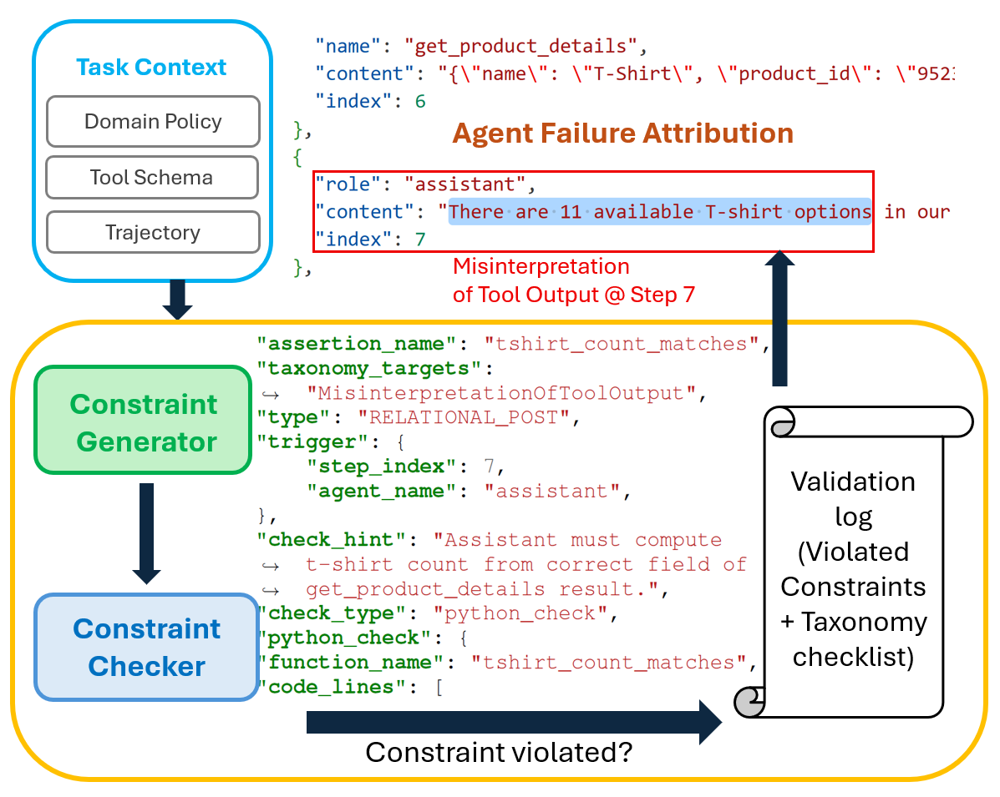
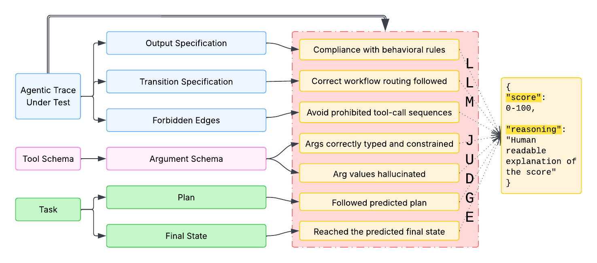
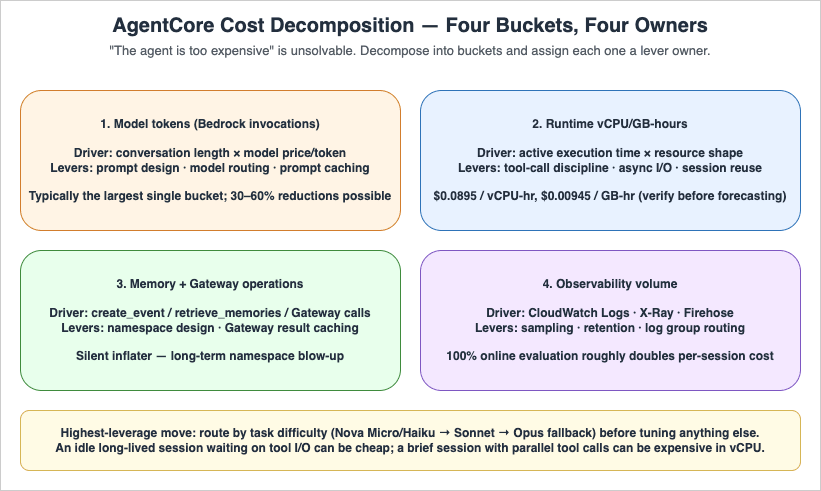
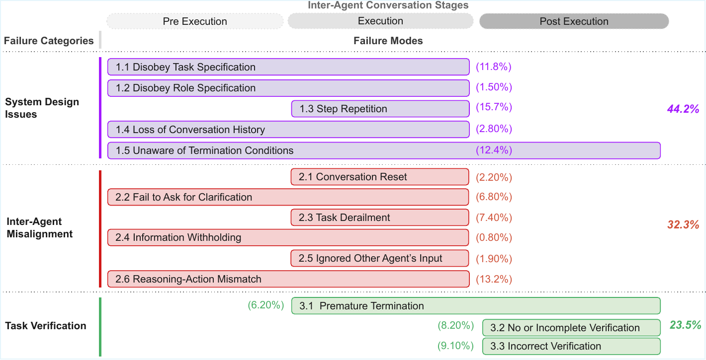

# 智能体轨迹可观测性综述：从日志采集到诊断、评测与治理

> 时间边界：2023-2026  
> 语料基础：`agentic_trace_insight/notes` 中的 117 篇本地笔记，以及由这些笔记刷新得到的 `llm-wiki` 词条、观点与对比页  
> 报告性质：研究与工程综述，不是产品选型白皮书

---

## 摘要

智能体可观测性正在从“记录模型调用日志”的工程附属功能，演变为支撑智能体可靠性、安全性、合规性和成本控制的核心基础设施。117 篇本地笔记覆盖了学术论文、产品文档、工程博客、标准草案和产业材料；它们共同指向一个清晰结论：智能体系统的关键问题已经不再只是“最终答案对不对”，而是“执行过程中发生了什么、哪里首先不可恢复地出错、是否违反系统规范、证据能否被审计、成本能否被归因”。

本综述将现有材料重构为五层架构。第一层是轨迹证据层，负责将用户意图、模型消息、工具调用、工具返回、状态变化、记忆读写、环境观测和评测结果组织成可复用证据。第二层是 schema 与插桩层，围绕 OpenTelemetry、OpenInference、AgentTrace、Hermes trajectory format 和平台自定义格式展开，解决跨框架采集与语义保真问题。第三层是诊断与归因层，以 AgentRx、Who&When、DoVer、HORIZON、AgentDiagnose、MASPrism 等工作为代表，试图回答“哪个智能体、哪个步骤、哪条依赖链导致失败”。第四层是过程评测与治理层，以 AgentPex、Monitoring Monitorability、HarnessAudit、AgentPro、安全审计和防篡改 audit trail 为代表，强调最终成功率不足以覆盖过程违规、策略绕过和不可追责行为。第五层是生产平台与 token 经济层，包括 Langfuse、Arize Phoenix、Braintrust、AgentOps、Helicone、Datadog、Splunk、Elastic、New Relic、AWS、Google、阿里云、百度、Coze 等产品材料，显示可观测性正在与评估、数据集、实验、成本、预算和合规平台合流。

全文的核心判断是：智能体可观测性的真正对象不是日志，而是“可行动证据”。日志只回答发生了什么；可行动证据还必须支持失败定位、过程合规、审计追责、成本归因、预算控制和系统演化。因而，未来的智能体可观测系统不会只是 APM 的 LLM 插件，而会成为连接运行时、评测器、诊断器、安全策略、数据飞轮、token 经济学和 harness 工程的公共证据层。

---

## 1. 范围与材料组织

本综述的材料来自四类来源。

第一类是智能体轨迹诊断和评测论文，主要包括 AgentRx、AgentPex、AIOpsLab、DoVer、PROBE、Monitoring Monitorability、Beyond the Black Box、Continual Harness、Agentic Harness Engineering、Meerkat、AgentTrace、VCC、HORIZON、HarnessAudit、EAGER、OpsAgent、SeqCV、Why Do Multi-Agent LLM Systems Fail、Who&When、EvoCF、Lifting Traces to Logic、AgentSight、AgentPro、Do Code Semantics Help、FLARE、AgentDiagnose 和 Teaching Text Agents to Learn from Failure 等 `p-001` 到 `p-030` 条目。

第二类是 agent 可观测性、trace schema、OpenTelemetry、OpenInference、audit trail、安全护栏、MCP tracing 和产品架构相关技术材料，主要分布在 `c-*` 与 `s3-*` 条目。

第三类是云平台与商业工具材料，覆盖 Google ADK / Vertex AI、AWS Bedrock AgentCore、阿里云 AgentLoop、百炼、百度千帆、Coze Loop、Datadog、Splunk、Elastic、New Relic、LangSmith、Langfuse、Arize Phoenix、Braintrust、AgentOps、Helicone 等。

第四类是 coding agent 与 agent framework 材料，覆盖 Claude Code、Codex CLI、OpenAI Swarm / Agents SDK、Hermes Agent、OpenClaw、Llama Stack 和多智能体协作示例。

这些材料的质量并不均匀。学术论文通常给出明确任务定义、数据集和实验结果，但部署成本、权限模型和组织流程讨论不足。产品文档和产业文章更贴近生产接入和团队工作流，但常常缺少可复现实验和 schema 细节。综述因此不采用单一路线，而是把每类材料放入不同证据位置：论文用于定义问题和方法边界，产品材料用于刻画落地需求和平台能力，标准与协议材料用于判断互操作性和长期演进方向。

---

## 2. 核心词条：从 trace 到可行动证据

本章先澄清若干核心词条。这里的目的不是给出孤立定义，而是建立后文综述的推理链条：智能体系统首先需要把运行过程记录成可分析的轨迹；轨迹经过 schema 和插桩规范化后，才能支持失败归因、过程合规、harness 改进、审计追责和 token 经济学分析。换言之，本文所说的 trace 不是“日志文件”的同义词，而是贯穿学术方法和产业平台的共同证据层。

### 2.1 智能体轨迹

智能体轨迹是按时间组织的执行证据，覆盖用户意图、模型消息、工具调用、工具返回、状态读写、环境观测、评测结果和成本事件。它与普通日志的关键差别在于，普通日志主要回答“发生了什么”，而智能体轨迹还要回答“为什么这样发生、是否应该这样发生、后续能否据此修复”。因此，轨迹必须保留事件之间的上下文关系，而不能只保存一组离散的请求和响应。

学术界对轨迹的处理重点是字段语义和分析可用性。[AgentTrace](notes/p-014_AgentTrace_A_Structured_Logging_Framewor.md) 将智能体行为拆成系统级、认知级和环境级三类表面，使执行、推理和环境反馈都能进入同一条可分析记录；[Hermes Agent Trajectory Format](notes/c-013_Hermes_Agent_Trajectory_Format.md) 从训练数据和重放角度强调工具调用、工具响应和消息结构的一致性；[OpenInference Specification](notes/c-014_OpenInference_Specification.md) 则把 LLM、agent、tool、retriever、embedding、evaluator、guardrail 等 span kind 纳入 OpenTelemetry 语义空间。三者的共同点是：轨迹字段不是越多越好，而是必须面向后续诊断、评测、审计和训练任务。

图 2-1 说明，AgentTrace 并不把智能体压缩成一次 LLM request，而是同时记录系统执行、认知步骤和环境交互。这正是 agent trace 与普通 API 日志的分水岭：工具调用、状态更新和环境反馈经常是失败根因，若这些事件没有结构化记录，后续只能靠人工阅读文本猜测。

产业界的做法更关注接入路径和可视化运营。[Datadog LLM Observability](notes/s2-006_Monitor_troubleshoot_and_improve_AI_agen.md) 将 agent 执行流、token 使用和错误位置纳入既有 APM 体验；[Langfuse](notes/s2-014_langfuselangfuse__GitHub.md) 以开源自托管方式连接 trace、prompt、eval 和 dataset；[Arize Phoenix](notes/s2-016_Arize-aiphoenix__GitHub.md) 强调 open instrumentation 与评估；[AgentOps](notes/s2-020_AgentOps_-_AI_Agent_Monitoring_and_Obser.md) 则将 session replay、token tracking 和 agent 运行监控产品化。产业路线的优点是把 trace 变成团队能使用的 timeline、dashboard、query 和 replay；局限是许多产品仍停留在“看见执行流”，尚未稳定支持因果诊断和跨平台 schema 互操作。

因此，智能体轨迹的定义应从下游用途反推。若目标只是统计 token 和延迟，普通 LLM span 足够；若目标是失败归因，必须记录工具 schema、参数、返回、状态变化和事件依赖；若目标是审计，必须记录身份、时间顺序、策略版本和完整性字段；若目标是 token 经济学，必须记录模型选择、缓存命中、重试链、预算策略和任务质量。

### 2.2 失败归因

失败归因关注失败由哪个智能体、哪个步骤、哪类约束违反或哪条依赖链触发。它不是简单地把失败轨迹交给 LLM 总结，而是要把“看起来异常的步骤”转化为“可验证的根因”。这一区分很重要：长轨迹中后续多个步骤都可能异常，但它们往往只是早期错误传播的结果；多智能体系统中，最终输出错误也可能来自上游 agent 的错误信息、共享状态污染或角色分工失效。

学术界已经形成几条互补路线。[AgentRx](notes/p-001_AgentRx_Diagnosing_AI_Agent_Failures_from_Execution_Trajectories.md) 将问题具体化为定位“第一个不可恢复关键步骤”，并利用工具 schema、领域策略和执行前缀构造约束检查；[DoVer](notes/p-003_DoVer_Intervention-Driven_Auto_Debugging.md) 强调干预式验证，通过替换或修改关键步骤来判断归因是否真的影响结果；[Which Agent Causes Task Failures and When](notes/p-022_Which_Agent_Causes_Task_Failures_and_Whe.md) 把多智能体归因拆成“哪个 agent”和“什么时候失败”；[Long-Horizon Task Mirage](notes/p-016_The_Long-Horizon_Task_Mirage_Diagnosing_.md) 则提醒我们，短任务上的诊断成功不能直接外推到长程任务。

图 2-2 展示了 AgentRx 从轨迹到约束再到失败定位的流程。它支撑的核心观点是：失败归因需要结构化约束和可检查证据，而不是只依赖自然语言解释。

产业界通常从另一个入口开始：先发现异常，再组织复盘。[Datadog LLM Observability](notes/s2-006_Monitor_troubleshoot_and_improve_AI_agen.md) 通过执行流、错误 span 和性能指标帮助工程师定位可疑步骤；[AgentOps](notes/s2-020_AgentOps_-_AI_Agent_Monitoring_and_Obser.md) 通过 session replay 和 token tracking 暴露异常会话；[Arize Phoenix](notes/s2-016_Arize-aiphoenix__GitHub.md) 则把 trace 与评估结合，支持开发者在数据集和实验层面复盘失败。产业工具的强项是快速定位入口和协作排查，弱项是因果验证。一个 span 标红或成本异常并不自动说明它是根因，仍需要 AgentRx/DoVer 式的约束和干预思想补足。

因此，失败归因在综述中应被理解为一条从运行时信号到可验证解释的链条：异常会话触发关注，结构化 trace 提供证据，约束或分类法生成候选根因，干预或回归测试验证判断，最终形成修复建议。只停在任一环节，都不能称为完整诊断。

### 2.3 过程合规性

过程合规性评估智能体是否按系统提示、工具 schema、业务规则、权限边界和安全策略行动，而不是只看最终答案是否正确。这个词条解决的是评价对象的问题：最终成功可以掩盖过程违规，例如跳过必要确认、调用未授权工具、泄露敏感信息、绕过系统指令，或在用户不可见的中间步骤里违反业务流程。

学术界对过程合规的贡献在于把“过程”变成可评测对象。[AgentPex](notes/p-004_Willful_Disobedience_Automatically_Detecting_Failures_in_Agentic_Traces.md) 从提示和工具规范中抽取行为规则，再用 judge 对完整轨迹进行合规评分，证明最终 reward 和过程规范并不等价；[Monitoring Monitorability](notes/p-006_Monitoring_Monitorability.md) 研究过程信号是否能支持风险检测，说明中间推理和过程可见性本身就是监控资源；[HarnessAudit](notes/p-017_Auditing_Agent_Harness_Safety.md) 把安全评估单元从最终输出扩展到完整 harness 与执行轨迹。

图 2-3 展示了 AgentPex 如何从任务规范和工具约束出发检查轨迹。它说明过程合规不是主观“看起来合理”，而是把提示、工具 schema 和业务规则转化为可检查条件。

产业界更关心如何把合规要求落实到运行系统。[AI Agents in Production](notes/c-018_AI_Agents_in_Production_Monitoring_Guard.md) 讨论 guardrail、熔断器、回退和监控实践；[AWS AgentCore Production Guide](notes/s1-007_Amazon_Bedrock_AgentCore_Production_Oper.md) 把生产运维、成本、可靠性和可观测性放在同一框架中；[OWASP Agentic Top 10](notes/s3-009_OWASP_Top_10_for_Agentic_Applications_Co.md) 从越权、工具滥用、数据泄露和策略绕过等角度给出风险分类。产业做法的特点是把过程合规转成 policy、guardrail、audit log、alert 和 human review workflow，而不只是离线 benchmark。

这一词条的关键结论是：合规性必须前移到轨迹层。在客户服务、医疗、金融、企业自动化和受监管场景中，过程违规本身就是失败。最终数据库状态正确，不能抵消不合规访问或缺失审批链。因而后续所有关于评测、审计和治理的讨论，都应把过程合规作为与最终结果并列的评价维度。

### 2.4 Harness

Harness 是模型外部可编辑的执行表面，包括系统提示、工具描述、工具实现、中间件、技能、子智能体配置、记忆机制、权限边界和环境协议。它解释了为什么很多智能体失败不能简单归因于“模型不够强”：工具描述含糊、技能不可发现、记忆污染、中间件缺失、子 agent 角色不清，都会导致能力本来足够的模型在系统中失败。

学术界正在把 harness 从经验配置提升为工程对象。[Agentic Harness Engineering](notes/p-011_Agentic_Harness_Engineering_Observabilit.md) 提出组件可观测性、经验可观测性和决策可观测性，要求 harness 组件文件化、轨迹经验可压缩、编辑决策带可证伪预测；[Lifting Traces to Logic](notes/p-024_Lifting_Traces_to_Logic_Programmatic_Ski.md) 进一步展示轨迹可以被提升为规则、技能或程序化结构，用于后续任务复用。两者共同说明，trace 的价值不只是复盘失败，还可以推动 harness 演化。

图 2-4 说明，harness 改进需要把运行经验、组件状态和编辑决策连接起来。它把“调 prompt”扩展为更系统的工程任务：管理工具、记忆、技能、子 agent、回归测试和回滚条件。

产业界对 harness 的管理通常落在平台工作流中。[Langfuse](notes/s2-014_langfuselangfuse__GitHub.md) 以 prompt、trace、eval、dataset 形成闭环；[Arize Phoenix](notes/s2-016_Arize-aiphoenix__GitHub.md) 强调评估和实验；[AWS AgentCore Production Guide](notes/s1-007_Amazon_Bedrock_AgentCore_Production_Oper.md) 则把 runtime、memory、observability、成本和部署策略纳入生产运维。产业做法不一定使用 harness 这个术语，但 prompt registry、tool registry、eval set、sandbox、release、rollback 和 budget policy 实际上都在管理 harness。

因此，harness 是连接诊断和改进的中间层。失败归因告诉我们哪里出错；harness 工程决定修哪里、如何验证、如何回滚。若没有 harness 版本和变更记录，trace 只能解释过去，不能稳定改善未来。

### 2.5 审计轨迹、成本归因与 Token 经济学

审计轨迹、成本归因和 token 经济学看似属于不同主题，但在智能体系统中都依赖同一种能力：把运行行为转化为可追责、可聚合、可解释的证据。审计要回答谁在何时依据什么策略做了什么动作；成本归因要回答钱花在哪个用户、功能、模型、工具、agent 或失败链上；token 经济学则进一步追问这些花费是否换来了相应质量、可靠性和业务价值。

审计方向的学术和标准材料强调证据可信度。[Agent Audit Trail](notes/c-012_Agent_Audit_Trail_A_Standard_Logging_For.md) 关注身份、动作、参数、结果、时间顺序和完整性字段；防篡改 audit trail 相关材料说明，多 agent 框架需要原生支持记录完整性；[HarnessAudit](notes/p-017_Auditing_Agent_Harness_Safety.md) 则把安全评估落到完整执行轨迹。成本方向的材料强调经济可解释性：[Token Economics](notes/s3-011_Token_Economics_for_LLM_Agents_A_Dual-Vi.md) 从计算和经济双视角分析 token 投入，[LLM Agent Cost Attribution](notes/s3-014_LLM_Agent_Cost_Attribution_Complete_Prod.md) 强调按 agent、功能和工作流拆解成本。

图 2-5 将 token 经济学拆成成本可见性、运行时控制、上下文与缓存、质量归一化、数据飞轮等路线。它说明 token 经济学不是“少用 token”的单点技巧，而是贯穿观测、决策、执行、评测和治理的系统架构。

产业界已经把这些主题产品化。[AWS AgentCore Production Guide](notes/s1-007_Amazon_Bedrock_AgentCore_Production_Oper.md) 将成本拆成模型 token、runtime、memory 和 observability 流量，并提出模型路由、prompt caching、batch inference 等杠杆；[GenAIOps on AWS](notes/s1-010_GenAIOps_on_AWS_End-to-End_Observability.md) 把 input/output token、生成成本、检索质量、TTFT 和上下文窗口保护写入同一观测路径；[AgentOps](notes/s2-020_AgentOps_-_AI_Agent_Monitoring_and_Obser.md) 强调 runaway cost 检测；[Helicone](notes/s2-022_Helicone_LLM_Observability_Platform__Lea.md) 通过 gateway/proxy 路线进入请求记录、缓存和成本管理。

这组词条的共同结论是：审计、成本和 token 效率都不能在账单或事故之后才处理。它们必须进入运行时 trace：记录预算阈值、路由理由、缓存命中、压缩比例、人工豁免、策略版本、失败类别和质量分数。否则系统只能知道“花了多少钱”或“出了什么事”，却无法解释为什么发生、是否值得、下一次如何避免。

## 3. 五层架构：智能体可观测性的系统分解

本章把前面的词条组织成系统架构。智能体可观测性不是一个单点工具，而是一条从运行轨迹到治理决策的证据流水线。它至少包含五层：轨迹证据层、schema 与插桩层、诊断与归因层、过程评测与治理层、生产平台与 token 经济层。五层之间不是简单上下游关系，而是互相约束：轨迹字段决定诊断上限，诊断结果决定评测数据如何回流，治理要求反过来规定审计字段，成本控制又要求把 token、模型、工具和预算策略写入同一 trace 域。

### 3.1 轨迹证据层

轨迹证据层回答“系统到底发生了什么”。它是所有上层能力的原材料，但它的目标不是尽可能多地保存日志，而是保留足以复原任务路径、解释失败、检查合规和计算成本的证据。一个可用的 agent trace 至少应包含用户意图、模型消息、工具调用、工具返回、状态读写、环境变化、用户反馈、失败标签、评测结果和成本事件。

学术界强调事件完整性和可分析性。[AgentTrace](notes/p-014_AgentTrace_A_Structured_Logging_Framewor.md) 的系统/认知/环境三表面说明，agent 行为不能被压缩成单个 LLM span；[OpenInference Specification](notes/c-014_OpenInference_Specification.md) 则把 agent、tool、retriever、evaluator、guardrail 等语义纳入可互操作的 span kind。学术路线的贡献在于给出“应记录什么”和“字段之间如何关联”的方法基础。

图 3-1 说明，agent trace 需要同时覆盖系统执行、认知步骤和环境交互。它解释了为什么只记录 LLM request span 不够：工具调用、状态更新和环境反馈才是很多失败的真实触发点。

产业界更强调可接入性和可查询性。[Datadog LLM Observability](notes/s2-006_Monitor_troubleshoot_and_improve_AI_agen.md) 将 agent 执行流接入 APM 视图；[AgentOps](notes/s2-020_AgentOps_-_AI_Agent_Monitoring_and_Obser.md) 提供 session replay 与 token tracking；[Langfuse](notes/s2-014_langfuselangfuse__GitHub.md) 用开源平台把 trace、prompt、eval 和 dataset 串联。产业工具的现实价值在于降低接入和协作成本，但它们是否真正支持诊断，取决于底层 trace 是否保留 agent-specific 语义。

这一层的设计原则应从下游问题反推。要诊断就记录约束和状态，要审计就记录身份和策略版本，要控成本就记录 token、模型、缓存和重试链。若缺少 agent 身份、工具 schema、父子 span、call id、策略版本和任务上下文，后续平台只能展示漂亮的 timeline，却不能稳定回答“为什么失败”。

### 3.2 Schema 与插桩层

Schema 与插桩层回答“如何把发生的事情标准化并低成本采集”。它处在证据层之上、所有分析层之下，因此它既是技术规范问题，也是产品边界问题。没有字段就没有能力：没有工具参数就无法定位工具误用，没有状态读写就无法解释记忆污染，没有预算事件就无法分析成本策略，没有身份和策略版本就无法审计。

学术和标准侧的做法可以理解为两条路线的结合。一条是通用可观测性骨架：[OpenTelemetry AI Agent Observability](notes/c-003_OpenTelemetry_AI_Agent_Observability_Sta.md) 和 OTel 生态提供 trace id、span id、parent-child、上下文传播和后端兼容。另一条是 agent-specific 语义：[OpenInference Specification](notes/c-014_OpenInference_Specification.md) 为 LLM/agent 应用补充 span kind 和属性，[Hermes Agent Trajectory Format](notes/c-013_Hermes_Agent_Trajectory_Format.md) 强调 trajectory 结构一致性，[Agent Audit Trail](notes/c-012_Agent_Audit_Trail_A_Standard_Logging_For.md) 则面向审计证据补充身份、动作和完整性字段。

图 3-2 展示了系统级 observability 需要连接 agent framework、instrumentation、storage、analysis 和 UI。它说明 schema 与插桩层不是一个 SDK 小问题，而是平台架构的中间枢纽。

产业界关注的是如何让这些字段进入生产系统。[GenAIOps on AWS](notes/s1-010_GenAIOps_on_AWS_End-to-End_Observability.md) 以云端观测栈组织 token、成本、检索质量、TTFT 和上下文窗口保护；[AWS AgentCore Production Guide](notes/s1-007_Amazon_Bedrock_AgentCore_Production_Oper.md) 将 runtime、memory、observability 和成本纳入生产运维；[Arize Phoenix](notes/s2-016_Arize-aiphoenix__GitHub.md) 通过 open instrumentation 和评估连接 trace 与实验。产业路线强调低侵入部署、自动插桩、APM 集成和 exporter 兼容，但它们需要避免把 agent 语义压扁成普通 HTTP span。

因此，合理架构不是在 OTel 和 agent schema 之间二选一。OTel 负责传播和生态，agent schema 负责语义和诊断。真正困难的是语义映射：同一个 tool call、retrieval、handoff、guardrail 或 budget event 在不同框架里字段不同，导致评测器和诊断器难以跨平台复用。后文“跨格式语义映射”缺口正来自这里。

### 3.3 诊断与归因层

诊断与归因层回答“为什么失败，应该修哪里”。它把轨迹从事后回放材料转化为修复线索：哪个智能体、哪个步骤、哪条依赖链、哪类约束违反导致失败。与普通日志分析不同，智能体诊断不能只找 exception，因为许多失败是非崩溃型失败：系统执行完成，但结果错误、过程违规、成本失控或协作失败。

学术界已经形成四类方法。第一类是约束驱动诊断，[AgentRx](notes/p-001_AgentRx_Diagnosing_AI_Agent_Failures_from_Execution_Trajectories.md) 用工具 schema、领域策略和执行前缀定位第一个关键失败步骤。第二类是干预式诊断，[DoVer](notes/p-003_DoVer_Intervention-Driven_Auto_Debugging.md) 通过修改或替换关键步骤验证归因是否真的影响结果。第三类是数据集和分类法驱动诊断，[Long-Horizon Task Mirage](notes/p-016_The_Long-Horizon_Task_Mirage_Diagnosing_.md) 关注长程任务失败机制，[Which Agent Causes Task Failures and When](notes/p-022_Which_Agent_Causes_Task_Failures_and_Whe.md) 关注多 agent 责任主体和失败时刻。第四类是轻量信号驱动诊断，尝试用执行轨迹表征、模型不确定性或程序语义降低 judge 成本。

图 3-3 支撑的判断是：失败诊断必须把“读轨迹”变成“定位关键失败步骤和约束违反”。AgentRx 的流程体现了从轨迹到约束、再到故障定位的路径，避免把后续连锁错误误判为根因。

产业界通常先用运行时信号触发诊断。[Datadog LLM Observability](notes/s2-006_Monitor_troubleshoot_and_improve_AI_agen.md) 通过错误 span、慢调用和执行流定位可疑区域；[AgentOps](notes/s2-020_AgentOps_-_AI_Agent_Monitoring_and_Obser.md) 通过 session replay、token tracking 和 runaway cost 暴露异常会话；[Arize Phoenix](notes/s2-016_Arize-aiphoenix__GitHub.md) 把 trace 和 eval 连接到实验分析。产业路线的强项是快速发现问题和支持团队协作，弱项是因果验证。因此，一个成熟系统需要把产品侧的发现入口和学术侧的约束/干预方法结合起来。

这一层尚未成熟的原因有三点。第一，失败分类法碎片化，不同论文和产品用不同类别体系。第二，长轨迹中的因果链容易断裂，LLM-as-judge 会混淆根因与后果。第三，多智能体失败的责任边界不清晰，错误可能跨 agent、工具和共享状态传播。未来诊断系统不应只依赖单体 judge，而应结合结构化信号、约束、干预和人工复核。

### 3.4 过程评测与治理层

过程评测与治理层回答“行为是否被允许、是否可追责、是否可验证”。它与诊断层的区别在于：诊断关注失败后如何修复，治理关注执行过程是否符合规范，即使最终任务成功也可能判为风险。对受监管或高风险场景而言，过程违规本身就是失败。

学术界已经证明过程证据有独立价值。[AgentPex](notes/p-004_Willful_Disobedience_Automatically_Detecting_Failures_in_Agentic_Traces.md) 从提示和工具规范中抽取行为规则，再对完整轨迹进行合规评分；[Monitoring Monitorability](notes/p-006_Monitoring_Monitorability.md) 说明过程信号会影响风险检测能力；[HarnessAudit](notes/p-017_Auditing_Agent_Harness_Safety.md) 把安全评估单元从最终输出扩展到完整 harness 和执行轨迹。这些工作共同说明，最终答案正确不足以证明智能体行为可靠。

图 3-4 支撑的判断是：审计和安全评估必须围绕完整 harness 与执行轨迹展开。它把风险对象从“最终回答”扩展到提示、工具、策略和中间行为。

产业界把治理落到 guardrail、policy engine、审计日志、人工审批和合规 dashboard。[AI Agents in Production](notes/c-018_AI_Agents_in_Production_Monitoring_Guard.md) 强调生产系统中的监控、护栏和安全最佳实践；[OWASP Agentic Top 10](notes/s3-009_OWASP_Top_10_for_Agentic_Applications_Co.md) 提供越权、工具滥用、数据泄露和策略绕过等风险框架；[AWS AgentCore Production Guide](notes/s1-007_Amazon_Bedrock_AgentCore_Production_Oper.md) 则将生产可观测性、成本优化和可靠性放在同一运营体系中。

治理要求会反过来约束 trace schema。如果日志需要作为证据，字段就不能只为调试便利而设计，还必须支持证明“谁在何时依据哪个规则允许了哪个动作”。这也解释了为什么调试日志和审计日志应分层：调试日志追求信息充分，审计日志追求证据可信。完整 trace 有助于诊断，但审计链还必须考虑脱敏、访问控制、保留策略和防篡改。

### 3.5 生产平台与 Token 经济层

生产平台与 token 经济层回答“如何落地、如何运营、如何控制成本，并在质量不崩塌的前提下提高单位 token 产出”。它是前四层在真实组织中的承载面。没有这一层，前面的 trace、schema、diagnosis 和 governance 都可能停留在研究原型或调试工具层面。

学术界为 token 经济学提供了评价语言。[Token Economics](notes/s3-011_Token_Economics_for_LLM_Agents_A_Dual-Vi.md) 强调 token 投入必须和质量、收益、任务难度一起分析；[Long-Horizon Task Mirage](notes/p-016_The_Long-Horizon_Task_Mirage_Diagnosing_.md) 显示长程任务会放大失败和成本问题。学术侧提醒我们，“多用 token”可能是有效扩展推理预算，也可能只是失败循环、上下文膨胀或自愈合机制在不可行任务上的浪费。

图 3-5 支撑的判断是：成本不是单一模型账单，而是模型 token、runtime、memory、可观测性流量和工具调用共同形成的系统成本。它说明 token 经济层必须把成本归因拆到 agent、工具、模型和工作流，而不能只看月度账单。

产业界已经围绕这层形成多种平台路线。[AWS AgentCore Production Guide](notes/s1-007_Amazon_Bedrock_AgentCore_Production_Oper.md) 将成本拆成模型 token、runtime、memory 和可观测性流量，并给出模型路由、prompt caching 和 batch inference 等杠杆；[GenAIOps on AWS](notes/s1-010_GenAIOps_on_AWS_End-to-End_Observability.md) 把 input/output token、模型成本、检索质量、TTFT 和上下文窗口保护写入观测路径；[AgentOps](notes/s2-020_AgentOps_-_AI_Agent_Monitoring_and_Obser.md) 把 token tracking 和 runaway cost 作为 agent 监控重点；[Helicone](notes/s2-022_Helicone_LLM_Observability_Platform__Lea.md) 通过 gateway/proxy 切入请求记录、缓存和成本管理。

生产平台层的核心张力是：成本可见性不等于成本控制。只展示每次请求花了多少钱，仍然是事后观察；真正的控制需要记录和执行预算策略、模型路由、上下文裁剪、缓存命中、批量异步、采样策略和超预算降级。更进一步，这些策略必须与 eval 绑定：如果成本下降伴随失败率上升、过程违规增多或审计证据丢失，就不是有效优化。

### 3.6 五层之间的闭环

五层架构的关键不是分层本身，而是闭环。轨迹证据层生成原始材料；schema 与插桩层决定这些材料能否跨工具复用；诊断与归因层把失败压缩成修复线索；过程评测与治理层把行为纳入规范和审计；生产平台与 token 经济层把质量、成本和组织流程连接起来。若其中任一层缺失，系统都会退化：没有轨迹就无法复盘，没有 schema 就无法规模化，没有诊断就只能人工读日志，没有治理就无法进入受监管场景，没有 token 经济层就无法判断系统是否可持续运行。

学术界已经开始研究这种闭环。[Agentic Harness Engineering](notes/p-011_Agentic_Harness_Engineering_Observabilit.md) 把失败经验、组件状态和编辑决策连接起来，要求 harness 变更带有可证伪预测和回归验证；[Lifting Traces to Logic](notes/p-024_Lifting_Traces_to_Logic_Programmatic_Ski.md) 展示轨迹可以被提升为规则、技能或程序化结构。这说明 trace 的最终价值不是观察，而是推动系统演化。

图 3-6 说明，轨迹可以从经验材料转化为可执行结构。它支撑的判断是：可观测性如果不能进入数据飞轮和 harness 改进，就只能停留在排障层。

产业界也在形成类似闭环。[Langfuse](notes/s2-014_langfuselangfuse__GitHub.md) 将 trace、prompt、eval 和 dataset 放在同一平台；[Arize Phoenix](notes/s2-016_Arize-aiphoenix__GitHub.md) 把 instrumentation 和评估结合；[AWS AgentCore Production Guide](notes/s1-007_Amazon_Bedrock_AgentCore_Production_Oper.md) 将 runtime、memory、observability、成本和部署策略纳入生产运营。产业闭环的典型路径是：trace 发现 bad case，诊断定位根因，样本进入 eval/dataset，prompt/tool/harness 产生 patch，回归测试验证，发布系统记录版本和回滚条件。

这个闭环也带来新的治理问题。如果系统自动修改 prompt、工具、记忆或技能，却不记录修改意图、预期收益、潜在破坏和回滚条件，那么改进过程本身会变成新的黑盒。因此，未来 agent observability 的目标不只是让执行可见，还要让系统演化可见。

## 4. 七个核心观点

本章把前面的概念和架构压缩成七个可操作判断。每个判断都遵循同一条证据链：先说明判断本身，再解释为什么它在智能体系统中成立，然后分别给出学术界和产业界的做法，最后指出工程含义。这里的引用尽量靠近对应论断，避免把证据集中堆到章节末尾。

### 4.1 智能体可观测性不是日志收集

智能体可观测性不能等同于“把所有消息保存下来”。日志收集只是必要条件，真正的可观测性要求日志能够被诊断器、评测器、审计器和成本分析器消费。一个系统即使保存了完整 chat history，如果缺少工具参数、状态变化、agent 身份、父子 span、策略版本和成本事件，仍然无法回答为什么失败、是否违规、该修哪个 harness 组件。

学术界的做法是先把日志提升为结构化语义事件。[AgentTrace](notes/p-014_AgentTrace_A_Structured_Logging_Framewor.md) 将 agent 行为组织为系统、认知和环境三类表面，使工具调用、状态变化和环境反馈进入同一证据链；[OpenInference Specification](notes/c-014_OpenInference_Specification.md) 将 LLM、agent、tool、retriever、evaluator 和 guardrail 等对象映射到可互操作的 trace 语义；[AgentRx](notes/p-001_AgentRx_Diagnosing_AI_Agent_Failures_from_Execution_Trajectories.md) 则进一步说明，轨迹只有能定位关键失败步骤和约束违反时，才真正成为可行动证据。

图 4-1 支撑的判断是：日志要想服务智能体可靠性，必须覆盖系统执行、认知步骤和环境交互。只记录模型输入输出，会把工具和状态压扁成文本，无法解释很多非崩溃型失败。

产业界的做法是把结构化事件转成可搜索、可回放和可告警的工作流。[Datadog LLM Observability](notes/s2-006_Monitor_troubleshoot_and_improve_AI_agen.md) 强调在生产中查看 agent 执行流、token 使用和错误位置；[Langfuse](notes/s2-014_langfuselangfuse__GitHub.md) 连接 trace、prompt、eval 和 dataset；[AgentOps](notes/s2-020_AgentOps_-_AI_Agent_Monitoring_and_Obser.md) 以 session replay、token tracking 和 runaway cost 检测切入 agent 运行监控。产业工具的价值来自协作和运营入口，但它们是否只是“更好看的日志浏览器”，取决于底层是否保留 agent-specific 语义并能连接 eval、审计和修复流程。

这个判断的工程含义很直接：评价 observability 平台时，不应只看 timeline UI，而要检查四个能力。第一，能否导出原始轨迹；第二，是否保留工具、状态、agent 和策略语义；第三，是否能把失败样本进入 eval/dataset；第四，是否能把诊断结论转化为 prompt、tool schema、harness 或 policy 的变更记录。

### 4.2 最终奖励不足以评估智能体

最终任务成功不能证明智能体过程正确。智能体可能在最终答案正确的同时跳过必要确认、调用未授权工具、泄露敏感信息、绕过系统策略，或通过高成本重试才偶然成功。因而，最终 reward、过程规范、安全风险和经济效率必须分开评估。

学术界已经从多个角度证明过程信号有独立价值。[AgentPex](notes/p-004_Willful_Disobedience_Automatically_Detecting_Failures_in_Agentic_Traces.md) 从提示和工具规范中抽取行为规则，证明最终成功和过程合规不是同一指标；[Monitoring Monitorability](notes/p-006_Monitoring_Monitorability.md) 研究过程信号对风险检测能力的影响，说明只看最终输出会丢失中间风险线索；[HarnessAudit](notes/p-017_Auditing_Agent_Harness_Safety.md) 把安全评估对象从最终回答扩展到完整 harness 和执行轨迹。

图 4-2 说明，过程证据本身是一种监控资源。若系统隐藏或丢弃中间过程，风险检测能力会被削弱；若过程可观测，评测器和监控器就能更早发现违规或欺骗迹象。

产业界的做法是把最终评测、过程评分和人工复核放进同一平台。[Langfuse](notes/s2-014_langfuselangfuse__GitHub.md) 与 [Arize Phoenix](notes/s2-016_Arize-aiphoenix__GitHub.md) 都强调 trace 与 eval 的结合；[AI Agents in Production](notes/c-018_AI_Agents_in_Production_Monitoring_Guard.md) 讨论 guardrail、熔断器、监控和人工介入。产业平台通常不会只报告一个 pass/fail，而是把 guardrail 命中、人工 review、trace drilldown、数据集回归和线上告警组合起来。

这个判断要求 benchmark 和生产指标同时报告四类结果：最终任务结果、过程规范得分、失败归因结果和资源/成本效率。单一 pass@1 会把偶然成功、违规成功、高成本成功和稳健成功混在一起。对生产系统来说，过程违规应进入失败标签和审计记录，而不是在最终答案正确时被忽略。

### 4.3 Schema 决定产品边界

Schema 不是后端实现细节，而是产品能力边界。平台能回答什么问题，取决于 trace 预先保留了什么语义。没有 agent 身份，就无法比较多智能体分工；没有工具参数和返回摘要，就无法定位工具误用；没有 policy version，就无法证明动作是否按规则执行；没有 cost 和 token 字段，就无法做预算控制；没有 eval 结果，就无法把质量和运行指标 join。

学术界和标准化工作的分歧，实质是下游目标不同。[OpenInference Specification](notes/c-014_OpenInference_Specification.md) 面向互操作，把 LLM/agent 应用的大量对象映射到 OpenTelemetry 生态；[Hermes Agent Trajectory Format](notes/c-013_Hermes_Agent_Trajectory_Format.md) 面向训练、重放和工具调用结构一致性；[Agent Audit Trail](notes/c-012_Agent_Audit_Trail_A_Standard_Logging_For.md) 面向审计，强调身份、时间、动作、参数、结果和完整性字段。这些格式不是互相替代，而是分别回答诊断、训练、互操作和审计场景需要哪些字段。

图 4-3 展示了系统级可观测性如何连接 agent framework、instrumentation、storage、analysis 和 UI。它说明 schema 与插桩层决定了上层产品能否支持分析，而不仅是前端能否画出执行流。

产业界的差异来自接入层级。[Datadog LLM Observability](notes/s2-006_Monitor_troubleshoot_and_improve_AI_agen.md) 代表传统 APM 扩展路线，优势是能接入既有企业运维栈；[Arize Phoenix](notes/s2-016_Arize-aiphoenix__GitHub.md) 与 OpenInference 路线强调开放 instrumentation 和评估；[Helicone](notes/s2-022_Helicone_LLM_Observability_Platform__Lea.md) 通过 gateway/proxy 看到请求、缓存和成本；[AWS AgentCore Production Guide](notes/s1-007_Amazon_Bedrock_AgentCore_Production_Oper.md) 则在云平台 runtime 层看到更完整的成本、memory 和 observability 事件。不同接入层看到的字段不同，产品边界自然不同。

因此，schema 竞争的关键不是谁字段最多，而是谁能稳定连接 OTel 骨架、agent 语义、隐私策略和成本字段。只做私有字段和 UI 的平台短期容易演示，长期会被数据迁移、审计和跨工具诊断限制。

### 4.4 Harness 是可优化的工程表面

许多智能体失败不是模型能力不足，而是模型外部工作环境设计不佳。这里的工作环境就是 harness：系统提示、工具描述、工具实现、中间件、技能、子智能体、记忆机制、权限边界和执行协议。把 harness 视为可优化表面，意味着修复 agent 不应只靠换模型或改一句 prompt，而要管理这些外部组件的版本、评测、回滚和演化。

学术界已经把 harness 从经验配置提升为工程对象。[Agentic Harness Engineering](notes/p-011_Agentic_Harness_Engineering_Observabilit.md) 提出组件可观测性、经验可观测性和决策可观测性，要求 harness 组件文件化、轨迹经验可压缩、编辑决策带可证伪预测；[Lifting Traces to Logic](notes/p-024_Lifting_Traces_to_Logic_Programmatic_Ski.md) 展示轨迹可以提升为程序化技能或规则，使失败经验可复用；[Building Consistent Workflows with Codex](notes/a-014_Building_Consistent_Workflows_with_Codex.md) 则从 coding agent 工作流角度说明，子任务、工具协作和 trace 组织会影响多 agent 工作是否稳定。

图 4-4 支撑的判断是：harness 可以作为可观测、可编辑、可回滚的工程对象，而不是隐藏在 prompt 和工具代码里的经验集合。

产业界虽然不总使用 harness 这个术语，但对应实践已经存在。[Langfuse](notes/s2-014_langfuselangfuse__GitHub.md) 用 prompt registry、trace、eval 和 dataset 形成闭环；[Arize Phoenix](notes/s2-016_Arize-aiphoenix__GitHub.md) 强调评估和实验；[AWS AgentCore Production Guide](notes/s1-007_Amazon_Bedrock_AgentCore_Production_Oper.md) 把 runtime、memory、observability、成本和部署策略纳入生产运维。prompt version、tool registry、eval set、sandbox、release 和 rollback 本质上都是 harness 管理。

这个判断改变了失败修复的边界。一次失败可能需要收紧工具 schema、增加中间件、拆分技能、修改记忆策略、约束子 agent，或添加回归测试。平台应记录这些 harness 变更的来源 trace、预期影响、验证结果和回滚条件，否则“自动改进”本身会成为新的黑盒。

### 4.5 审计能力需要防篡改证据链

审计日志和调试日志目标不同。调试日志追求信息充分，方便工程师理解和修复；审计日志追求证据可信，要求能够证明记录没有被篡改、动作有明确责任主体、策略和权限在当时可追溯。受监管智能体系统需要身份、策略版本、动作、参数、结果、时间戳、敏感字段处理和完整性证明。

学术界和标准材料已经提出审计证据的必要字段。[Agent Audit Trail](notes/c-012_Agent_Audit_Trail_A_Standard_Logging_For.md) 强调动作、身份、时间顺序和完整性字段；[HarnessAudit](notes/p-017_Auditing_Agent_Harness_Safety.md) 把安全评估扩展到完整执行轨迹；[OWASP Agentic Top 10](notes/s3-009_OWASP_Top_10_for_Agentic_Applications_Co.md) 从越权、工具滥用、数据泄露和策略绕过等角度说明 agent 系统的威胁面。它们共同说明，审计不能在事故后临时整理日志，而必须成为运行时协议的一部分。

图 4-5 支撑的判断是：安全审计要覆盖完整执行管线，而不是只检查最终输出。它使审计对象从 answer 扩展到 prompt、tool、policy、state 和 action。

产业界的做法是把审计链落到身份、权限、完整性和保留策略上。[Tamper-evident audit RFC](notes/s3-008_RFC_should_AutoGen_support_tamper-eviden.md) 讨论多 agent 框架是否应原生支持防篡改 audit trail；[AWS AgentCore Production Guide](notes/s1-007_Amazon_Bedrock_AgentCore_Production_Oper.md) 将生产可靠性、可观测性和成本管理放进云平台运营框架；[AI Agents in Production](notes/c-018_AI_Agents_in_Production_Monitoring_Guard.md) 则从监控、护栏和安全实践角度讨论运行系统如何降低风险。产业实现通常会引入访问控制、hash/signature、保留策略、SIEM 集成和人工审批。

这个判断的含义是，审计能力会加剧隐私与诊断深度之间的张力。越完整的轨迹越有助于复盘，但也越可能包含用户数据、企业文件、工具返回和敏感推理。工程上应把调试日志和审计日志分层，分别设置保留、脱敏、访问和完整性策略。

### 4.6 成本是可观测性信号

Token 成本、工具调用成本、重试成本和缓存命中率正在成为 agent observability 的核心指标。成本不是月末账单上的财务尾项，而是运行时行为的投影：上下文无限膨胀、工具循环、失败重试、agent 间重复工作、检索不命中和模型路由错误，都会首先体现在成本曲线上。

学术界提供了理解成本信号的分析框架。[Token Economics](notes/s3-011_Token_Economics_for_LLM_Agents_A_Dual-Vi.md) 强调 token 投入必须与质量、收益和任务难度一起分析；[Long-Horizon Task Mirage](notes/p-016_The_Long-Horizon_Task_Mirage_Diagnosing_.md) 揭示长程任务会放大失败和成本问题。二者共同说明，成本异常不是孤立经济现象，而是规划、检索、工具使用和失败恢复机制的系统性信号。

图 4-6 支撑的判断是：成本应分解到模型 token、runtime、memory、可观测性流量和工具链，而不是只在账单层汇总。

产业界已经把成本信号纳入观测面。[AWS AgentCore Production Guide](notes/s1-007_Amazon_Bedrock_AgentCore_Production_Oper.md) 把成本拆成模型 token、runtime、memory 和可观测性流量，并提出模型路由、prompt caching、batch inference 等控制杠杆；[GenAIOps on AWS](notes/s1-010_GenAIOps_on_AWS_End-to-End_Observability.md) 把 input/output token、生成成本、检索质量、TTFT 和上下文窗口保护写入观测路径；[AgentOps](notes/s2-020_AgentOps_-_AI_Agent_Monitoring_and_Obser.md) 强调 session replay、token tracking 和 runaway cost 检测；[Helicone](notes/s2-022_Helicone_LLM_Observability_Platform__Lea.md) 通过 gateway/proxy 路线进入请求记录、缓存和成本管理。

工程上，成本分析不能停留在月度账单。生产平台应支持按任务、用户、agent、工具、模型、失败类别和 trace 片段 drill down。更合理的指标不是单次调用成本，而是单次成功任务成本、单位质量成本和失败样本浪费成本。

### 4.7 Token 效率必须带质量分母

Token 经济学的核心不是把 token 压到最低，而是理解 token 投入的边际收益。少用 token 不一定更好，多用 token 也不一定浪费。多智能体系统、长上下文 agent 和自愈合工作流可能通过消耗更多 token 获得更高成功率；但如果报告只展示成功率提升，不展示 token、延迟和调用次数，就无法判断这种提升是架构改进，还是单纯把计算预算放大。

学术界正在把 token 效率定义为带质量分母的指标。[Token Economics](notes/s3-011_Token_Economics_for_LLM_Agents_A_Dual-Vi.md) 从计算和经济双视角讨论 token 消耗，强调 token 投入必须与质量和收益一起分析；[Why Do Multi-Agent LLM Systems Fail](notes/p-021_Why_Do_Multi_Agent_LLM_Systems_Fail.md) 说明多智能体架构、底层模型和协作机制都会影响失败率与执行代价；[AI-NativeBench](notes/c-008_AI-NativeBench_An_Open-Source_White-Box_.md) 指出自愈合机制在不可行工作流上可能成为成本乘数。这些材料共同说明，token 只能和任务质量、失败类型和恢复机制一起解释。

图 4-7 展示了 token 经济学从观测采集、成本归因、策略决策、执行记录、质量评测到治理回滚的控制闭环。它支撑的判断是：预算策略必须可观测、可解释、可回滚，而不能只在账单层做事后统计。

产业界的做法集中在预算、模型路由、缓存、上下文压缩和 dashboard。[AWS AgentCore Production Guide](notes/s1-007_Amazon_Bedrock_AgentCore_Production_Oper.md) 给出模型路由、prompt caching 和 batch inference 等杠杆；[GenAIOps on AWS](notes/s1-010_GenAIOps_on_AWS_End-to-End_Observability.md) 在 prompt 构建阶段检查上下文窗口并上报 token 成本；[Cost Optimization with Observability](notes/s3-013_A_Guide_to_AI_Agent_Cost_Optimization_Wi.md) 把可观测性定位为成本优化基础设施。产业实践说明，成本控制策略必须和 eval 绑定，否则压缩上下文、降低模型等级或提高缓存命中都可能换来过程违规或质量下降。

因此，综述应把“成本/token/质量”作为三元指标，而不是把成本放在附录。合理比较至少包括每请求或每会话 token、成功率/token 或质量/美元、失败 trace 的浪费成本。生产平台也应把预算策略作为可观测对象记录下来，包括预算层级、阈值、降级动作、模型候选、缓存命中和人工豁免。

## 5. 关键对比

本章的作用不是给论文或产品排名，而是帮助系统设计者判断“当前问题属于哪一层”。智能体可观测性涉及记录、诊断、合规、运行监控、离线分析和 token 经济学。不同问题需要不同证据对象和不同工程路径：日志能复现过程，但不能自动解释根因；诊断能解释失败，但不一定覆盖合规；成本 dashboard 能暴露异常，但没有质量分母就无法判断优化是否有效。本章按这些关键边界展开。

### 5.1 失败诊断、过程合规与结构化日志

失败诊断、过程合规和结构化日志常被放在同一个“observability”工具箱里，但它们回答的是三类不同问题。结构化日志回答“发生了什么、如何复现”；失败诊断回答“哪里失败、为什么失败、应该修哪里”；过程合规回答“执行过程是否满足规则、权限和安全策略”。三者共享同一条轨迹，却有不同输入、输出和成功标准。

| 维度 | 失败诊断 | 过程合规 | 结构化日志 |
|---|---|---|---|
| 核心问题 | 哪里失败、为什么失败 | 是否按规范行动 | 发生了什么、如何复现 |
| 典型输入 | 失败轨迹、工具约束、人工标注 | 系统提示、工具 schema、完整轨迹 | 消息、工具调用、状态、span |
| 典型输出 | 关键失败步骤、失败类别、责任主体 | 多维合规评分、违规类型 | 结构化事件、可查询 trace |
| 适用阶段 | 失败后调试与 benchmark 分析 | 持续评测与治理审计 | 运行时采集与离线分析基底 |
| 代表工作 | AgentRx、Who&When、DoVer、GUIDE | AgentPex、Monitoring Monitorability、HarnessAudit | AgentTrace、OpenInference、OTel、Hermes |

学术界的分工比较清楚。[AgentRx](notes/p-001_AgentRx_Diagnosing_AI_Agent_Failures_from_Execution_Trajectories.md) 和 [DoVer](notes/p-003_DoVer_Intervention-Driven_Auto_Debugging.md) 代表失败诊断路线：前者用约束定位关键失败步骤，后者用干预验证归因是否成立。[AgentPex](notes/p-004_Willful_Disobedience_Automatically_Detecting_Failures_in_Agentic_Traces.md) 和 [HarnessAudit](notes/p-017_Auditing_Agent_Harness_Safety.md) 代表过程合规路线：它们关注最终成功之外的规则遵守、安全边界和 harness 行为。[AgentTrace](notes/p-014_AgentTrace_A_Structured_Logging_Framewor.md) 与 [OpenInference Specification](notes/c-014_OpenInference_Specification.md) 则提供记录层和 schema 层，使前两类方法有稳定输入。

图 5-1 用 DoVer 展示诊断层与日志层的差异：日志提供候选证据，但干预验证才把“疑似原因”变成更可信的失败解释。

产业界通常把三类能力集成在一个平台里。[Datadog LLM Observability](notes/s2-006_Monitor_troubleshoot_and_improve_AI_agen.md) 提供执行流、错误位置和指标；[Langfuse](notes/s2-014_langfuselangfuse__GitHub.md) 将 trace、prompt、eval 和 dataset 连接起来；[Arize Phoenix](notes/s2-016_Arize-aiphoenix__GitHub.md) 强调开放 instrumentation 与评估。平台集成有利于团队使用，但 dashboard 不能替代诊断算法和合规规则。工程上应先补结构化日志和导出能力；若风险来自越权、遗漏审批或工具误用，再补过程合规；若失败样本很多但修复效率低，再投入失败诊断和根因分类。

### 5.2 学术论文与产品材料

综述需要同时使用学术论文和产品材料，因为它们提供的是不同类型的证据。论文更适合回答机制、任务定义、数据集和方法效果；产品材料更适合回答接入、权限、成本、组织流程和运维约束。只读论文会低估部署现实，只读产品材料会高估 dashboard 对根因诊断的帮助。

| 维度 | 学术论文 | 产品/工程材料 |
|---|---|---|
| 关注对象 | 失败机制、归因任务、评测基准、形式化定义 | SDK 接入、dashboard、告警、成本、团队流程 |
| 证据形态 | 数据集、实验、消融、统计指标 | 文档、集成示例、架构图、客户案例 |
| 优势 | 问题定义清晰，能比较方法效果 | 贴近生产需求，暴露部署约束 |
| 盲区 | 部署成本和组织流程不足 | schema 细节和可复现实验不足 |
| 综述用法 | 概念和方法基准 | 工程需求和落地证据 |

学术界的优势在于问题形式化。[AgentRx](notes/p-001_AgentRx_Diagnosing_AI_Agent_Failures_from_Execution_Trajectories.md) 把失败诊断转化为关键失败步骤定位；[AgentPex](notes/p-004_Willful_Disobedience_Automatically_Detecting_Failures_in_Agentic_Traces.md) 把过程合规转化为轨迹级规范检查；[Why Do Multi-Agent LLM Systems Fail](notes/p-021_Why_Do_Multi_Agent_LLM_Systems_Fail.md) 提供多智能体失败分类和实验比较。这类材料适合支撑“机制是什么、如何比较方法、哪些失败类型需要区分”。

产业界的优势在于揭示真实接入和运营压力。[Datadog LLM Observability](notes/s2-006_Monitor_troubleshoot_and_improve_AI_agen.md) 展示多 agent 执行流和生产排查场景；[AgentOps](notes/s2-020_AgentOps_-_AI_Agent_Monitoring_and_Obser.md) 把 session replay、token tracking 和 runaway cost 作为产品功能；[Langfuse](notes/s2-014_langfuselangfuse__GitHub.md) 说明开源自托管、trace、prompt、eval 和 dataset 闭环对团队工程流程的重要性。

图 5-2 展示了系统级 observability 的平台结构。它说明产品落地不是把论文方法包装成 UI，而是要连接 framework、instrumentation、storage、analysis 和 user workflow。

因此，本文在使用证据时区分两类语气。论文证据可用于定义机制和方法边界；产品证据可用于说明产业需求和部署形态。不能用厂商叙述替代方法证据，也不能把离线 benchmark 的效果直接外推到多租户、合规、预算和权限复杂的生产环境。

### 5.3 OpenTelemetry 与 Agent-specific Schema

OpenTelemetry 与 agent-specific schema 的关系不是二选一。OpenTelemetry 解决跨服务关联、span 传播、指标日志生态和企业后端集成；agent-specific schema 解决意图、计划、工具语义、记忆读写、handoff、过程规范、失败类别和预算策略等任务语义。没有 OTel，agent trace 容易成为孤岛；没有 agent schema，trace 又会丢失诊断语义。

| 维度 | OpenTelemetry | Agent-specific Schema |
|---|---|---|
| 擅长 | 跨服务 trace、span 传播、指标/日志生态、厂商集成 | 意图、计划、工具语义、记忆、推理步骤、规范和失败类别 |
| 不足 | 容易丢失 agent 任务语义 | 容易碎片化，生态互通弱 |
| 最佳组合 | OTel 作为传输和关联骨架 | agent-specific 字段作为诊断语义层 |

学术和标准化材料已经给出组合方向。[OpenInference Specification](notes/c-014_OpenInference_Specification.md) 说明如何把 LLM/agent 对象映射到 OTel 生态；[AgentTrace](notes/p-014_AgentTrace_A_Structured_Logging_Framewor.md) 说明 agent 行为还需要系统、认知和环境三类表面；[Hermes Agent Trajectory Format](notes/c-013_Hermes_Agent_Trajectory_Format.md) 从 trajectory 结构一致性角度强调消息、工具调用和响应格式。它们共同说明，OTel 是骨架，agent schema 是语义层。

图 5-3 说明 agent 轨迹必须保留系统、认知和环境表面。若只使用通用 span，而不补充 agent-specific 字段，很多诊断和合规问题会失去输入。

产业界的选择取决于已有基础设施。[Datadog LLM Observability](notes/s2-006_Monitor_troubleshoot_and_improve_AI_agen.md) 适合已有 APM 栈的企业；[Arize Phoenix](notes/s2-016_Arize-aiphoenix__GitHub.md) 和 OpenInference 路线适合强调开放 instrumentation 与评估的团队；[AWS AgentCore Production Guide](notes/s1-007_Amazon_Bedrock_AgentCore_Production_Oper.md) 则代表云平台 runtime 与 observability 深度集成路线。工程决策上，已有 APM 栈的团队应优先接入 OTel；需要失败归因、过程合规或 harness 演化的团队，必须在 OTel span 上补充 agent、tool、state、policy、eval 和 cost 字段。

### 5.4 单智能体失败与多智能体失败

单智能体失败和多智能体失败的差别不只是 agent 数量。单智能体失败通常可以在一条轨迹内定位计划偏离、工具参数错误、误读观察或输出不合规；多智能体失败还涉及角色分工、通信协议、消息依赖、共享状态、handoff 和冲突决策。多 agent 系统中，责任可能跨 agent 和时间传播，最终失败点不一定是根因。

| 维度 | 单智能体失败 | 多智能体失败 |
|---|---|---|
| 失败边界 | 单条轨迹内的步骤、工具和状态 | 多个角色之间的消息、依赖和共享状态 |
| 主要根因 | 工具参数错误、计划偏离、误读观察、输出不合规 | 通信丢失、角色职责混淆、依赖传播、冲突决策 |
| 归因难点 | 第一个不可恢复步骤不唯一 | 责任可能跨 agent 和时间扩散 |
| 所需 trace | 步骤级消息和工具调用 | agent 身份、交互边、依赖链、共享资源访问 |
| 代表材料 | AgentRx、AgentPex、AgentSight | Who&When、Why Do Multi-Agent LLM Systems Fail、EvoCF、MASPrism |

学术界已经把二者拆成不同问题。[AgentRx](notes/p-001_AgentRx_Diagnosing_AI_Agent_Failures_from_Execution_Trajectories.md) 更适合单条轨迹内定位关键失败步骤；[Why Do Multi-Agent LLM Systems Fail](notes/p-021_Why_Do_Multi_Agent_LLM_Systems_Fail.md) 展示多智能体系统中的通信、角色、依赖和架构失败；[Which Agent Causes Task Failures and When](notes/p-022_Which_Agent_Causes_Task_Failures_and_Whe.md) 进一步把问题拆成责任主体和失败时刻。

图 5-4 支撑的判断是：多智能体失败不是单智能体错误的简单相加，而是引入了通信、角色、依赖和共享状态等新的失败轴。

产业界面对的是 trace 表达问题。[Datadog LLM Observability](notes/s2-006_Monitor_troubleshoot_and_improve_AI_agen.md) 的执行流视图适合展示多 agent 路径；[AgentOps](notes/s2-020_AgentOps_-_AI_Agent_Monitoring_and_Obser.md) 的 session replay 有助于复盘 agent 会话；[AI Agents in Production](notes/c-018_AI_Agents_in_Production_Monitoring_Guard.md) 则从生产安全和护栏角度提醒多 agent 系统需要运行时约束。工程上，单智能体系统可先从步骤级 trace 和工具 schema 入手；多智能体系统必须额外记录 agent id、handoff、消息边、依赖关系和共享资源访问。否则，失败会被压扁成单条日志流，无法区分“个体错误”和“协作协议放大错误”。

### 5.5 运行时监控与离线分析

运行时监控和离线分析的差别在于时效性、开销和解释深度。运行时监控负责及时发现异常、告警、限流或阻断；离线分析负责解释失败、比较方法、生成证据和改进系统。生产系统需要二者配合：没有运行时监控，系统无法止损；没有离线分析，系统无法从失败中学习。

| 维度 | 运行时监控 | 离线分析 |
|---|---|---|
| 目标 | 及时发现异常、告警、限流或阻断 | 解释失败、比较模型、生成证据和改进系统 |
| 延迟要求 | 低延迟、低开销、可在线执行 | 可接受批处理和较高 judge 成本 |
| 数据粒度 | 核心 span、指标、错误和抽样日志 | 完整轨迹、原始上下文、标注和实验结果 |
| 常见方法 | OTel、eBPF、SDK 插桩、dashboard | AgentRx、AgentPex、AHE、benchmark 分析 |
| 取舍 | 实时性优先，解释可能较浅 | 解释性优先，成本和隐私压力更高 |

学术界更关注离线解释和修复。[DoVer](notes/p-003_DoVer_Intervention-Driven_Auto_Debugging.md) 通过干预验证失败归因；[AgentRx](notes/p-001_AgentRx_Diagnosing_AI_Agent_Failures_from_Execution_Trajectories.md) 用约束定位关键失败步骤；[Agentic Harness Engineering](notes/p-011_Agentic_Harness_Engineering_Observabilit.md) 把离线失败经验转化为 harness patch；[Monitoring Monitorability](notes/p-006_Monitoring_Monitorability.md) 则说明过程信号影响监控能力。

图 5-5 说明离线分析的价值在于验证原因，而不仅是发现异常。DoVer 的干预式流程适合在运行时告警之后确认哪个步骤真正影响结果。

产业界更强调在线指标、告警和运营控制。[GenAIOps on AWS](notes/s1-010_GenAIOps_on_AWS_End-to-End_Observability.md) 关注成本、延迟、TTFT、检索质量和告警；[Datadog LLM Observability](notes/s2-006_Monitor_troubleshoot_and_improve_AI_agen.md) 将执行流和 APM 体验结合；[AWS AgentCore Production Guide](notes/s1-007_Amazon_Bedrock_AgentCore_Production_Oper.md) 把 runtime、memory、observability 和成本控制纳入生产运维。工程上，对高吞吐常规路径可用全量 metrics 加抽样 trace；对错误路径、高成本路径和安全敏感路径，应保留完整 trace，供离线诊断和审计使用。

### 5.6 Token 成本与质量收益

Token 经济学不能被简化为“少用 token”。优化目标至少有三类：降低总 token 花费，提高单位 token 的质量产出，降低失败、重试和工具循环造成的浪费。三者会相互冲突：上下文压缩降低输入 token，但可能损失诊断和审计证据；更强模型减少重试，但单次调用价格更高；自愈合机制提升可恢复性，但在不可行任务上可能形成成本陷阱。

| 维度 | 降低总 token 花费 | 提高单位 token 质量产出 | 降低失败浪费 |
|---|---|---|---|
| 优化目标 | 控制账单和预算 | 提升质量/美元或成功率/token | 减少失败、重试和工具循环造成的无效消耗 |
| 主要指标 | 每请求 token、每会话成本、账单预测 | 成功率/token、质量/美元、边际收益 | 失败 trace 成本、重试次数、循环调用成本 |
| 风险 | 过度压缩导致质量下降 | 高质量样本掩盖成本不可扩展 | 只处理失败路径，不处理正常路径低效 |
| 需要字段 | prompt/completion token、模型价格、用户/功能标签 | 评测分数、任务难度、模型选择 | 失败类别、重试链、工具循环、终止原因 |

学术界提供质量分母。[Token Economics](notes/s3-011_Token_Economics_for_LLM_Agents_A_Dual-Vi.md) 从计算和经济双视角讨论 token 消耗，强调 token 投入要与质量和收益一起分析；[Why Do Multi-Agent LLM Systems Fail](notes/p-021_Why_Do_Multi_Agent_LLM_Systems_Fail.md) 说明多智能体架构和底层模型选择会影响失败率与执行代价；[AI-NativeBench](notes/c-008_AI-NativeBench_An_Open-Source_White-Box_.md) 指出自愈合循环可能在不可行工作流上放大 token 浪费。

图 5-6 将 token 经济学拆成成本可见性、运行时控制、上下文与缓存、质量归一化和数据飞轮。它说明 token 优化必须放在质量、失败和系统演化的框架里解释。

产业界提供成本可见性和控制杠杆。[AWS AgentCore Production Guide](notes/s1-007_Amazon_Bedrock_AgentCore_Production_Oper.md) 给出模型路由、prompt caching 和 batch inference 等成本杠杆；[GenAIOps on AWS](notes/s1-010_GenAIOps_on_AWS_End-to-End_Observability.md) 将 token、成本、检索质量和延迟放入同一观测路径；[AgentOps](notes/s2-020_AgentOps_-_AI_Agent_Monitoring_and_Obser.md) 强调 token tracking 和 runaway cost 检测。工程决策上，任何性能结论都应同时报告质量、token、延迟和调用次数；否则无法判断提升来自架构改进，还是来自更大的计算预算。

### 5.7 模型路由、上下文压缩与缓存复用

模型路由、上下文压缩和缓存复用都能降低成本，但它们作用于不同层。模型路由改变模型选择，上下文压缩改变输入规模，缓存复用减少重复计算。把三者混成“降本”会掩盖不同风险：路由错误会降低质量，压缩错误会丢失证据，缓存错误会复用过期或不该复用的信息。

| 维度 | 模型路由 | 上下文压缩 | 缓存复用 |
|---|---|---|---|
| 机制 | 按任务难度、风险和预算选择模型 | 裁剪、摘要或分层保留历史上下文 | 复用 prompt、工具结果或语义相似响应 |
| 主要收益 | 降低昂贵模型调用占比 | 降低每轮输入 token 与延迟 | 减少重复计算和外部调用 |
| 主要风险 | 低估任务难度导致质量下降 | 丢失关键证据或审计上下文 | 缓存陈旧、隐私泄漏或错误复用 |
| 观测要求 | 记录路由理由、候选模型和降级结果 | 记录被裁剪内容摘要与压缩比例 | 记录命中率、失效策略和复用来源 |

学术侧主要提醒我们，成本机制必须带质量和任务难度分层。[Token Economics](notes/s3-011_Token_Economics_for_LLM_Agents_A_Dual-Vi.md) 提供了 token 投入与质量收益一起分析的框架；与记忆、技能和 harness 外部化相关的材料也说明，上下文不是简单越短越好，很多长期任务需要保留状态、规则和证据。

图 5-7 展示了从观测采集到成本归因、策略决策、执行记录、质量评测和治理回滚的闭环。它支撑的判断是：每次路由、压缩和缓存决策都应进入 trace，而不仅是最后汇总成本。

产业界已经把这些机制落成产品和平台能力。[AWS AgentCore Production Guide](notes/s1-007_Amazon_Bedrock_AgentCore_Production_Oper.md) 给出模型路由、prompt caching 和 batch inference；[GenAIOps on AWS](notes/s1-010_GenAIOps_on_AWS_End-to-End_Observability.md) 在 prompt 构建阶段检查上下文窗口并上报 token 成本；[Cost Optimization with Observability](notes/s3-013_A_Guide_to_AI_Agent_Cost_Optimization_Wi.md) 把可观测性定位为成本优化基础设施；[Helicone](notes/s2-022_Helicone_LLM_Observability_Platform__Lea.md) 通过 gateway/proxy 路线处理请求、缓存和成本管理。工程上，模型路由适合任务异质性高的产品，上下文压缩适合长程 agent 和多轮会话，缓存复用适合重复查询、稳定工具和高频工作流。三者都必须绑定质量回归测试。

### 5.8 Token 经济学架构路线对比

Token 经济学最终会落实为架构路线选择，而不是单点优化技巧。Gateway/proxy 路线控制模型请求入口，适合快速获得账单、缓存和跨模型使用视图；agent runtime 路线把预算和模型选择放入规划、工具、记忆、handoff 和重试链；context/cache 路线作用于输入规模和重复计算；eval-first 路线把成本与任务质量绑定；data flywheel 路线把高成本失败样本转化为评测集、harness patch 和回归测试。

图 5-8 说明，token 经济学由多层架构共同构成。成本可见性、运行时控制、上下文与缓存、质量归一化和数据飞轮各自解决不同问题，不能被压缩为“少用 token”。

| 架构路线 | 代表做法 | 最适合的系统 | 主要收益 | 关键风险 |
|---|---|---|---|---|
| Gateway/proxy | Helicone、部分 AgentOps/Datadog 接入、统一模型网关 | 多模型调用、请求量大、接入路径标准化的产品 | 快速统计 token、价格、缓存和用户/功能维度成本 | 无法解释 agent 内部工具循环、记忆污染和 handoff 失败 |
| Agent runtime | AWS AgentCore、框架内 budget manager、模型 router | 长程 agent、多工具 agent、多智能体协作 | 预算策略可进入执行路径，能按任务难度和风险路由模型 | 策略错误会直接影响质量，且需要框架深度插桩 |
| Context/cache | prompt caching、semantic cache、工具结果缓存、上下文摘要 | 多轮会话、重复查询、稳定工具链和 RAG | 降低输入 token、延迟和重复工具调用 | 缓存陈旧、错误复用、隐私泄漏或丢失审计证据 |
| Eval-first | Braintrust/Phoenix/Langfuse 式 eval 与 experiment | 有明确任务集、质量指标和回归测试的团队 | 能用质量/美元、成功率/token 判断优化是否有效 | 离线评测集覆盖不足时会误判生产收益 |
| Data flywheel | bad case 回流、harness patch、回归测试 | 失败可复现、需要持续改进的 agent 产品 | 将失败浪费转化为系统修复和知识沉淀 | 自动修复若缺少审计和回滚会制造新风险 |

学术侧为这些路线提供评价框架。[Token Economics](notes/s3-011_Token_Economics_for_LLM_Agents_A_Dual-Vi.md) 提供质量/token 的理论分母，[LLM Agent Cost Attribution](notes/s3-014_LLM_Agent_Cost_Attribution_Complete_Prod.md) 强调按 agent、功能和工作流拆解成本。产业侧则提供落地形态：[AWS AgentCore Production Guide](notes/s1-007_Amazon_Bedrock_AgentCore_Production_Oper.md) 更接近 runtime 与云平台成本分解路线；[GenAIOps on AWS](notes/s1-010_GenAIOps_on_AWS_End-to-End_Observability.md) 更接近指标管线路线；[AgentOps](notes/s2-020_AgentOps_-_AI_Agent_Monitoring_and_Obser.md) 强调 session replay、token tracking 和 runaway cost；[Helicone](notes/s2-022_Helicone_LLM_Observability_Platform__Lea.md) 代表 gateway/proxy 成本入口。

这些路线不是替代关系。成熟系统通常需要 gateway/proxy 提供成本入口，runtime 记录预算决策，context/cache 降低重复消耗，eval-first 提供质量分母，data flywheel 把高成本失败转成长期改进。综述在比较架构时应明确“优化发生在请求入口、agent 内部、上下文层、评测层还是系统演化层”，否则容易把完全不同的做法混成同一类。

## 6. 方法谱系

现有方法不是一组松散论文和产品功能，而是一条从 trace capture 到 diagnosis、governance、platformization 和 token economics 的流水线。每个谱系解决一个中间环节：记录与标准化提供证据，诊断与归因解释失败，过程评测与监督定义行为边界，harness 演化把失败转成改进，安全审计保证证据可信，产品平台把能力交给团队使用，token 经济学把质量、成本和预算策略纳入同一运行闭环。缺少任何一环，可观测性都会退化为“能看见但不能行动”。

### 6.1 轨迹记录与标准化

轨迹记录与标准化谱系是整条流水线的入口。它的输入是分散在模型调用、工具调用、状态读写、环境反馈、评测结果和成本事件中的原始执行材料；输出应是可查询、可重放、可关联、可迁移的结构化 trace。这个谱系要解决的不是“记录多少日志”，而是“哪些字段能支撑后续诊断、评测、审计和成本控制”。

学术界和标准化材料分别从不同下游目标定义轨迹格式。[AgentTrace](notes/p-014_AgentTrace_A_Structured_Logging_Framewor.md) 面向诊断和行为理解，将 agent 行为拆成系统、认知和环境三类表面；[OpenInference Specification](notes/c-014_OpenInference_Specification.md) 面向互操作，把 LLM、agent、tool、retriever、evaluator 和 guardrail 纳入 OpenTelemetry 语义空间；[Hermes Agent Trajectory Format](notes/c-013_Hermes_Agent_Trajectory_Format.md) 面向训练和重放，强调工具调用和响应结构一致；[Agent Audit Trail](notes/c-012_Agent_Audit_Trail_A_Standard_Logging_For.md) 面向审计，要求身份、动作、时间顺序和完整性字段。这些格式的差异说明，标准化不是单一格式胜出，而是不同下游任务对字段集合提出不同约束。

图 6-1 展示 AgentTrace 如何把系统执行、认知步骤和环境交互组织为统一轨迹。它支撑的判断是：如果轨迹没有覆盖工具、状态和环境，后续诊断就只能依赖文本猜测。

产业界关注的是如何低成本接入并和既有工具栈兼容。[Arize Phoenix](notes/s2-016_Arize-aiphoenix__GitHub.md) 与 OpenInference 路线强调 open instrumentation 和 eval 连接；[Datadog LLM Observability](notes/s2-006_Monitor_troubleshoot_and_improve_AI_agen.md) 把 agent trace 接入传统 APM 和团队运维流程；[AWS AgentCore Production Guide](notes/s1-007_Amazon_Bedrock_AgentCore_Production_Oper.md) 则在云平台 runtime、memory、observability 和成本层面提供集成。产业路线的核心问题是接入成本和生态兼容，但如果只追求低侵入而不保留 agent 语义，后续诊断和治理会受到限制。

这一谱系的输出会直接进入失败诊断、过程评测和成本归因。因此，最小公共证据层至少应包含 trace/span 关联、agent/tool 标识、工具参数与结果摘要、状态变化、策略版本、eval 结果、token/cost 字段和审计所需身份字段。平台可以保留私有增强字段，但核心证据应能跨系统迁移。

### 6.2 失败诊断与根因定位

失败诊断与根因定位谱系接收结构化 trace，输出关键失败步骤、失败类别、责任主体和修复线索。它的目标是把人工逐行读日志变成半自动或自动分析。这里的关键不是生成一段自然语言解释，而是区分根因和后果：长轨迹中后续异常可能只是早期错误传播，多智能体系统中最终失败点可能不是责任主体。

学术界形成了多条互补路线。[AgentRx](notes/p-001_AgentRx_Diagnosing_AI_Agent_Failures_from_Execution_Trajectories.md) 是约束驱动诊断的代表，用工具 schema、领域策略和执行前缀定位第一个不可恢复关键步骤；[DoVer](notes/p-003_DoVer_Intervention-Driven_Auto_Debugging.md) 强调干预式验证，通过替换或修改关键步骤来确认因果；[Which Agent Causes Task Failures and When](notes/p-022_Which_Agent_Causes_Task_Failures_and_Whe.md) 把多智能体失败拆成“哪个 agent”和“什么时候失败”；[Long-Horizon Task Mirage](notes/p-016_The_Long-Horizon_Task_Mirage_Diagnosing_.md) 则揭示长程任务失败机制不同于短任务。它们共同说明，诊断谱系不是单一 LLM judge，而是约束、干预、责任分配和长程分析的组合。

图 6-2 支撑的判断是：诊断不能只让 LLM 阅读日志后给解释，还需要通过干预或替换关键步骤验证归因。它把“看起来像原因”的步骤和“确实改变结果”的步骤区分开。

产业界更多从异常会话、高成本 trace 和用户反馈触发诊断。[Datadog LLM Observability](notes/s2-006_Monitor_troubleshoot_and_improve_AI_agen.md) 用执行流、错误 span 和性能指标定位可疑区域；[AgentOps](notes/s2-020_AgentOps_-_AI_Agent_Monitoring_and_Obser.md) 用 session replay、token tracking 和 runaway cost 暴露异常会话；[Arize Phoenix](notes/s2-016_Arize-aiphoenix__GitHub.md) 把 trace 和 eval 连接到实验复盘。产业工具能放大工程师注意力，但因果确认仍需要学术侧的约束和干预思想。

这一谱系的输出不应停在诊断报告。关键失败步骤和失败类别应进入过程评测、harness patch、数据集回归和产品告警规则。短期内更现实的目标是“辅助工程师定位高价值失败样本”；长期目标才是端到端自动诊断和自动修复。

### 6.3 过程评测与自动监督

过程评测与自动监督谱系接收完整轨迹和规范，输出过程合规分数、违规类型、风险标记和可复用评测样本。它解决的是最终 reward 不足的问题：智能体可能最终完成任务，但中途跳过审批、误用工具、泄露信息或违反业务规则。过程评测将“怎样完成任务”纳入评价。

学术界从三个方向推进这一谱系。[AgentPex](notes/p-004_Willful_Disobedience_Automatically_Detecting_Failures_in_Agentic_Traces.md) 从提示和工具 schema 中抽取行为规则，检查单条轨迹是否违反规范；[Monitoring Monitorability](notes/p-006_Monitoring_Monitorability.md) 评估过程信号对风险监控能力的贡献；[HarnessAudit](notes/p-017_Auditing_Agent_Harness_Safety.md) 把安全评估对象扩展到完整 harness 和执行轨迹。三者分别对应规则合规、监控能力和安全审计。

图 6-3 说明过程信号本身会影响监控能力。它支撑的判断是：如果系统隐藏或丢弃中间过程，评测器和监控器会失去重要风险线索。

产业界把过程评测落到 eval pipeline、guardrail、review queue 和 dataset 管理。[Langfuse](notes/s2-014_langfuselangfuse__GitHub.md) 连接 trace、prompt、eval 和 dataset；[Arize Phoenix](notes/s2-016_Arize-aiphoenix__GitHub.md) 强调 instrumentation 与评估；[AI Agents in Production](notes/c-018_AI_Agents_in_Production_Monitoring_Guard.md) 讨论生产系统中的 guardrail、熔断和安全实践。产业流程的关键是把过程违规样本进入数据集和回归，而不是只在 dashboard 上标红。

这一谱系的瓶颈是规范质量。提示、工具 schema 和业务 SOP 写得越明确，过程评测越稳定；规范越隐含，judge 越容易变成主观解释。未来系统需要把“可评测性”作为 prompt、tool 和 harness 设计要求：规则必须能被机器检查，违规必须能定位到具体动作和策略版本。

### 6.4 Harness 演化与数据飞轮

Harness 演化与数据飞轮谱系接收诊断结果和过程评测样本，输出 prompt patch、tool schema patch、memory/skill 更新、harness 版本和回归测试。它回答的问题是：发现失败之后，系统如何真正变好。这里的数据飞轮对象不只是样本，还包括规则、技能、记忆和 harness 组件。

学术界已经展示从 trace 到改进的多种路径。[Agentic Harness Engineering](notes/p-011_Agentic_Harness_Engineering_Observabilit.md) 把 harness 组件文件化、可观测化和可回滚化，要求编辑决策带可证伪预测；[Lifting Traces to Logic](notes/p-024_Lifting_Traces_to_Logic_Programmatic_Ski.md) 展示轨迹可以被提升为可复用技能或规则；相关的 Teaching from Failure 和 continual harness 工作则强调从失败中学习顺序决策经验。它们共同说明，trace 的价值不只是复盘，而是系统演化。

图 6-4 支撑的判断是：轨迹可以被提升为可组合的程序化技能或规则，而不只是保存在日志系统里。它把 trace reuse 从经验总结推进到可执行结构。

产业界通过 prompt/dataset/eval/release 管理把 bad case 变成回归测试和版本变更。[Langfuse](notes/s2-014_langfuselangfuse__GitHub.md) 提供 prompt、trace、eval 和 dataset 闭环；[Arize Phoenix](notes/s2-016_Arize-aiphoenix__GitHub.md) 支持评估与实验；[AWS AgentCore Production Guide](notes/s1-007_Amazon_Bedrock_AgentCore_Production_Oper.md) 将 runtime、memory、observability、成本和部署策略纳入生产系统。产业闭环通常是：trace 发现 bad case，诊断定位根因，样本进入 eval/dataset，harness 产生 patch，回归测试验证，发布系统记录版本和回滚条件。

这一谱系的风险是自动演化不可审计。如果系统自动修改 prompt、工具、记忆或技能，却不记录修改意图、预期收益、潜在破坏和回滚条件，那么改进过程本身会变成新的黑盒。因而，数据飞轮必须和审计、版本控制、评测和成本策略绑定。

### 6.5 安全、审计与合规

安全、审计与合规谱系接收执行轨迹、策略、身份和工具动作，输出风险分类、审计记录、违规证据和合规报表。它要求 trace 不只是可读，还要可信。对能访问企业系统、用户数据或外部工具的智能体而言，安全问题并不只发生在最终回答，而发生在每一次工具调用、权限判断和状态写入中。

学术界和标准材料分别提供风险、记录格式和评测框架。[OWASP Agentic Top 10](notes/s3-009_OWASP_Top_10_for_Agentic_Applications_Co.md) 提供越权、工具滥用、数据泄露和策略绕过等风险分类；[Agent Audit Trail](notes/c-012_Agent_Audit_Trail_A_Standard_Logging_For.md) 提供审计记录格式，强调身份、动作、时间顺序和完整性；[HarnessAudit](notes/p-017_Auditing_Agent_Harness_Safety.md) 提供轨迹级安全评估流程。三者组合起来，才同时回答“有什么风险、如何记录证据、如何评估执行过程”。

图 6-5 说明安全审计必须覆盖完整 harness 和执行轨迹。它支撑的判断是：输出过滤只能处理结果层风险，无法替代过程级审计。

产业界把这些要求落到身份、权限、审计日志、策略引擎和合规报表。[Tamper-evident audit RFC](notes/s3-008_RFC_should_AutoGen_support_tamper-eviden.md) 讨论多 agent 框架是否应原生支持防篡改记录；[AWS AgentCore Production Guide](notes/s1-007_Amazon_Bedrock_AgentCore_Production_Oper.md) 将生产可靠性、可观测性和成本管理放进云平台运营框架；[AI Agents in Production](notes/c-018_AI_Agents_in_Production_Monitoring_Guard.md) 从监控、护栏和安全实践角度讨论如何降低运行风险。

这一谱系会提高采集成本和隐私压力，但这是生产化的必要代价。工程上需要通过字段分层、脱敏、hash、签名、采样和访问控制来平衡诊断深度与数据暴露。审计日志和调试日志应分层：前者追求证据可信，后者追求诊断充分。

### 6.6 产品平台与市场

产品平台与市场谱系接收上述方法能力，输出团队可使用的 SDK、dashboard、eval workflow、dataset 管理、成本分析和治理界面。它说明 agent observability 正在从单点 trace viewer 走向 eval、dataset、prompt 管理、成本控制和合规的一体化平台。产品之间的差异不是 UI 风格，而是数据所有权、接入层级、eval 深度和企业运维集成方式。

学术界提供系统架构和方法基准，但较少覆盖采购、权限、多租户、成本中心和组织流程。[AgentSight](notes/p-025_AgentSight_System-Level_Observability_fo.md) 展示系统级 observability 架构，[OpenInference Specification](notes/c-014_OpenInference_Specification.md) 提供开放语义层。它们可以解释产品平台需要哪些技术模块，但不能替代产业材料对落地路径的说明。

图 6-6 支撑的判断是：系统级 observability 需要把 agent framework、instrumentation、storage、analysis 和 UI 连接成完整平台，而不是只提供单个 SDK。

产业界形成多条路线。[Langfuse](notes/s2-014_langfuselangfuse__GitHub.md) 代表开源自托管和 trace/eval/dataset 闭环；[Arize Phoenix](notes/s2-016_Arize-aiphoenix__GitHub.md) 代表 open instrumentation 与评估；[AgentOps](notes/s2-020_AgentOps_-_AI_Agent_Monitoring_and_Obser.md) 代表 agent session replay、token tracking 和运行监控；[Datadog LLM Observability](notes/s2-006_Monitor_troubleshoot_and_improve_AI_agen.md) 代表传统 APM 平台扩展到 agent 工作流；[Helicone](notes/s2-022_Helicone_LLM_Observability_Platform__Lea.md) 代表 gateway/proxy 请求和成本入口。

产品层最重要的趋势是 eval 和 observability 融合。传统 APM 关注延迟、错误和吞吐；LLM/agent 平台还必须关注输出质量、安全性、成本、提示版本、数据集和评测实验。只做 trace viewer 的工具会被平台化能力挤压，因为团队最终需要的不只是看见失败，而是把失败转成数据、策略和系统改进。

### 6.7 Token 经济学与成本控制

Token 经济学与成本控制谱系接收 trace、eval、billing 和 policy 信号，输出成本归因、预算策略、模型路由、缓存决策、质量/美元指标和失败浪费分析。它正在成为 agent observability 的独立分支，因为 agent 成本不是单次模型调用价格，而是任务路径、上下文长度、工具调用、重试、缓存命中和失败恢复共同形成的系统成本。

学术界提供质量分母和归因框架。[Token Economics](notes/s3-011_Token_Economics_for_LLM_Agents_A_Dual-Vi.md) 从计算和经济双视角讨论 token 消耗，要求把 token 投入与质量和收益一起分析；[LLM Agent Cost Attribution](notes/s3-014_LLM_Agent_Cost_Attribution_Complete_Prod.md) 强调按 agent、功能和工作流拆解成本；与 AI-NativeBench、多智能体失败和长程任务相关的材料进一步说明，失败循环和自愈合机制会显著改变成本结构。

图 6-7 将 token 经济学拆成 gateway/proxy 成本可见性、agent runtime 预算控制、上下文压缩与缓存、eval-first 质量归一化、data flywheel 与 harness 改进。它支撑的判断是：这些杠杆属于不同架构层，不能简单合并为“少用 token”。

产业界提供模型路由、预算护栏、prompt cache、账单预测和 runaway cost 告警。[AWS AgentCore Production Guide](notes/s1-007_Amazon_Bedrock_AgentCore_Production_Oper.md) 给出模型路由、prompt caching、batch inference 和成本分解实践；[GenAIOps on AWS](notes/s1-010_GenAIOps_on_AWS_End-to-End_Observability.md) 将 token、成本、检索质量和延迟放进同一观测路径；[AgentOps](notes/s2-020_AgentOps_-_AI_Agent_Monitoring_and_Obser.md) 强调 token tracking 和 runaway cost；[Helicone](notes/s2-022_Helicone_LLM_Observability_Platform__Lea.md) 通过 gateway/proxy 进入请求和缓存管理；[Cost Optimization with Observability](notes/s3-013_A_Guide_to_AI_Agent_Cost_Optimization_Wi.md) 则把可观测性定位为成本优化基础设施。

图 6-8 展示从观测采集、成本归因、策略决策、执行记录、质量评测到治理回滚的控制闭环。它说明预算策略本身应成为 trace 的一部分，包括候选模型、路由理由、预算余额、降级动作、缓存命中、压缩比例、人工豁免和回滚条件。

这一谱系当前还没有完全汇合。成本可见性工具能回答“钱花在哪里”，但不一定能决定“下一次如何少花且不降质”；成本控制机制有工程效果，但缺少统一的质量/token 指标；学术评测开始关注 token 经济学，却常常没有接入真实账单、企业限流和多租户预算。未来更完整的系统应把 trace、eval、billing 和 policy engine 连接起来，使预算策略可观测、可解释、可回滚。

## 7. 研究缺口

前文已经把智能体 trace 的价值分成证据层、schema 层、诊断层、过程评测层和生产经济层。相应地，研究缺口也不只是“缺更好的 dashboard”或“缺更好的 judge”。真正的缺口在于：现有论文往往能在一个任务、一个格式或一个失败类型上证明机制有效，产业平台则能把日志、成本和告警接入生产系统，但二者之间还缺少可迁移的语义、可比较的分类法、可审计的预算策略和足够可靠的自动修复证据。

### 7.1 跨格式语义映射仍缺失

第一类缺口是跨格式语义映射。现有材料已经分别给出了多种 trace 表达：学术侧的 [AgentTrace](notes/p-014_AgentTrace_A_Structured_Logging_Framewor.md) 强调任务、模型调用、工具调用和状态流之间的结构化关系，[Hermes Agent Trajectory Format](notes/c-013_Hermes_Agent_Trajectory_Format.md) 试图把 agent 轨迹整理成可共享的统一格式，[Agent Audit Trail](notes/c-012_Agent_Audit_Trail_A_Standard_Logging_For.md) 则把记录重点放到审计可追责上；产业侧的 [OpenInference Specification](notes/c-014_OpenInference_Specification.md)、[Datadog LLM Observability](notes/s2-006_Monitor_troubleshoot_and_improve_AI_agen.md)、[Arize Phoenix](notes/s2-016_Arize-aiphoenix__GitHub.md) 和 [AWS AgentCore Production Guide](notes/s1-007_Amazon_Bedrock_AgentCore_Production_Oper.md) 更关注与 OTel、APM、eval 和生产监控系统的接入。

问题不在于“没有格式”，而在于格式之间缺少字段级和语义级的可验证映射。例如，同样是一次工具调用，不同系统可能记录为 span、event、action、step 或 audit entry；同样是一次策略触发，可能出现在 policy violation、guardrail event、budget decision 或 evaluator feedback 中。没有映射层，学术诊断器很难直接消费产业日志，产业平台也难以复现实验论文中的失败归因结果。因此后续研究需要的不只是新 schema，而是 schema mapping benchmark：给定同一条 agent 执行，能否把不同格式中的任务边界、工具参数、状态变更、错误传播和预算事件映射到同一组语义对象。

### 7.2 失败分类法碎片化

第二类缺口是失败分类法碎片化。[AgentRx](notes/p-001_AgentRx_Diagnosing_AI_Agent_Failures_from_Execution_Trajectories.md) 更偏向从执行轨迹中定位失败步骤和根因，[Long-Horizon Task Mirage](notes/p-016_The_Long-Horizon_Task_Mirage_Diagnosing_.md) 强调长任务中表面成功与真实能力之间的落差，[Why Do Multi-Agent LLM Systems Fail](notes/p-021_Why_Do_Multi_Agent_LLM_Systems_Fail.md) 把失败拆到多智能体协作、通信和角色分工，[AgentPex](notes/p-004_Willful_Disobedience_Automatically_Detecting_Failures_in_Agentic_Traces.md) 则把重点放到过程规则违背。产业侧的 [Datadog LLM Observability](notes/s2-006_Monitor_troubleshoot_and_improve_AI_agen.md) 和 [AgentOps](notes/s2-020_AgentOps_-_AI_Agent_Monitoring_and_Obser.md) 通常按错误码、延迟、成本、用户反馈和 trace replay 来组织问题。

这些分类都合理，但粒度和目标不同，导致它们难以直接合并。学术分类倾向于解释机制：计划错、工具错、协作错、监督错。产业分类倾向于支撑处置：哪条链路报警、哪个版本退化、哪类用户受影响、哪项成本异常。综述中可以提出的判断是：未来更可用的失败分类法应当是分层的。底层记录事件和工具错误，中层描述推理、计划、记忆、检索和协作错误，高层再映射到业务风险、安全风险和成本浪费。这里仍属于待验证推断的是：不同领域是否能共享同一套高层 taxonomy；医疗、金融、软件工程和客服 agent 的业务风险可能需要领域扩展。

### 7.3 长轨迹与多智能体因果推断仍不可靠

第三类缺口是长轨迹和多智能体场景中的因果推断。短轨迹中，失败步骤、错误输出和最终失败常常相距不远；长任务中，早期检索偏差、工具误用、记忆污染或错误子目标可能在几十步之后才表现为失败。[DoVer](notes/p-003_DoVer_Intervention-Driven_Auto_Debugging.md) 提供了通过干预验证候选根因的方向，[Which Agent Causes Task Failures and When](notes/p-022_Which_Agent_Causes_Task_Failures_and_Whe.md) 把责任定位扩展到多智能体和时间维度，[Long-Horizon Task Mirage](notes/p-016_The_Long-Horizon_Task_Mirage_Diagnosing_.md) 则提醒最终结果可能掩盖过程中的能力缺陷。

产业界目前更常见的做法是 session replay、trace drill-down、异常 span 聚合和人工 review，[AgentOps](notes/s2-020_AgentOps_-_AI_Agent_Monitoring_and_Obser.md) 与 [Datadog LLM Observability](notes/s2-006_Monitor_troubleshoot_and_improve_AI_agen.md) 都体现了这种生产调试路径。它们有助于定位异常，但还不能保证“看到的异常就是原因”。因此未来需要把三类证据结合起来：结构化依赖图说明错误可能如何传播，干预或反事实执行说明去掉某一步后结果是否改变，多智能体责任模型说明哪个角色在什么时候引入了不可恢复的偏差。这里的核心限制是成本：大规模反事实重放、模型替换和工具重放在生产环境中可能昂贵，也可能破坏真实上下文。

### 7.4 过程评测依赖规范质量

第四类缺口是过程评测对规范质量的依赖。[AgentPex](notes/p-004_Willful_Disobedience_Automatically_Detecting_Failures_in_Agentic_Traces.md) 的关键启发是：只看最终答案不足以发现 agent 是否违背系统提示、工具规则或业务约束。[Monitoring Monitorability](notes/p-006_Monitoring_Monitorability.md) 进一步说明，过程是否可监控本身就是系统能力的一部分。可是这类方法有一个前提：规范必须能被抽取、表达和检查。

产业界的问题更复杂。[AI Agents in Production](notes/c-018_AI_Agents_in_Production_Monitoring_Guard.md)、[OWASP Agentic Top 10](notes/s3-009_OWASP_Top_10_for_Agentic_Applications_Co.md) 和 [AWS AgentCore Production Guide](notes/s1-007_Amazon_Bedrock_AgentCore_Production_Oper.md) 关心的是权限、数据访问、工具边界、人工审批、合规记录和运行时 guardrail。真实业务规则常常存在于 SOP、合规文档、团队惯例和审批流程中，而不是结构化 tool schema 中。于是过程评测的瓶颈从“如何 judge”前移到“如何把隐式业务规范变成可执行 policy”。没有这一步，评测器只能检查语法化规则，不能覆盖业务真正关心的越权、绕行和不当自动化。

### 7.5 隐私与诊断深度冲突

第五类缺口是隐私和诊断深度之间的冲突。完整 trace 对诊断最有价值，因为它包含用户输入、模型响应、工具参数、工具返回、文件片段、记忆读写和中间判断。[Agent Audit Trail](notes/c-012_Agent_Audit_Trail_A_Standard_Logging_For.md) 与 [HarnessAudit](notes/p-017_Auditing_Agent_Harness_Safety.md) 都说明，审计和安全评估需要足够完整的证据链。问题是，证据越完整，越可能暴露用户数据、企业文档、内部系统返回和敏感推理线索。

产业实践通常用访问控制、租户隔离、采样、脱敏、hash、保留周期和审批流来降低风险，[AWS AgentCore Production Guide](notes/s1-007_Amazon_Bedrock_AgentCore_Production_Oper.md)、[AI Agents in Production](notes/c-018_AI_Agents_in_Production_Monitoring_Guard.md) 以及 [Tamper-evident audit RFC](notes/s3-008_RFC_should_AutoGen_support_tamper-eviden.md) 都指向这一治理方向。但这些机制会削弱诊断：被 mask 的参数可能正是失败原因，被采样掉的 span 可能是错误传播的第一步，被 hash 的工具返回可能无法判断语义是否错误。后续研究需要量化“诊断保真度”：在不同脱敏、采样和摘要策略下，根因定位、过程合规判断和成本归因会损失多少准确性。

### 7.6 成本归因与质量归因尚未统一

第六类缺口是成本归因和质量归因仍然分离。[Token Economics](notes/s3-011_Token_Economics_for_LLM_Agents_A_Dual-Vi.md) 提出的关键方向是把 token 消耗放到质量分母下理解，而 [LLM Agent Cost Attribution](notes/s3-014_LLM_Agent_Cost_Attribution_Complete_Prod.md) 则把成本归因拆到用户、功能、agent、模型和任务等维度。它们共同说明一个问题：账单本身无法解释浪费，eval 分数本身也无法解释经济性。

产业界已经有成本 dashboard、模型调用统计和告警机制，[AWS AgentCore Production Guide](notes/s1-007_Amazon_Bedrock_AgentCore_Production_Oper.md)、[GenAIOps on AWS](notes/s1-010_GenAIOps_on_AWS_End-to-End_Observability.md) 与 [AgentOps](notes/s2-020_AgentOps_-_AI_Agent_Monitoring_and_Obser.md) 都覆盖了成本可见性。但缺少的是 trace、eval、billing 与 policy decision 的 join。真正可操作的指标应当是单位成功任务成本、单位质量成本、失败根因对应浪费成本和预算策略带来的质量变化。没有这种统一归因，团队只能知道“这个月 token 变多了”，却很难判断变多来自更多成功任务、更多失败重试、上下文膨胀、模型路由错误，还是缓存失效。

### 7.7 Token 预算策略缺少标准化表示

第七类缺口是 token 预算策略尚未成为标准化 trace 对象。当前材料已经讨论了阈值、告警、路由到低成本模型、上下文压缩、缓存复用和任务终止等策略。[Token Economics](notes/s3-011_Token_Economics_for_LLM_Agents_A_Dual-Vi.md) 从学术和架构角度把这些策略放到质量-成本权衡中，[AWS AgentCore Production Guide](notes/s1-007_Amazon_Bedrock_AgentCore_Production_Oper.md)、[GenAIOps on AWS](notes/s1-010_GenAIOps_on_AWS_End-to-End_Observability.md) 和 [Cost Optimization with Observability](notes/s3-013_A_Guide_to_AI_Agent_Cost_Optimization_Wi.md) 则呈现了更接近生产系统的控制路径。

但“预算策略”不应只是 dashboard 上的阈值。它至少包含预算所属层级、剩余额度、触发条件、候选模型、降级动作、压缩比例、缓存命中、人工豁免、回滚条件和质量保护线。没有这些字段，预算控制无法审计，也无法和质量变化做因果分析。后续研究可以把 budget policy 当作和 prompt、tool schema、guardrail 一样的一等对象：每次策略触发都记录输入状态、决策理由、动作和后果。这样才能比较“低价模型路由”“上下文压缩”“缓存复用”“提前终止”这几种做法在不同任务上的质量损失和成本收益。

### 7.8 自动修复缺少生产实证

第八类缺口是自动修复缺少生产实证。[Agentic Harness Engineering](notes/p-011_Agentic_Harness_Engineering_Observabilit.md) 和 [Lifting Traces to Logic](notes/p-024_Lifting_Traces_to_Logic_Programmatic_Ski.md) 都展示了从 trace 反推出 harness、规则或技能改进的可能性。这类研究的重要贡献是把 trace 从“事后分析材料”提升为“系统演化材料”：失败轨迹可以生成 patch，过程模式可以沉淀为规则，历史执行可以进入回归集。

产业侧的要求更保守。[Langfuse](notes/s2-014_langfuselangfuse__GitHub.md)、[Arize Phoenix](notes/s2-016_Arize-aiphoenix__GitHub.md) 和 [AWS AgentCore Production Guide](notes/s1-007_Amazon_Bedrock_AgentCore_Production_Oper.md) 支持观测、评测和版本管理，但生产系统通常还需要 human-in-the-loop、canary、回归测试、变更审批和回滚机制。这里的研究缺口不是“能否自动提出 patch”，而是“自动 patch 能否被安全地纳入生产变更流程”。一个更完整的实验设计应当同时报告修复成功率、误修率、回归风险、人工审核成本、回滚成本和上线后的长期漂移。否则自动修复可能把原有黑盒变成新的黑盒：系统确实在变好或变坏，但团队不知道是哪条自动变更导致的。

---

## 8. 面向系统设计的建议

前面的词条、观点、对比、方法谱系和研究缺口共同指向一个工程结论：agent trace 不能被当作事后日志，而应当成为系统设计的一部分。系统设计的目标不是记录更多文本，而是让任务、模型、工具、状态、成本、合规和修复动作处在同一条可查询、可比较、可审计的证据链中。本章把这些结论转成面向架构设计和产品选型的建议。

### 8.1 把 trace schema 设计成产品/API 契约

第一条建议是把 trace schema 作为产品和 API 设计的一部分，而不是上线后追加的日志后处理格式。[AgentTrace](notes/p-014_AgentTrace_A_Structured_Logging_Framewor.md)、[Hermes Agent Trajectory Format](notes/c-013_Hermes_Agent_Trajectory_Format.md) 和 [OpenInference Specification](notes/c-014_OpenInference_Specification.md) 都说明，agent trace 至少要覆盖任务上下文、模型调用、工具调用、状态变更、错误和父子依赖。学术界的重点是让这些字段支撑可复现实验和诊断算法；产业界的重点则是让字段进入 APM、eval、告警和数据导出流程，例如 [Datadog LLM Observability](notes/s2-006_Monitor_troubleshoot_and_improve_AI_agen.md)、[Arize Phoenix](notes/s2-016_Arize-aiphoenix__GitHub.md) 和 [AWS AgentCore Production Guide](notes/s1-007_Amazon_Bedrock_AgentCore_Production_Oper.md) 所体现的接入路径。

因此，系统设计时不应只问“能不能看日志”，而应明确 schema 能回答哪些问题：谁触发了任务，模型为什么被选择，工具参数是什么，返回摘要是什么，哪一步失败，哪个策略触发，成本归到哪个用户或功能。每条工具调用至少应记录工具名、参数摘要、返回摘要、错误、耗时、调用者 agent、父 span 和任务上下文。这里的设计取舍是：字段越完整，诊断、审计和成本归因越强；字段越少，隐私和存储压力越低。合理做法是把必需字段、可选字段和敏感字段分层，而不是把所有内容都塞进自由文本日志。

### 8.2 用 OTel 做传播骨架，保留 agent-specific 语义

第二条建议是采用 OpenTelemetry 作为跨服务传播骨架，同时保留 agent-specific 语义字段。OTel 的优势是 span、trace id、service、latency 和错误传播已经能接入现有观测栈；agent-specific schema 的优势是能表达任务目标、工具语义、角色、计划、记忆和策略事件。[OpenTelemetry AI Agent Observability](notes/c-003_OpenTelemetry_AI_Agent_Observability_Sta.md) 与 [OpenInference Specification](notes/c-014_OpenInference_Specification.md) 的组合说明了这一方向，[AgentSight](notes/p-025_AgentSight_System-Level_Observability_fo.md) 也把系统级观测和 agent 语义结合起来。

学术界如果只定义独立轨迹格式，容易和生产系统脱节；产业界如果只复用通用 span，容易丢失 agent 任务语义。更稳妥的架构是双层表示：底层用 OTel 保证跨服务关联和基础性能监控，上层用 agent 字段记录任务、计划、工具、状态、handoff、eval、budget 和 policy。这样既能让 trace 进入现有 APM，也能让诊断器和评测器消费 agent 语义。产品选型时，不能只看 dashboard 是否漂亮，还要检查原始轨迹导出、schema 扩展、eval 集成、隐私控制和成本 drill-down 是否支持这种双层表示。

### 8.3 对长轨迹和多智能体显式记录依赖边

第三条建议是对长轨迹和多智能体任务显式记录 agent 身份、handoff、依赖边、共享状态访问和子 agent 侧链。单智能体失败通常可以沿步骤序列回溯；多智能体失败还要处理角色分工、通信质量、共享记忆和跨 agent 责任传播。[Why Do Multi-Agent LLM Systems Fail](notes/p-021_Why_Do_Multi_Agent_LLM_Systems_Fail.md) 提供了多智能体失败 taxonomy，[Which Agent Causes Task Failures and When](notes/p-022_Which_Agent_Causes_Task_Failures_and_Whe.md) 则把责任定位放到 agent 和时间两个维度上。

产业界常用 replay、drill-down 和告警聚合来排查问题，但对多智能体系统来说，仅有线性时间轴是不够的。设计 trace 时应把消息边、任务委派、共享状态读写、工具所有权和子 agent 返回结果记录成可查询对象。对长轨迹和多智能体任务，也不应只依赖单体 LLM judge；更稳妥的做法是结合约束检查、结构化信号、局部干预、人工复核和失败 taxonomy。这样才能区分“最终失败的 agent”和“最早引入不可恢复错误的 agent”。

### 8.4 将最终结果、过程规范、安全事件和审计证据关联起来

第四条建议是把最终 reward、过程规范、失败类别、安全事件和审计证据写入同一 trace 关联域。最终成功不能证明过程合规，[AgentPex](notes/p-004_Willful_Disobedience_Automatically_Detecting_Failures_in_Agentic_Traces.md) 说明了如何从系统提示和工具 schema 中抽取规范并检测违背，[Monitoring Monitorability](notes/p-006_Monitoring_Monitorability.md) 强调过程可监控性，[HarnessAudit](notes/p-017_Auditing_Agent_Harness_Safety.md) 则把 harness 安全审计作为独立对象。

产业设计中，受监管场景要区分调试日志和审计日志。调试日志服务于工程定位，可以采样、摘要和短期保留；审计日志服务于追责和合规，需要身份、策略版本、时间戳、操作对象、审批状态和完整性保护。[Agent Audit Trail](notes/c-012_Agent_Audit_Trail_A_Standard_Logging_For.md)、[OWASP Agentic Top 10](notes/s3-009_OWASP_Top_10_for_Agentic_Applications_Co.md)、[AI Agents in Production](notes/c-018_AI_Agents_in_Production_Monitoring_Guard.md) 与 [Tamper-evident audit RFC](notes/s3-008_RFC_should_AutoGen_support_tamper-eviden.md) 共同指向这一治理设计。关键不是保存所有原文，而是让必要证据能够证明谁在什么策略版本下做了什么，以及记录是否被篡改。

### 8.5 让失败样本进入 harness 数据飞轮，但自动修改必须可证伪

第五条建议是让失败样本进入数据飞轮：诊断、标注、评测集、prompt/tool/harness patch 和回归测试应当形成闭环。[Agentic Harness Engineering](notes/p-011_Agentic_Harness_Engineering_Observabilit.md) 把 harness 看成可优化的工程表面，[Lifting Traces to Logic](notes/p-024_Lifting_Traces_to_Logic_Programmatic_Ski.md) 展示了从 trace 提炼逻辑和技能的路径，[DoVer](notes/p-003_DoVer_Intervention-Driven_Auto_Debugging.md) 则提醒修复假设最好通过干预验证。

产业落地时，自动修改不能绕过变更治理。每一次 prompt、tool、memory、skill、router 或 budget policy 修改都应有可证伪变更契约：预期修复什么失败，可能破坏什么能力，用什么回归集验证，如何 canary，如何回滚，谁批准上线。[Langfuse](notes/s2-014_langfuselangfuse__GitHub.md)、[Arize Phoenix](notes/s2-016_Arize-aiphoenix__GitHub.md) 和 [AWS AgentCore Production Guide](notes/s1-007_Amazon_Bedrock_AgentCore_Production_Oper.md) 提供了版本、eval 和生产监控的基础设施，但是否允许自动 patch 进入生产，还取决于团队能否把变更风险显式记录下来。

### 8.6 把 token 预算作为运行时策略对象

第六条建议是把 token 预算作为运行时策略对象记录下来，而不是只在账单层做月度统计。[Token Economics](notes/s3-011_Token_Economics_for_LLM_Agents_A_Dual-Vi.md) 的核心启发是 token 效率必须带质量分母，[LLM Agent Cost Attribution](notes/s3-014_LLM_Agent_Cost_Attribution_Complete_Prod.md) 则要求把成本归到用户、功能、agent、模型和任务。产业侧的 [GenAIOps on AWS](notes/s1-010_GenAIOps_on_AWS_End-to-End_Observability.md)、[Cost Optimization with Observability](notes/s3-013_A_Guide_to_AI_Agent_Cost_Optimization_Wi.md)、[AgentOps](notes/s2-020_AgentOps_-_AI_Agent_Monitoring_and_Obser.md) 和 [Helicone](notes/s2-022_Helicone_LLM_Observability_Platform__Lea.md) 则展示了成本观测、路由、缓存和 dashboard 的工程路径。

具体设计上，trace 应记录预算层级、剩余额度、触发阈值、降级动作、模型候选、上下文压缩比例、缓存命中、批量异步策略、采样策略和豁免原因。成本优化也应拆开记录：模型路由影响单次调用价格，上下文压缩影响输入规模，缓存复用影响重复计算，批量异步影响吞吐，采样影响观测成本。报告 agent 质量时，应同步报告 token、延迟、调用次数和失败浪费成本，避免用更大计算预算伪装成架构改进。

### 8.7 用可导出证据评估平台，而不是只看界面能力

最后一条建议面向产品选型。平台比较不应只看是否有 replay、dashboard 或告警，而要看它能否导出原始轨迹、保留 agent 语义、关联 eval、支持隐私策略、提供成本 drill-down，并与现有 APM 和数据仓库 join。[Datadog LLM Observability](notes/s2-006_Monitor_troubleshoot_and_improve_AI_agen.md) 强在 APM 集成，[Langfuse](notes/s2-014_langfuselangfuse__GitHub.md) 和 [Arize Phoenix](notes/s2-016_Arize-aiphoenix__GitHub.md) 强在 LLM/agent eval 与 trace 工作流，[AgentOps](notes/s2-020_AgentOps_-_AI_Agent_Monitoring_and_Obser.md) 强调 agent session 监控，[AWS AgentCore Production Guide](notes/s1-007_Amazon_Bedrock_AgentCore_Production_Oper.md) 更偏生产运营和云上治理。

这些路线不是简单优劣关系，而是适配不同组织边界：已有成熟 APM 的团队更需要 agent 语义补层，研究或产品迭代团队更需要 eval 和 replay，受监管团队更需要审计、权限和保留策略，成本敏感团队更需要 budget policy 和归因字段。平台选型的核心问题应是：当一次失败、一次越权、一次成本异常或一次自动修复发生时，平台能否给出可导出的证据链，而不是只能给出界面上的摘要。

---

## 9. 结论

### 9.1 总结：trace 是智能体系统的工程证据层

本文的核心结论是：智能体可观测性正在形成一个新的基础设施层。它以轨迹为原始材料，但目标不是保存更多日志，而是生成可行动证据。这个证据层同时服务于运行时监控、失败诊断、过程评测、安全审计、成本归因和 token 预算控制。[AgentTrace](notes/p-014_AgentTrace_A_Structured_Logging_Framewor.md)、[OpenInference Specification](notes/c-014_OpenInference_Specification.md) 和 [AgentSight](notes/p-025_AgentSight_System-Level_Observability_fo.md) 说明了 trace/schema/platform 这条主线；[AgentRx](notes/p-001_AgentRx_Diagnosing_AI_Agent_Failures_from_Execution_Trajectories.md)、[DoVer](notes/p-003_DoVer_Intervention-Driven_Auto_Debugging.md) 和 [Which Agent Causes Task Failures and When](notes/p-022_Which_Agent_Causes_Task_Failures_and_Whe.md) 说明了 trace 如何进入失败归因；[AgentPex](notes/p-004_Willful_Disobedience_Automatically_Detecting_Failures_in_Agentic_Traces.md) 与 [HarnessAudit](notes/p-017_Auditing_Agent_Harness_Safety.md) 则说明过程合规和安全审计必须依赖执行证据。

这个结论改变了 agent 系统的评价方式。过去更常见的问题是“最终答案是否正确”；现在必须同时问：任务为什么成功或失败，过程是否合规，工具是否被正确调用，责任是否可定位，成本是否合理，预算策略是否影响质量，修复是否经过回归验证。换句话说，trace 不再是调试附属品，而是 agent 系统从演示走向生产时必须拥有的事实层。

### 9.2 分论：学术路线与产业路线正在汇合

117 篇本地笔记显示，学术界和产业界正在从不同方向逼近同一个问题。学术界的贡献是把 trace 分析从黑盒结果评估推进到步骤级归因、干预验证、过程规范检测、长程失败机制、多智能体责任定位、harness 演化和 token 经济学。例如 [Long-Horizon Task Mirage](notes/p-016_The_Long-Horizon_Task_Mirage_Diagnosing_.md) 暴露了长任务评测的表面成功问题，[Why Do Multi-Agent LLM Systems Fail](notes/p-021_Why_Do_Multi_Agent_LLM_Systems_Fail.md) 提供了协作失败 taxonomy，[Agentic Harness Engineering](notes/p-011_Agentic_Harness_Engineering_Observabilit.md) 与 [Lifting Traces to Logic](notes/p-024_Lifting_Traces_to_Logic_Programmatic_Ski.md) 把失败轨迹转成 harness 和规则改进方向。

产业界的贡献是把这些能力放进可运行平台：APM 集成、trace replay、eval dataset、prompt/version 管理、成本 dashboard、隐私控制、审计记录和云上治理。[Datadog LLM Observability](notes/s2-006_Monitor_troubleshoot_and_improve_AI_agen.md)、[Langfuse](notes/s2-014_langfuselangfuse__GitHub.md)、[Arize Phoenix](notes/s2-016_Arize-aiphoenix__GitHub.md)、[AgentOps](notes/s2-020_AgentOps_-_AI_Agent_Monitoring_and_Obser.md) 和 [AWS AgentCore Production Guide](notes/s1-007_Amazon_Bedrock_AgentCore_Production_Oper.md) 分别代表了 APM、LLM observability、eval/workflow、agent session monitoring 和云上生产治理路线。两条路线的差别不是谁替代谁，而是学术界更擅长提出机制和可比实验，产业界更擅长处理接入、权限、成本、保留和运营闭环。

### 9.3 总括：下一阶段竞争点是可验证的闭环能力

未来真正有价值的系统不会只是单点 trace viewer，而是能把 OpenTelemetry 生态、agent-specific schema、自动诊断、过程评测、审计证据、token 经济学和数据飞轮连接起来的综合平台。它的竞争点也不会只是“看见更多”，而是“看见之后能否验证、归因、治理和改进”。这要求系统同时具备三类闭环：从 trace 到诊断和修复的质量闭环，从 trace 到审计和策略的治理闭环，从 trace 到成本和预算的经济闭环。

因此，智能体可观测性的核心问题可以概括为一句话：如何把不可预测的智能体执行过程，转化为可复现、可解释、可验证、可审计、可改进的工程证据。这个问题将决定 2026 年以后 agent 系统能否从演示走向可靠生产。本文仍然保留一个审慎判断：自动诊断、自动修复和 token 预算控制都已经有明确方向，但只有当它们能被统一记录、被评测集验证、被审计日志追责、被成本指标约束时，才真正构成生产级智能体基础设施。

---

# Chapter Manifest

- Source: `report.md`
- Chapters: `10`

| Order | File | Heading |
| --- | --- | --- |
| 1 | `01-摘要.md` | `摘要` |
| 2 | `02-1-范围与材料组织.md` | `1. 范围与材料组织` |
| 3 | `03-2-核心词条-从-trace-到可行动证据.md` | `2. 核心词条：从 trace 到可行动证据` |
| 4 | `04-3-五层架构-智能体可观测性的系统分解.md` | `3. 五层架构：智能体可观测性的系统分解` |
| 5 | `05-4-七个核心观点.md` | `4. 七个核心观点` |
| 6 | `06-5-关键对比.md` | `5. 关键对比` |
| 7 | `07-6-方法谱系.md` | `6. 方法谱系` |
| 8 | `08-7-研究缺口.md` | `7. 研究缺口` |
| 9 | `09-8-面向系统设计的建议.md` | `8. 面向系统设计的建议` |
| 10 | `10-9-结论.md` | `9. 结论` |
