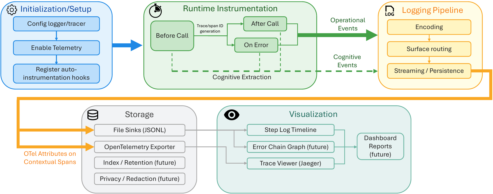
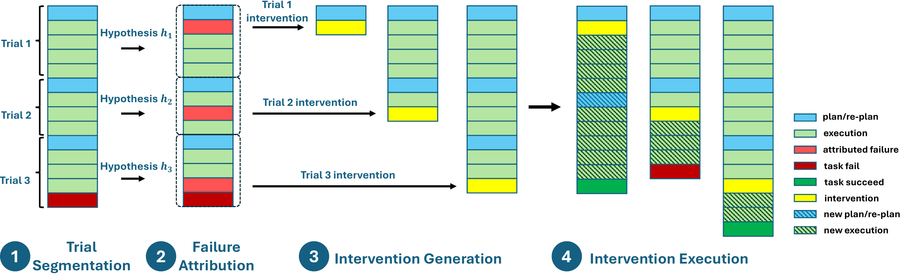
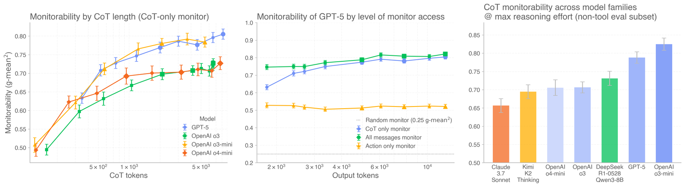
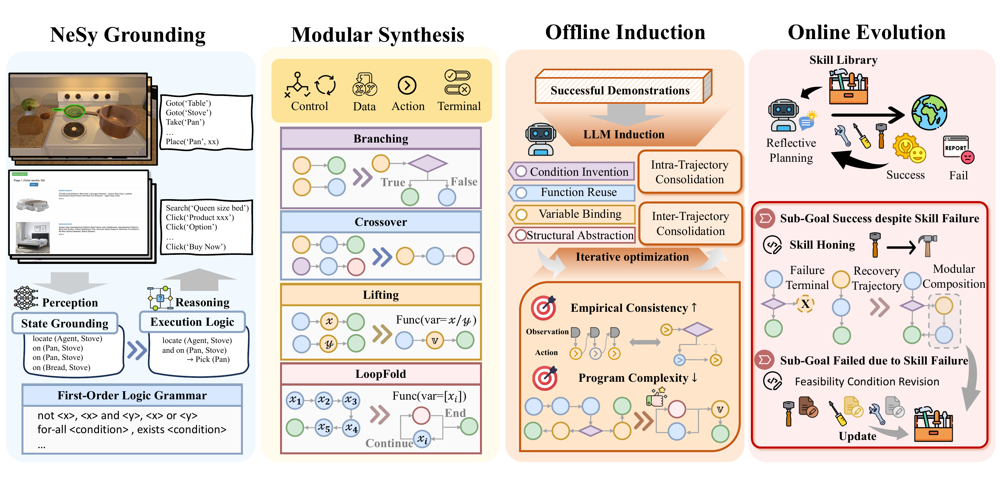
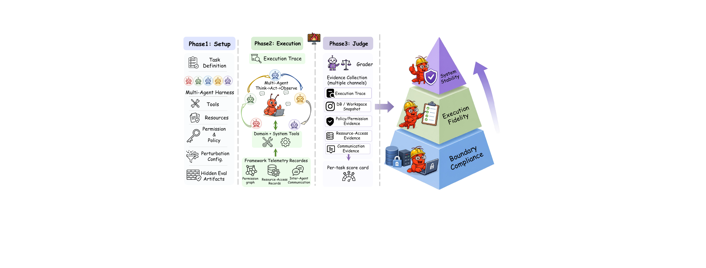
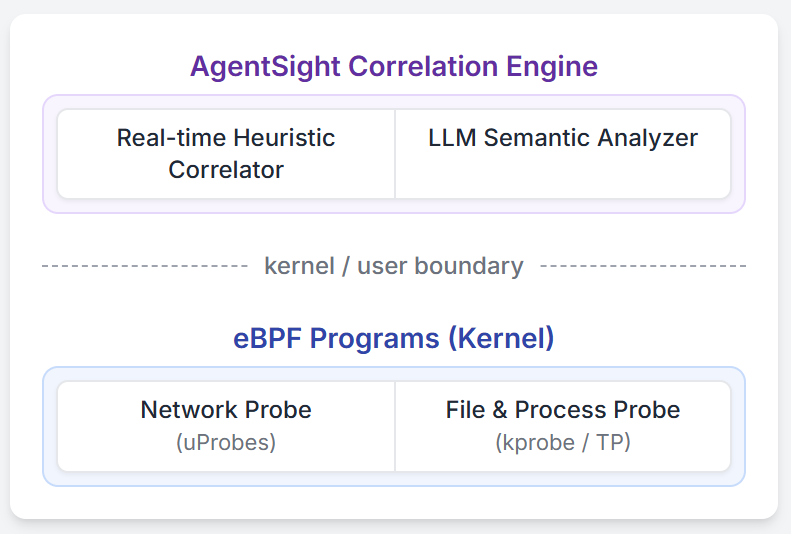
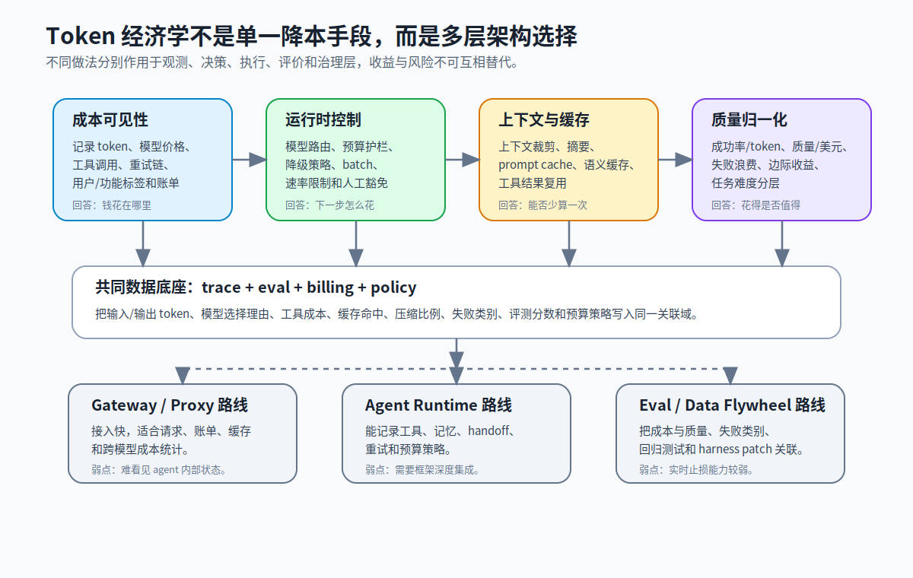
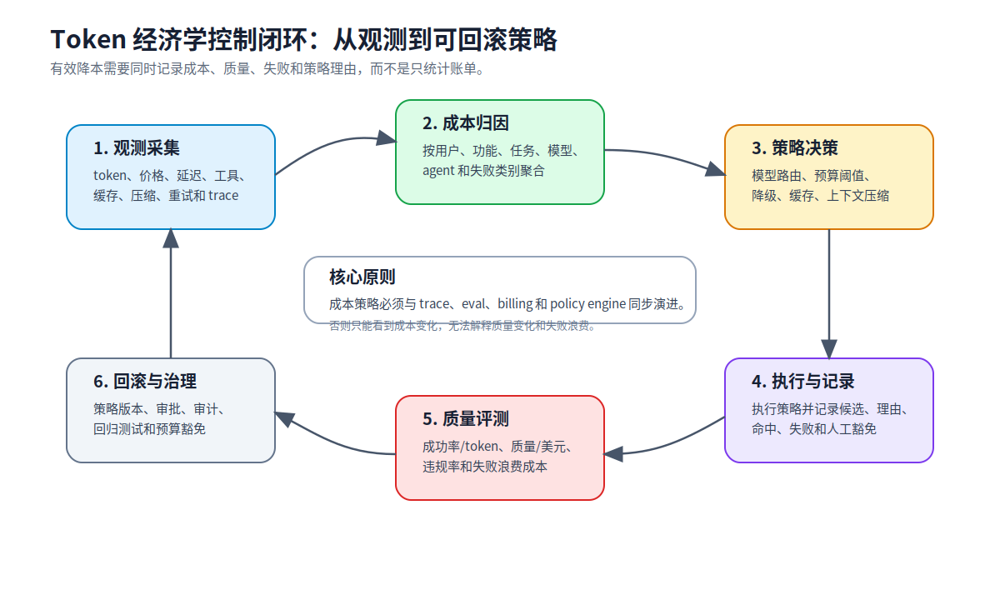

## 6. 方法谱系

现有方法不是一组松散论文和产品功能，而是一条从 trace capture 到 diagnosis、governance、platformization 和 token economics 的流水线。每个谱系解决一个中间环节：记录与标准化提供证据，诊断与归因解释失败，过程评测与监督定义行为边界，harness 演化把失败转成改进，安全审计保证证据可信，产品平台把能力交给团队使用，token 经济学把质量、成本和预算策略纳入同一运行闭环。缺少任何一环，可观测性都会退化为“能看见但不能行动”。

### 6.1 轨迹记录与标准化

轨迹记录与标准化谱系是整条流水线的入口。它的输入是分散在模型调用、工具调用、状态读写、环境反馈、评测结果和成本事件中的原始执行材料；输出应是可查询、可重放、可关联、可迁移的结构化 trace。这个谱系要解决的不是“记录多少日志”，而是“哪些字段能支撑后续诊断、评测、审计和成本控制”。

学术界和标准化材料分别从不同下游目标定义轨迹格式。[AgentTrace](../../../notes/p-014_AgentTrace_A_Structured_Logging_Framewor.md) [[R001]](../../../notes/p-014_AgentTrace_A_Structured_Logging_Framewor.md) 面向诊断和行为理解，将 agent 行为拆成系统、认知和环境三类表面；[OpenInference Specification](../../../notes/c-014_OpenInference_Specification.md) [[R003]](../../../notes/c-014_OpenInference_Specification.md) 面向互操作，把 LLM、agent、tool、retriever、evaluator 和 guardrail 纳入 OpenTelemetry 语义空间；[Hermes Agent Trajectory Format](../../../notes/c-013_Hermes_Agent_Trajectory_Format.md) [[R002]](../../../notes/c-013_Hermes_Agent_Trajectory_Format.md) 面向训练和重放，强调工具调用和响应结构一致；[Agent Audit Trail](../../../notes/c-012_Agent_Audit_Trail_A_Standard_Logging_For.md) [[R020]](../../../notes/c-012_Agent_Audit_Trail_A_Standard_Logging_For.md) 面向审计，要求身份、动作、时间顺序和完整性字段。这些格式的差异说明，标准化不是单一格式胜出，而是不同下游任务对字段集合提出不同约束。

图 6-1 展示 AgentTrace 如何把系统执行、认知步骤和环境交互组织为统一轨迹。它支撑的判断是：如果轨迹没有覆盖工具、状态和环境，后续诊断就只能依赖文本猜测。

产业界关注的是如何低成本接入并和既有工具栈兼容。[Arize Phoenix](../../../notes/s2-016_Arize-aiphoenix__GitHub.md) [[R006]](../../../notes/s2-016_Arize-aiphoenix__GitHub.md) 与 OpenInference 路线强调 open instrumentation 和 eval 连接；[Datadog LLM Observability](../../../notes/s2-006_Monitor_troubleshoot_and_improve_AI_agen.md) [[R004]](../../../notes/s2-006_Monitor_troubleshoot_and_improve_AI_agen.md) 把 agent trace 接入传统 APM 和团队运维流程；[AWS AgentCore Production Guide](../../../notes/s1-007_Amazon_Bedrock_AgentCore_Production_Oper.md) [[R016]](../../../notes/s1-007_Amazon_Bedrock_AgentCore_Production_Oper.md) 则在云平台 runtime、memory、observability 和成本层面提供集成。产业路线的核心问题是接入成本和生态兼容，但如果只追求低侵入而不保留 agent 语义，后续诊断和治理会受到限制。

这一谱系的输出会直接进入失败诊断、过程评测和成本归因。因此，最小公共证据层至少应包含 trace/span 关联、agent/tool 标识、工具参数与结果摘要、状态变化、策略版本、eval 结果、token/cost 字段和审计所需身份字段。平台可以保留私有增强字段，但核心证据应能跨系统迁移。

### 6.2 失败诊断与根因定位

失败诊断与根因定位谱系接收结构化 trace，输出关键失败步骤、失败类别、责任主体和修复线索。它的目标是把人工逐行读日志变成半自动或自动分析。这里的关键不是生成一段自然语言解释，而是区分根因和后果：长轨迹中后续异常可能只是早期错误传播，多智能体系统中最终失败点可能不是责任主体。

学术界形成了多条互补路线。[AgentRx](../../../notes/p-001_AgentRx_Diagnosing_AI_Agent_Failures_from_Execution_Trajectories.md) [[R008]](../../../notes/p-001_AgentRx_Diagnosing_AI_Agent_Failures_from_Execution_Trajectories.md) 是约束驱动诊断的代表，用工具 schema、领域策略和执行前缀定位第一个不可恢复关键步骤；[DoVer](../../../notes/p-003_DoVer_Intervention-Driven_Auto_Debugging.md) [[R009]](../../../notes/p-003_DoVer_Intervention-Driven_Auto_Debugging.md) 强调干预式验证，通过替换或修改关键步骤来确认因果；[Which Agent Causes Task Failures and When](../../../notes/p-022_Which_Agent_Causes_Task_Failures_and_Whe.md) [[R010]](../../../notes/p-022_Which_Agent_Causes_Task_Failures_and_Whe.md) 把多智能体失败拆成“哪个 agent”和“什么时候失败”；[Long-Horizon Task Mirage](../../../notes/p-016_The_Long-Horizon_Task_Mirage_Diagnosing_.md) [[R011]](../../../notes/p-016_The_Long-Horizon_Task_Mirage_Diagnosing_.md) 则揭示长程任务失败机制不同于短任务。它们共同说明，诊断谱系不是单一 LLM judge，而是约束、干预、责任分配和长程分析的组合。

图 6-2 支撑的判断是：诊断不能只让 LLM 阅读日志后给解释，还需要通过干预或替换关键步骤验证归因。它把“看起来像原因”的步骤和“确实改变结果”的步骤区分开。

产业界更多从异常会话、高成本 trace 和用户反馈触发诊断。[Datadog LLM Observability](../../../notes/s2-006_Monitor_troubleshoot_and_improve_AI_agen.md) [[R004]](../../../notes/s2-006_Monitor_troubleshoot_and_improve_AI_agen.md) 用执行流、错误 span 和性能指标定位可疑区域；[AgentOps](../../../notes/s2-020_AgentOps_-_AI_Agent_Monitoring_and_Obser.md) [[R007]](../../../notes/s2-020_AgentOps_-_AI_Agent_Monitoring_and_Obser.md) 用 session replay、token tracking 和 runaway cost 暴露异常会话；[Arize Phoenix](../../../notes/s2-016_Arize-aiphoenix__GitHub.md) [[R006]](../../../notes/s2-016_Arize-aiphoenix__GitHub.md) 把 trace 和 eval 连接到实验复盘。产业工具能放大工程师注意力，但因果确认仍需要学术侧的约束和干预思想。

这一谱系的输出不应停在诊断报告。关键失败步骤和失败类别应进入过程评测、harness patch、数据集回归和产品告警规则。短期内更现实的目标是“辅助工程师定位高价值失败样本”；长期目标才是端到端自动诊断和自动修复。

### 6.3 过程评测与自动监督

过程评测与自动监督谱系接收完整轨迹和规范，输出过程合规分数、违规类型、风险标记和可复用评测样本。它解决的是最终 reward 不足的问题：智能体可能最终完成任务，但中途跳过审批、误用工具、泄露信息或违反业务规则。过程评测将“怎样完成任务”纳入评价。

学术界从三个方向推进这一谱系。[AgentPex](../../../notes/p-004_Willful_Disobedience_Automatically_Detecting_Failures_in_Agentic_Traces.md) [[R012]](../../../notes/p-004_Willful_Disobedience_Automatically_Detecting_Failures_in_Agentic_Traces.md) 从提示和工具 schema 中抽取行为规则，检查单条轨迹是否违反规范；[Monitoring Monitorability](../../../notes/p-006_Monitoring_Monitorability.md) [[R013]](../../../notes/p-006_Monitoring_Monitorability.md) 评估过程信号对风险监控能力的贡献；[HarnessAudit](../../../notes/p-017_Auditing_Agent_Harness_Safety.md) [[R014]](../../../notes/p-017_Auditing_Agent_Harness_Safety.md) 把安全评估对象扩展到完整 harness 和执行轨迹。三者分别对应规则合规、监控能力和安全审计。

图 6-3 说明过程信号本身会影响监控能力。它支撑的判断是：如果系统隐藏或丢弃中间过程，评测器和监控器会失去重要风险线索。

产业界把过程评测落到 eval pipeline、guardrail、review queue 和 dataset 管理。[Langfuse](../../../notes/s2-014_langfuselangfuse__GitHub.md) [[R005]](../../../notes/s2-014_langfuselangfuse__GitHub.md) 连接 trace、prompt、eval 和 dataset；[Arize Phoenix](../../../notes/s2-016_Arize-aiphoenix__GitHub.md) [[R006]](../../../notes/s2-016_Arize-aiphoenix__GitHub.md) 强调 instrumentation 与评估；[AI Agents in Production](../../../notes/c-018_AI_Agents_in_Production_Monitoring_Guard.md) [[R015]](../../../notes/c-018_AI_Agents_in_Production_Monitoring_Guard.md) 讨论生产系统中的 guardrail、熔断和安全实践。产业流程的关键是把过程违规样本进入数据集和回归，而不是只在 dashboard 上标红。

这一谱系的瓶颈是规范质量。提示、工具 schema 和业务 SOP 写得越明确，过程评测越稳定；规范越隐含，judge 越容易变成主观解释。未来系统需要把“可评测性”作为 prompt、tool 和 harness 设计要求：规则必须能被机器检查，违规必须能定位到具体动作和策略版本。

### 6.4 Harness 演化与数据飞轮

Harness 演化与数据飞轮谱系接收诊断结果和过程评测样本，输出 prompt patch、tool schema patch、memory/skill 更新、harness 版本和回归测试。它回答的问题是：发现失败之后，系统如何真正变好。这里的数据飞轮对象不只是样本，还包括规则、技能、记忆和 harness 组件。

学术界已经展示从 trace 到改进的多种路径。[Agentic Harness Engineering](../../../notes/p-011_Agentic_Harness_Engineering_Observabilit.md) [[R018]](../../../notes/p-011_Agentic_Harness_Engineering_Observabilit.md) 把 harness 组件文件化、可观测化和可回滚化，要求编辑决策带可证伪预测；[Lifting Traces to Logic](../../../notes/p-024_Lifting_Traces_to_Logic_Programmatic_Ski.md) [[R019]](../../../notes/p-024_Lifting_Traces_to_Logic_Programmatic_Ski.md) 展示轨迹可以被提升为可复用技能或规则；相关的 Teaching from Failure 和 continual harness 工作则强调从失败中学习顺序决策经验。它们共同说明，trace 的价值不只是复盘，而是系统演化。

图 6-4 支撑的判断是：轨迹可以被提升为可组合的程序化技能或规则，而不只是保存在日志系统里。它把 trace reuse 从经验总结推进到可执行结构。

产业界通过 prompt/dataset/eval/release 管理把 bad case 变成回归测试和版本变更。[Langfuse](../../../notes/s2-014_langfuselangfuse__GitHub.md) [[R005]](../../../notes/s2-014_langfuselangfuse__GitHub.md) 提供 prompt、trace、eval 和 dataset 闭环；[Arize Phoenix](../../../notes/s2-016_Arize-aiphoenix__GitHub.md) [[R006]](../../../notes/s2-016_Arize-aiphoenix__GitHub.md) 支持评估与实验；[AWS AgentCore Production Guide](../../../notes/s1-007_Amazon_Bedrock_AgentCore_Production_Oper.md) [[R016]](../../../notes/s1-007_Amazon_Bedrock_AgentCore_Production_Oper.md) 将 runtime、memory、observability、成本和部署策略纳入生产系统。产业闭环通常是：trace 发现 bad case，诊断定位根因，样本进入 eval/dataset，harness 产生 patch，回归测试验证，发布系统记录版本和回滚条件。

这一谱系的风险是自动演化不可审计。如果系统自动修改 prompt、工具、记忆或技能，却不记录修改意图、预期收益、潜在破坏和回滚条件，那么改进过程本身会变成新的黑盒。因而，数据飞轮必须和审计、版本控制、评测和成本策略绑定。

### 6.5 安全、审计与合规

安全、审计与合规谱系接收执行轨迹、策略、身份和工具动作，输出风险分类、审计记录、违规证据和合规报表。它要求 trace 不只是可读，还要可信。对能访问企业系统、用户数据或外部工具的智能体而言，安全问题并不只发生在最终回答，而发生在每一次工具调用、权限判断和状态写入中。

学术界和标准材料分别提供风险、记录格式和评测框架。[OWASP Agentic Top 10](../../../notes/s3-009_OWASP_Top_10_for_Agentic_Applications_Co.md) [[R017]](../../../notes/s3-009_OWASP_Top_10_for_Agentic_Applications_Co.md) 提供越权、工具滥用、数据泄露和策略绕过等风险分类；[Agent Audit Trail](../../../notes/c-012_Agent_Audit_Trail_A_Standard_Logging_For.md) [[R020]](../../../notes/c-012_Agent_Audit_Trail_A_Standard_Logging_For.md) 提供审计记录格式，强调身份、动作、时间顺序和完整性；[HarnessAudit](../../../notes/p-017_Auditing_Agent_Harness_Safety.md) [[R014]](../../../notes/p-017_Auditing_Agent_Harness_Safety.md) 提供轨迹级安全评估流程。三者组合起来，才同时回答“有什么风险、如何记录证据、如何评估执行过程”。

图 6-5 说明安全审计必须覆盖完整 harness 和执行轨迹。它支撑的判断是：输出过滤只能处理结果层风险，无法替代过程级审计。

产业界把这些要求落到身份、权限、审计日志、策略引擎和合规报表。[Tamper-evident audit RFC](../../../notes/s3-008_RFC_should_AutoGen_support_tamper-eviden.md) [[R027]](../../../notes/s3-008_RFC_should_AutoGen_support_tamper-eviden.md) 讨论多 agent 框架是否应原生支持防篡改记录；[AWS AgentCore Production Guide](../../../notes/s1-007_Amazon_Bedrock_AgentCore_Production_Oper.md) [[R016]](../../../notes/s1-007_Amazon_Bedrock_AgentCore_Production_Oper.md) 将生产可靠性、可观测性和成本管理放进云平台运营框架；[AI Agents in Production](../../../notes/c-018_AI_Agents_in_Production_Monitoring_Guard.md) [[R015]](../../../notes/c-018_AI_Agents_in_Production_Monitoring_Guard.md) 从监控、护栏和安全实践角度讨论如何降低运行风险。

这一谱系会提高采集成本和隐私压力，但这是生产化的必要代价。工程上需要通过字段分层、脱敏、hash、签名、采样和访问控制来平衡诊断深度与数据暴露。审计日志和调试日志应分层：前者追求证据可信，后者追求诊断充分。

### 6.6 产品平台与市场

产品平台与市场谱系接收上述方法能力，输出团队可使用的 SDK、dashboard、eval workflow、dataset 管理、成本分析和治理界面。它说明 agent observability 正在从单点 trace viewer 走向 eval、dataset、prompt 管理、成本控制和合规的一体化平台。产品之间的差异不是 UI 风格，而是数据所有权、接入层级、eval 深度和企业运维集成方式。

学术界提供系统架构和方法基准，但较少覆盖采购、权限、多租户、成本中心和组织流程。[AgentSight](../../../notes/p-025_AgentSight_System-Level_Observability_fo.md) [[R031]](../../../notes/p-025_AgentSight_System-Level_Observability_fo.md) 展示系统级 observability 架构，[OpenInference Specification](../../../notes/c-014_OpenInference_Specification.md) [[R003]](../../../notes/c-014_OpenInference_Specification.md) 提供开放语义层。它们可以解释产品平台需要哪些技术模块，但不能替代产业材料对落地路径的说明。

图 6-6 支撑的判断是：系统级 observability 需要把 agent framework、instrumentation、storage、analysis 和 UI 连接成完整平台，而不是只提供单个 SDK。

产业界形成多条路线。[Langfuse](../../../notes/s2-014_langfuselangfuse__GitHub.md) [[R005]](../../../notes/s2-014_langfuselangfuse__GitHub.md) 代表开源自托管和 trace/eval/dataset 闭环；[Arize Phoenix](../../../notes/s2-016_Arize-aiphoenix__GitHub.md) [[R006]](../../../notes/s2-016_Arize-aiphoenix__GitHub.md) 代表 open instrumentation 与评估；[AgentOps](../../../notes/s2-020_AgentOps_-_AI_Agent_Monitoring_and_Obser.md) [[R007]](../../../notes/s2-020_AgentOps_-_AI_Agent_Monitoring_and_Obser.md) 代表 agent session replay、token tracking 和运行监控；[Datadog LLM Observability](../../../notes/s2-006_Monitor_troubleshoot_and_improve_AI_agen.md) [[R004]](../../../notes/s2-006_Monitor_troubleshoot_and_improve_AI_agen.md) 代表传统 APM 平台扩展到 agent 工作流；[Helicone](../../../notes/s2-022_Helicone_LLM_Observability_Platform__Lea.md) [[R024]](../../../notes/s2-022_Helicone_LLM_Observability_Platform__Lea.md) 代表 gateway/proxy 请求和成本入口。

产品层最重要的趋势是 eval 和 observability 融合。传统 APM 关注延迟、错误和吞吐；LLM/agent 平台还必须关注输出质量、安全性、成本、提示版本、数据集和评测实验。只做 trace viewer 的工具会被平台化能力挤压，因为团队最终需要的不只是看见失败，而是把失败转成数据、策略和系统改进。

### 6.7 Token 经济学与成本控制

Token 经济学与成本控制谱系接收 trace、eval、billing 和 policy 信号，输出成本归因、预算策略、模型路由、缓存决策、质量/美元指标和失败浪费分析。它正在成为 agent observability 的独立分支，因为 agent 成本不是单次模型调用价格，而是任务路径、上下文长度、工具调用、重试、缓存命中和失败恢复共同形成的系统成本。

学术界提供质量分母和归因框架。[Token Economics](../../../notes/s3-011_Token_Economics_for_LLM_Agents_A_Dual-Vi.md) [[R021]](../../../notes/s3-011_Token_Economics_for_LLM_Agents_A_Dual-Vi.md) 从计算和经济双视角讨论 token 消耗，要求把 token 投入与质量和收益一起分析；[LLM Agent Cost Attribution](../../../notes/s3-014_LLM_Agent_Cost_Attribution_Complete_Prod.md) [[R022]](../../../notes/s3-014_LLM_Agent_Cost_Attribution_Complete_Prod.md) 强调按 agent、功能和工作流拆解成本；与 AI-NativeBench、多智能体失败和长程任务相关的材料进一步说明，失败循环和自愈合机制会显著改变成本结构。

图 6-7 将 token 经济学拆成 gateway/proxy 成本可见性、agent runtime 预算控制、上下文压缩与缓存、eval-first 质量归一化、data flywheel 与 harness 改进。它支撑的判断是：这些杠杆属于不同架构层，不能简单合并为“少用 token”。

产业界提供模型路由、预算护栏、prompt cache、账单预测和 runaway cost 告警。[AWS AgentCore Production Guide](../../../notes/s1-007_Amazon_Bedrock_AgentCore_Production_Oper.md) [[R016]](../../../notes/s1-007_Amazon_Bedrock_AgentCore_Production_Oper.md) 给出模型路由、prompt caching、batch inference 和成本分解实践；[GenAIOps on AWS](../../../notes/s1-010_GenAIOps_on_AWS_End-to-End_Observability.md) [[R023]](../../../notes/s1-010_GenAIOps_on_AWS_End-to-End_Observability.md) 将 token、成本、检索质量和延迟放进同一观测路径；[AgentOps](../../../notes/s2-020_AgentOps_-_AI_Agent_Monitoring_and_Obser.md) [[R007]](../../../notes/s2-020_AgentOps_-_AI_Agent_Monitoring_and_Obser.md) 强调 token tracking 和 runaway cost；[Helicone](../../../notes/s2-022_Helicone_LLM_Observability_Platform__Lea.md) [[R024]](../../../notes/s2-022_Helicone_LLM_Observability_Platform__Lea.md) 通过 gateway/proxy 进入请求和缓存管理；[Cost Optimization with Observability](../../../notes/s3-013_A_Guide_to_AI_Agent_Cost_Optimization_Wi.md) [[R030]](../../../notes/s3-013_A_Guide_to_AI_Agent_Cost_Optimization_Wi.md) 则把可观测性定位为成本优化基础设施。

图 6-8 展示从观测采集、成本归因、策略决策、执行记录、质量评测到治理回滚的控制闭环。它说明预算策略本身应成为 trace 的一部分，包括候选模型、路由理由、预算余额、降级动作、缓存命中、压缩比例、人工豁免和回滚条件。

这一谱系当前还没有完全汇合。成本可见性工具能回答“钱花在哪里”，但不一定能决定“下一次如何少花且不降质”；成本控制机制有工程效果，但缺少统一的质量/token 指标；学术评测开始关注 token 经济学，却常常没有接入真实账单、企业限流和多租户预算。未来更完整的系统应把 trace、eval、billing 和 policy engine 连接起来，使预算策略可观测、可解释、可回滚。
