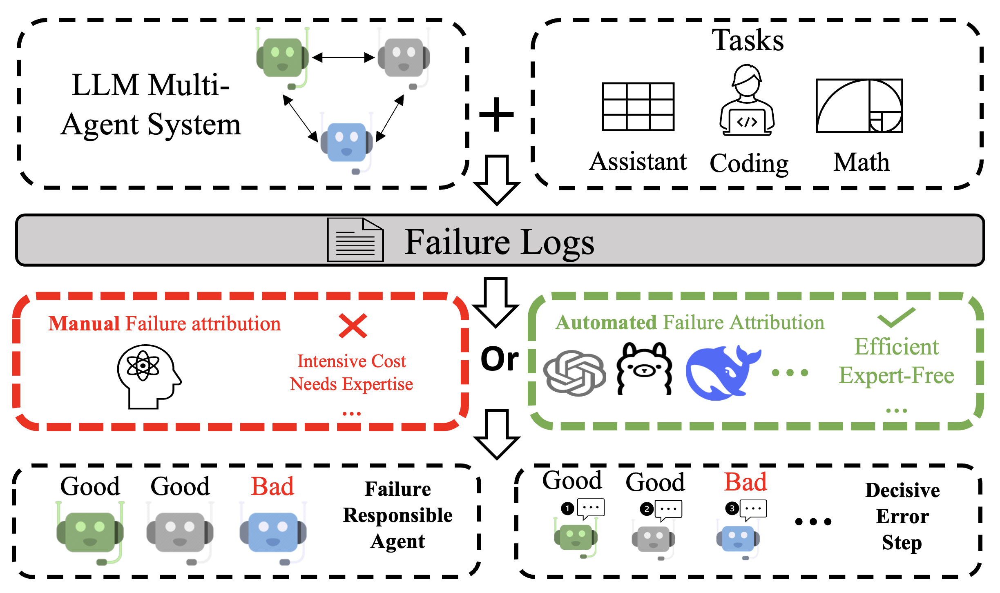
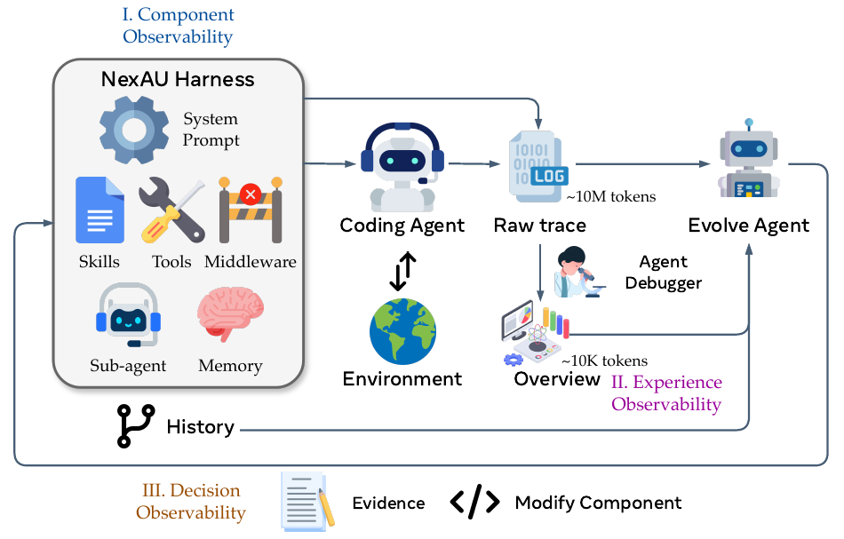

## 8. 面向系统设计的建议

前面的词条、观点、对比、方法谱系和研究缺口共同指向一个工程结论：agent trace 不能被当作事后日志，而应当成为系统设计的一部分。系统设计的目标不是记录更多文本，而是让任务、模型、工具、状态、成本、合规和修复动作处在同一条可查询、可比较、可审计的证据链中。本章把这些结论转成面向架构设计和产品选型的建议。

### 8.1 把 trace schema 设计成产品/API 契约

第一条建议是把 trace schema 作为产品和 API 设计的一部分，而不是上线后追加的日志后处理格式。[AgentTrace](../../../notes/p-014_AgentTrace_A_Structured_Logging_Framewor.md) [[R001]](../../../notes/p-014_AgentTrace_A_Structured_Logging_Framewor.md)、[Hermes Agent Trajectory Format](../../../notes/c-013_Hermes_Agent_Trajectory_Format.md) [[R002]](../../../notes/c-013_Hermes_Agent_Trajectory_Format.md) 和 [OpenInference Specification](../../../notes/c-014_OpenInference_Specification.md) [[R003]](../../../notes/c-014_OpenInference_Specification.md) 都说明，agent trace 至少要覆盖任务上下文、模型调用、工具调用、状态变更、错误和父子依赖。学术界的重点是让这些字段支撑可复现实验和诊断算法；产业界的重点则是让字段进入 APM、eval、告警和数据导出流程，例如 [Datadog LLM Observability](../../../notes/s2-006_Monitor_troubleshoot_and_improve_AI_agen.md) [[R004]](../../../notes/s2-006_Monitor_troubleshoot_and_improve_AI_agen.md)、[Arize Phoenix](../../../notes/s2-016_Arize-aiphoenix__GitHub.md) [[R006]](../../../notes/s2-016_Arize-aiphoenix__GitHub.md) 和 [AWS AgentCore Production Guide](../../../notes/s1-007_Amazon_Bedrock_AgentCore_Production_Oper.md) [[R016]](../../../notes/s1-007_Amazon_Bedrock_AgentCore_Production_Oper.md) 所体现的接入路径。

因此，系统设计时不应只问“能不能看日志”，而应明确 schema 能回答哪些问题：谁触发了任务，模型为什么被选择，工具参数是什么，返回摘要是什么，哪一步失败，哪个策略触发，成本归到哪个用户或功能。每条工具调用至少应记录工具名、参数摘要、返回摘要、错误、耗时、调用者 agent、父 span 和任务上下文。这里的设计取舍是：字段越完整，诊断、审计和成本归因越强；字段越少，隐私和存储压力越低。合理做法是把必需字段、可选字段和敏感字段分层，而不是把所有内容都塞进自由文本日志。

### 8.2 用 OTel 做传播骨架，保留 agent-specific 语义

第二条建议是采用 OpenTelemetry 作为跨服务传播骨架，同时保留 agent-specific 语义字段。OTel 的优势是 span、trace id、service、latency 和错误传播已经能接入现有观测栈；agent-specific schema 的优势是能表达任务目标、工具语义、角色、计划、记忆和策略事件。[OpenTelemetry AI Agent Observability](../../../notes/c-003_OpenTelemetry_AI_Agent_Observability_Sta.md) [[R025]](../../../notes/c-003_OpenTelemetry_AI_Agent_Observability_Sta.md) 与 [OpenInference Specification](../../../notes/c-014_OpenInference_Specification.md) [[R003]](../../../notes/c-014_OpenInference_Specification.md) 的组合说明了这一方向，[AgentSight](../../../notes/p-025_AgentSight_System-Level_Observability_fo.md) [[R031]](../../../notes/p-025_AgentSight_System-Level_Observability_fo.md) 也把系统级观测和 agent 语义结合起来。

学术界如果只定义独立轨迹格式，容易和生产系统脱节；产业界如果只复用通用 span，容易丢失 agent 任务语义。更稳妥的架构是双层表示：底层用 OTel 保证跨服务关联和基础性能监控，上层用 agent 字段记录任务、计划、工具、状态、handoff、eval、budget 和 policy。这样既能让 trace 进入现有 APM，也能让诊断器和评测器消费 agent 语义。产品选型时，不能只看 dashboard 是否漂亮，还要检查原始轨迹导出、schema 扩展、eval 集成、隐私控制和成本 drill-down 是否支持这种双层表示。

厂商实践可以作为设计校验。Google ADK 接入 Cloud Trace 说明，底层传播骨架必须能和云原生服务链路一致，否则 agent trace 会和后端 API、数据库、检索服务脱节 [[R032]](../../../notes/s1-001_Google_Cloud_Trace_observability_for_ADK.md)。AWS CloudWatch 与 AgentCore Runtime 说明，agent 语义还要和 runtime、session、工具调用、错误和成本指标共同出现，否则只能看到服务异常，不能解释 agent 行为 [[R033]](../../../notes/s1-006_Amazon_CloudWatch_generative_AI_observab.md) [[R034]](../../../notes/s1-008_Part_3_AgentCore_Runtime_Observability.md)。阿里云 AgentLoop、百炼、百度千帆和 Coze Loop 则提醒，应用平台还需要把 trace 与知识库、插件、组件、评测样本和发布流程连起来 [[R035]](../../../notes/s2-001_什么是AgentLoop-云监控CMS__阿里云文档.md) [[R036]](../../../notes/s2-002_应用观测-大模型服务平台百炼Model_Studio__阿里云文档.md) [[R037]](../../../notes/s2-003_Appbuilder_Trace跟踪功能基本用法__百度千帆文档.md) [[R038]](../../../notes/s2-005_目前主流的智能体可观测性和智能体评测相关的产品调研__Coze_Loop详细介绍.md)。因此，OTel 与 agent schema 的关系不是替代，而是“传播骨架 + 任务语义 + 应用迭代对象”的三层组合。

### 8.3 对长轨迹和多智能体显式记录依赖边

第三条建议是对长轨迹和多智能体任务显式记录 agent 身份、handoff、依赖边、共享状态访问和子 agent 侧链。单智能体失败通常可以沿步骤序列回溯；多智能体失败还要处理角色分工、通信质量、共享记忆和跨 agent 责任传播。[Why Do Multi-Agent LLM Systems Fail](../../../notes/p-021_Why_Do_Multi_Agent_LLM_Systems_Fail.md) [[R028]](../../../notes/p-021_Why_Do_Multi_Agent_LLM_Systems_Fail.md) 提供了多智能体失败 taxonomy，[Which Agent Causes Task Failures and When](../../../notes/p-022_Which_Agent_Causes_Task_Failures_and_Whe.md) [[R010]](../../../notes/p-022_Which_Agent_Causes_Task_Failures_and_Whe.md) 则把责任定位放到 agent 和时间两个维度上。

产业界常用 replay、drill-down 和告警聚合来排查问题，但对多智能体系统来说，仅有线性时间轴是不够的。设计 trace 时应把消息边、任务委派、共享状态读写、工具所有权和子 agent 返回结果记录成可查询对象。对长轨迹和多智能体任务，也不应只依赖单体 LLM judge；更稳妥的做法是结合约束检查、结构化信号、局部干预、人工复核和失败 taxonomy。这样才能区分“最终失败的 agent”和“最早引入不可恢复错误的 agent”。

这条建议在产品设计中可以落成具体字段。云厂商的分布式 trace 已经有 parent span、service、latency、error 等字段，但多智能体系统还需要 agent id、role、handoff target、message edge、shared memory read/write、tool owner、delegated task id 和 sub-agent result。否则 Google/AWS 式服务链路只能说明哪个服务慢或错 [[R032]](../../../notes/s1-001_Google_Cloud_Trace_observability_for_ADK.md) [[R034]](../../../notes/s1-008_Part_3_AgentCore_Runtime_Observability.md)，却难以说明哪个 agent 把错误状态传给了下游。应用平台也类似：Coze Loop 或千帆能帮助开发者看见组件和插件执行，但如果没有显式依赖边，失败样本进入评测集后仍难以区分“知识库召回错”“规划 agent 误用结果”“执行 agent 未复核”这三种责任 [[R037]](../../../notes/s2-003_Appbuilder_Trace跟踪功能基本用法__百度千帆文档.md) [[R038]](../../../notes/s2-005_目前主流的智能体可观测性和智能体评测相关的产品调研__Coze_Loop详细介绍.md)。

### 8.4 将最终结果、过程规范、安全事件和审计证据关联起来

第四条建议是把最终 reward、过程规范、失败类别、安全事件和审计证据写入同一 trace 关联域。最终成功不能证明过程合规，[AgentPex](../../../notes/p-004_Willful_Disobedience_Automatically_Detecting_Failures_in_Agentic_Traces.md) [[R012]](../../../notes/p-004_Willful_Disobedience_Automatically_Detecting_Failures_in_Agentic_Traces.md) 说明了如何从系统提示和工具 schema 中抽取规范并检测违背，[Monitoring Monitorability](../../../notes/p-006_Monitoring_Monitorability.md) [[R013]](../../../notes/p-006_Monitoring_Monitorability.md) 强调过程可监控性，[HarnessAudit](../../../notes/p-017_Auditing_Agent_Harness_Safety.md) [[R014]](../../../notes/p-017_Auditing_Agent_Harness_Safety.md) 则把 harness 安全审计作为独立对象。

产业设计中，受监管场景要区分调试日志和审计日志。调试日志服务于工程定位，可以采样、摘要和短期保留；审计日志服务于追责和合规，需要身份、策略版本、时间戳、操作对象、审批状态和完整性保护。[Agent Audit Trail](../../../notes/c-012_Agent_Audit_Trail_A_Standard_Logging_For.md) [[R020]](../../../notes/c-012_Agent_Audit_Trail_A_Standard_Logging_For.md)、[OWASP Agentic Top 10](../../../notes/s3-009_OWASP_Top_10_for_Agentic_Applications_Co.md) [[R017]](../../../notes/s3-009_OWASP_Top_10_for_Agentic_Applications_Co.md)、[AI Agents in Production](../../../notes/c-018_AI_Agents_in_Production_Monitoring_Guard.md) [[R015]](../../../notes/c-018_AI_Agents_in_Production_Monitoring_Guard.md) 与 [Tamper-evident audit RFC](../../../notes/s3-008_RFC_should_AutoGen_support_tamper-eviden.md) [[R027]](../../../notes/s3-008_RFC_should_AutoGen_support_tamper-eviden.md) 共同指向这一治理设计。关键不是保存所有原文，而是让必要证据能够证明谁在什么策略版本下做了什么，以及记录是否被篡改。

互联网平台的落地差异在于治理对象不同。AWS 和 CloudWatch/AgentCore 更容易把审计事件放进云账号、IAM、runtime 和日志保留策略中，适合企业级权限与合规 [[R033]](../../../notes/s1-006_Amazon_CloudWatch_generative_AI_observab.md) [[R034]](../../../notes/s1-008_Part_3_AgentCore_Runtime_Observability.md)；阿里云 AgentLoop、百炼、百度千帆和 Coze Loop 更贴近应用开发平台，审计对象往往是应用、插件、知识库、模型调用和发布版本 [[R035]](../../../notes/s2-001_什么是AgentLoop-云监控CMS__阿里云文档.md) [[R036]](../../../notes/s2-002_应用观测-大模型服务平台百炼Model_Studio__阿里云文档.md) [[R037]](../../../notes/s2-003_Appbuilder_Trace跟踪功能基本用法__百度千帆文档.md) [[R038]](../../../notes/s2-005_目前主流的智能体可观测性和智能体评测相关的产品调研__Coze_Loop详细介绍.md)。这意味着系统设计不能只定义一条“debug trace”，还要把同一执行中的调试证据、过程合规证据和审计证据拆成不同保留等级、不同访问权限和不同完整性要求。

### 8.5 让失败样本进入 harness 数据飞轮，但自动修改必须可证伪

第五条建议是让失败样本进入数据飞轮：诊断、标注、评测集、prompt/tool/harness patch 和回归测试应当形成闭环。[Agentic Harness Engineering](../../../notes/p-011_Agentic_Harness_Engineering_Observabilit.md) [[R018]](../../../notes/p-011_Agentic_Harness_Engineering_Observabilit.md) 把 harness 看成可优化的工程表面，[Lifting Traces to Logic](../../../notes/p-024_Lifting_Traces_to_Logic_Programmatic_Ski.md) [[R019]](../../../notes/p-024_Lifting_Traces_to_Logic_Programmatic_Ski.md) 展示了从 trace 提炼逻辑和技能的路径，[DoVer](../../../notes/p-003_DoVer_Intervention-Driven_Auto_Debugging.md) [[R009]](../../../notes/p-003_DoVer_Intervention-Driven_Auto_Debugging.md) 则提醒修复假设最好通过干预验证。

产业落地时，自动修改不能绕过变更治理。每一次 prompt、tool、memory、skill、router 或 budget policy 修改都应有可证伪变更契约：预期修复什么失败，可能破坏什么能力，用什么回归集验证，如何 canary，如何回滚，谁批准上线。[Langfuse](../../../notes/s2-014_langfuselangfuse__GitHub.md) [[R005]](../../../notes/s2-014_langfuselangfuse__GitHub.md)、[Arize Phoenix](../../../notes/s2-016_Arize-aiphoenix__GitHub.md) [[R006]](../../../notes/s2-016_Arize-aiphoenix__GitHub.md) 和 [AWS AgentCore Production Guide](../../../notes/s1-007_Amazon_Bedrock_AgentCore_Production_Oper.md) [[R016]](../../../notes/s1-007_Amazon_Bedrock_AgentCore_Production_Oper.md) 提供了版本、eval 和生产监控的基础设施，但是否允许自动 patch 进入生产，还取决于团队能否把变更风险显式记录下来。

### 8.6 把 token 预算作为运行时策略对象

第六条建议是把 token 预算作为运行时策略对象记录下来，而不是只在账单层做月度统计。[Token Economics](../../../notes/s3-011_Token_Economics_for_LLM_Agents_A_Dual-Vi.md) [[R021]](../../../notes/s3-011_Token_Economics_for_LLM_Agents_A_Dual-Vi.md) 的核心启发是 token 效率必须带质量分母，[LLM Agent Cost Attribution](../../../notes/s3-014_LLM_Agent_Cost_Attribution_Complete_Prod.md) [[R022]](../../../notes/s3-014_LLM_Agent_Cost_Attribution_Complete_Prod.md) 则要求把成本归到用户、功能、agent、模型和任务。产业侧的 [GenAIOps on AWS](../../../notes/s1-010_GenAIOps_on_AWS_End-to-End_Observability.md) [[R023]](../../../notes/s1-010_GenAIOps_on_AWS_End-to-End_Observability.md)、[Cost Optimization with Observability](../../../notes/s3-013_A_Guide_to_AI_Agent_Cost_Optimization_Wi.md) [[R030]](../../../notes/s3-013_A_Guide_to_AI_Agent_Cost_Optimization_Wi.md)、[AgentOps](../../../notes/s2-020_AgentOps_-_AI_Agent_Monitoring_and_Obser.md) [[R007]](../../../notes/s2-020_AgentOps_-_AI_Agent_Monitoring_and_Obser.md) 和 [Helicone](../../../notes/s2-022_Helicone_LLM_Observability_Platform__Lea.md) [[R024]](../../../notes/s2-022_Helicone_LLM_Observability_Platform__Lea.md) 则展示了成本观测、路由、缓存和 dashboard 的工程路径。

具体设计上，trace 应记录预算层级、剩余额度、触发阈值、降级动作、模型候选、上下文压缩比例、缓存命中、批量异步策略、采样策略和豁免原因。成本优化也应拆开记录：模型路由影响单次调用价格，上下文压缩影响输入规模，缓存复用影响重复计算，批量异步影响吞吐，采样影响观测成本。报告 agent 质量时，应同步报告 token、延迟、调用次数和失败浪费成本，避免用更大计算预算伪装成架构改进。

### 8.7 用可导出证据评估平台，而不是只看界面能力

最后一条建议面向产品选型。平台比较不应只看是否有 replay、dashboard 或告警，而要看它能否导出原始轨迹、保留 agent 语义、关联 eval、支持隐私策略、提供成本 drill-down，并与现有 APM 和数据仓库 join。[Datadog LLM Observability](../../../notes/s2-006_Monitor_troubleshoot_and_improve_AI_agen.md) [[R004]](../../../notes/s2-006_Monitor_troubleshoot_and_improve_AI_agen.md) 强在 APM 集成，[Langfuse](../../../notes/s2-014_langfuselangfuse__GitHub.md) [[R005]](../../../notes/s2-014_langfuselangfuse__GitHub.md) 和 [Arize Phoenix](../../../notes/s2-016_Arize-aiphoenix__GitHub.md) [[R006]](../../../notes/s2-016_Arize-aiphoenix__GitHub.md) 强在 LLM/agent eval 与 trace 工作流，[AgentOps](../../../notes/s2-020_AgentOps_-_AI_Agent_Monitoring_and_Obser.md) [[R007]](../../../notes/s2-020_AgentOps_-_AI_Agent_Monitoring_and_Obser.md) 强调 agent session 监控，[AWS AgentCore Production Guide](../../../notes/s1-007_Amazon_Bedrock_AgentCore_Production_Oper.md) [[R016]](../../../notes/s1-007_Amazon_Bedrock_AgentCore_Production_Oper.md) 更偏生产运营和云上治理。

这些路线不是简单优劣关系，而是适配不同组织边界：已有成熟 APM 的团队更需要 agent 语义补层，研究或产品迭代团队更需要 eval 和 replay，受监管团队更需要审计、权限和保留策略，成本敏感团队更需要 budget policy 和归因字段。平台选型的核心问题应是：当一次失败、一次越权、一次成本异常或一次自动修复发生时，平台能否给出可导出的证据链，而不是只能给出界面上的摘要。

---
